# Dev BA Kit

Diagram and documentation skills for developers doing BA work, packaged as a [Claude Code](https://docs.claude.com/en/docs/claude-code) plugin. Describe a system or process in plain language — or point the kit at a codebase — and it produces the right diagram (Mermaid, PlantUML, D2, or BPMN), compile-checks it, and renders it. Output is bilingual and follows the language you write in.

[](LICENSE) [](https://github.com/nv-minh/dev-ba-kit/actions/workflows/ci.yml) &nbsp; 28 skills &nbsp;·&nbsp; Mermaid / PlantUML / D2 / BPMN / draw.io &nbsp;·&nbsp; EN / VI

**English** · [Tiếng Việt](README.vi.md)

---

## Skills

Twenty-eight skills. Twenty-two draw diagrams (including four **draw.io** cloud-architecture skills with real AWS/Azure/GCP/Databricks stencils + a **draw.io** UML sequence skill); `/scan-project` and `/code-flow` read your code; two routers pick the right skill for you — `/diagram` (diagrams) and `/ba` (BA documents); `/gallery` builds a one-file handoff deck; `/sync-confluence` syncs to Confluence. Every diagram passes a unified validation gate (`diagram-validate`) before it's reported done. Document skills are landing in waves — see `rules/doc-selection.md` for the roadmap.

| Skill | Output | Engine | Use for |
|---|---|---|---|
| `/sequence` | Sequence diagram — who calls whom, over time | Mermaid | Login, payment, webhook, OAuth callback |
| `/activity` | Activity / flowchart with decision branches | Mermaid | Simple 1–2 role flows, inline in GitHub/Obsidian |
| `/activity-swimlane` | Activity diagram with real swimlanes (one lane per role) | PlantUML | Default for multi-role processes with cross-lane steps |
| `/bpmn` | BPMN 2.0 (OMG standard), editable in the browser | Node engine | Import into Camunda/Bizagi, or OMG notation |
| `/state` | State diagram — entity lifecycle | Mermaid | Order/Account/Subscription with several states |
| `/code-flow` | Trace ONE function/module in code → a flow (seq/activity/state) + `file:line` provenance | Mermaid | Explain how a specific function works, from its source |
| `/dfd` | Data Flow Diagram — where data moves (L0 context + L1 exploded) | D2 | The DATA view (entities ↔ processes ↔ stores) |
| `/mindmap` | Scope / idea decomposition tree | Mermaid | Discovery — break scope into a tree before the SRS |
| `/journey` | User journey map with satisfaction 1–5 | Mermaid | Experience across touchpoints + pain points |
| `/timeline` | Roadmap milestones over time (PM-light, not Gantt) | Mermaid | Project/feature milestones by period |
| `/erd` | Entity-relationship diagram, inline in Markdown | Mermaid | Data model read inside docs |
| `/d2-erd` | Standalone ERD with clear PK/FK | D2 | Data model for slides / export |
| `/dbdiagram` | DBML schema + SQL export | DBML CLI | Dev handoff, dbdiagram.io / dbdocs.io, enums/indexes |
| `/d2-activity` | Standalone activity diagram | D2 | Multi-branch flow needing a clean image |
| `/d2-architect` | System architecture — a single context picture | D2 | Nested components / services / DB / external services |
| `/system-design` | Multi-level **C4** (Context → Container → Component) + runtime view + HTML deck | D2 + HTML | Larger systems needing zoom + PNG/PDF export |
| `/usecase-diagram` | Use case diagram (actors + use cases) | PlantUML | Kickoff, system scope, include/extend |
| `/orgchart` | Org / reporting hierarchy (+ optional power/interest map) | D2 (+ Mermaid) | Kickoff — who reports to whom, stakeholder analysis |
| `/drawio-aws` · `/drawio-azure` · `/drawio-gcp` · `/drawio-databricks` | **Cloud architecture with real cloud stencils** (official service icons, validated) | draw.io | Arch review / Well-Architected — brand-accurate, not generic boxes |
| `/drawio-sequence` | **UML sequence diagram** (lifelines × time-ordered messages: sync / return / async) | draw.io | Request/response + integration flows as an editable `.drawio` |
| `/scan-project` | **Scan a codebase** → a full architecture set (C4 + module map + ERD + sequences) | D2 + Mermaid | Reverse-engineering an existing (brownfield) project |
| `/diagram` | **Router** — describe a need, it picks + runs the right diagram skill | — | "Which of these should I use?" |
| `/ba` | **Router (documents)** — describe the BA document you need, it picks + runs the right document skill | — | Requirements, specs, tests, delivery — "which doc skill?" |
| `/gallery` | **One-file deck** — every diagram of a feature, tabbed, with export toolbar | HTML | Stakeholder handoff (Copy/PNG/PDF) |
| `/sync-confluence` | **Sync code changes or a conversation** into a Confluence page (in-place, preview first) | Atlassian MCP | Keeping docs in step with the latest code |

Not sure which to use? Run **`/diagram`** — describe what you want to show and it picks (and runs) the right skill. `rules/diagram-selection.md` is the decision matrix behind it.

## Examples

Sample output for a small *payment* domain. D2, PlantUML, and BPMN diagrams are pre-rendered; Mermaid renders natively on GitHub. Architecture diagrams add technology icons automatically when a component maps to a known stack.

**System Context (C4 L1)** — `/system-design`, `/scan-project`

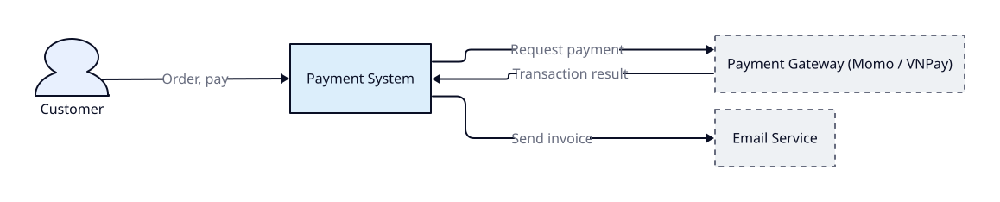

**Containers (C4 L2)** — `/system-design`

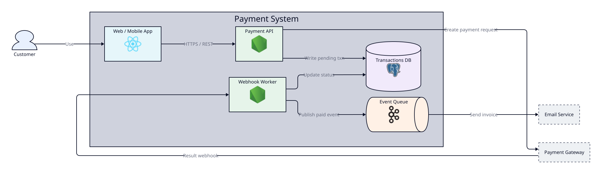

**System architecture** — `/d2-architect`

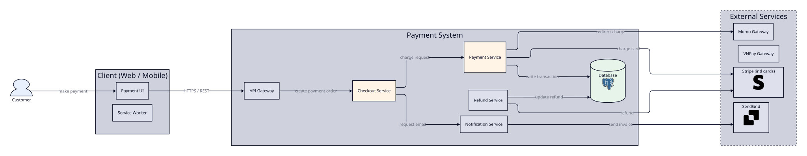

**Sequence** — `/sequence` (Mermaid):

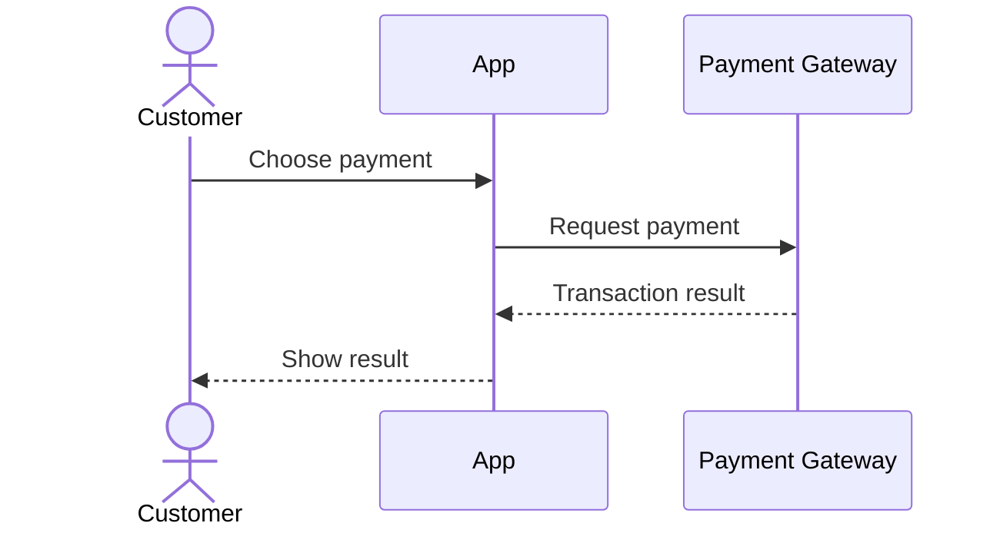

**Activity / flowchart** — `/activity` (Mermaid):

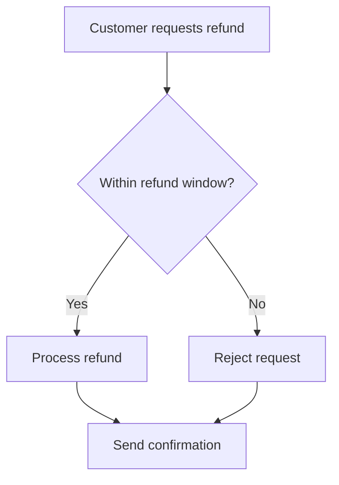

**Activity with swimlanes** — `/activity-swimlane` (PlantUML):

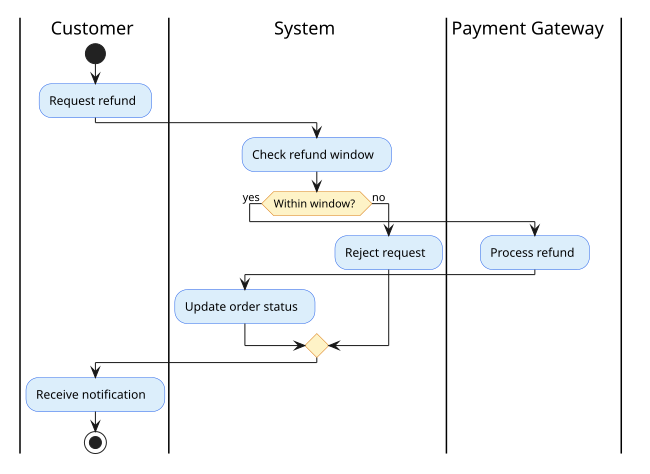

**BPMN 2.0** — `/bpmn` (editable in the browser):

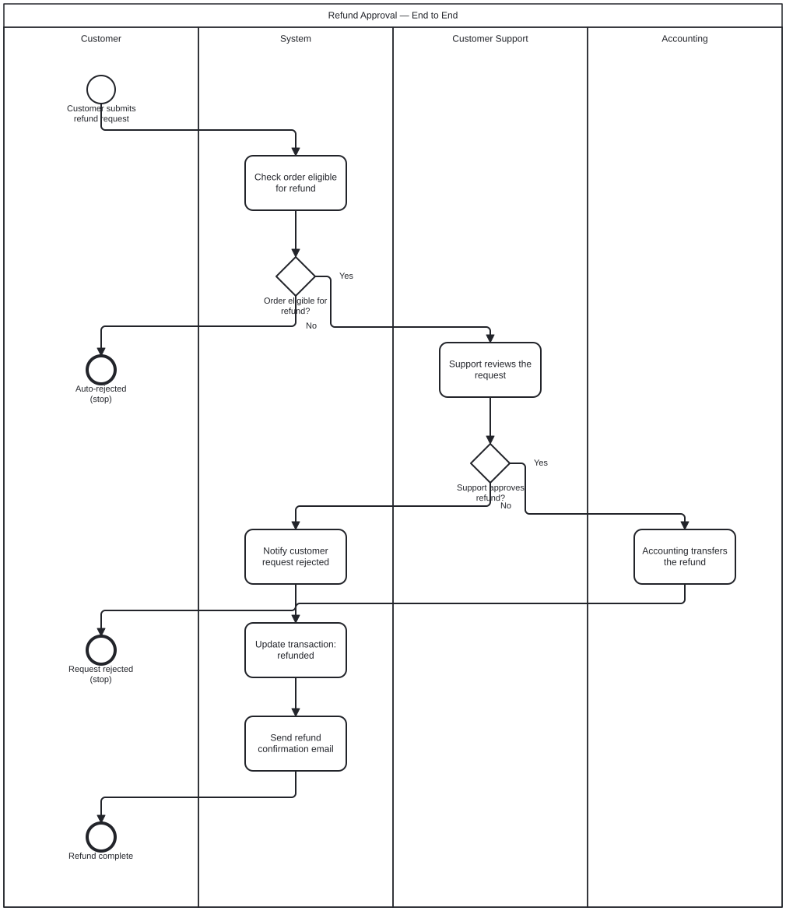

**State** — `/state` (Order lifecycle, Mermaid):

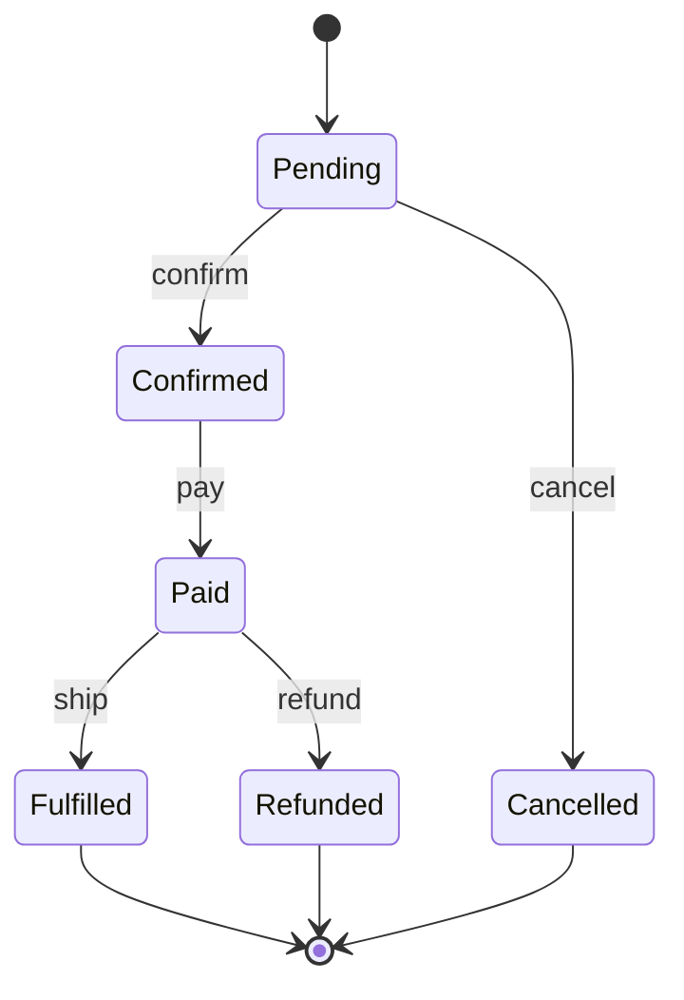

**ERD, inline** — `/erd` (Mermaid):

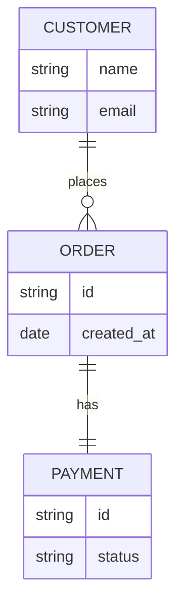

**ERD, standalone** — `/d2-erd`

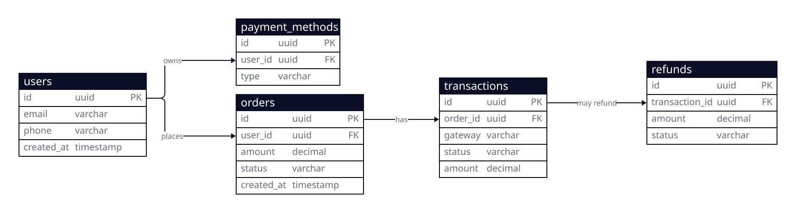

**DBML schema** — `/dbdiagram` (+ SQL export):

```dbml
Table customers {
  id uuid [pk]
  email varchar [unique, not null]
}

Table orders {
  id uuid [pk]
  customer_id uuid [ref: > customers.id]
  status varchar [note: 'pending | paid | refunded']
  created_at timestamp
}

Table payments {
  id uuid [pk]
  order_id uuid [ref: > orders.id]
  gateway varchar [note: 'momo | vnpay']
  amount decimal
}
```

**Standalone activity diagram** — `/d2-activity`

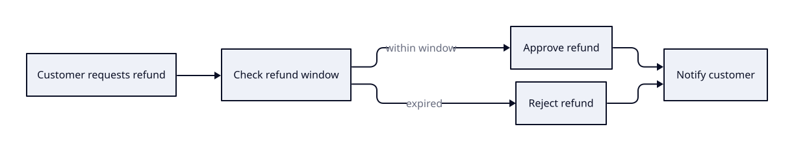

**Use case diagram** — `/usecase-diagram` (PlantUML):

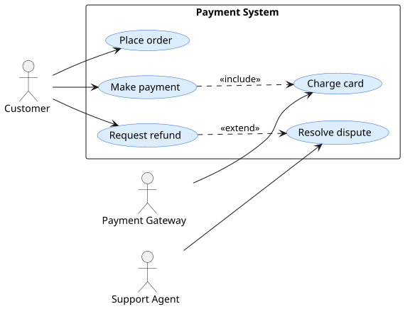

The C4 HTML deck (dark theme, one-click PNG/PDF export) is written to `docs/{feature}/system-design/`.

## Worked example — Atlas Re

A *fictional, anonymized* reinsurance underwriting platform (modelled on a real NestJS + React codebase — no real names/fields/paths). **Every diagram skill ships one rendered example**, generated by its real pipeline. See [`example/atlas-re/README.md`](example/atlas-re/README.md) for the full inventory + [`DOMAIN.md`](example/atlas-re/DOMAIN.md) for the domain.

**System architecture** — `/d2-architect` (every block carries its tech icon: React, nginx, NestJS, Postgres, Redis, Kafka, Azure; gateway = hexagon, cache = `stored_data`, DB = cylinder, queue = `queue`):


**C4 Container (L2)** — `/system-design` (Context + Container levels):


**Data model** — `/d2-erd` (DBML + inline `/erd` also available):


**Behavior + people** — `/sequence` · `/state` · `/erd` (inline Mermaid in [`srs/`](example/atlas-re/srs/)), `/activity-swimlane` & `/usecase-diagram` (PlantUML):

 

**Cloud (draw.io, real stencils)** — `/drawio-azure` (primary), plus fabricated `/drawio-aws` · `/drawio-gcp` · `/drawio-databricks`. Click an image to open its `.drawio` source (also editable in [draw.io](https://app.diagrams.net)):

<a href="example/atlas-re/drawio/atlas-re-azure.drawio"></a>
<a href="example/atlas-re/drawio/atlas-re-aws.drawio"></a>
<a href="example/atlas-re/drawio/atlas-re-gcp.drawio"></a>
<a href="example/atlas-re/drawio/atlas-re-databricks.drawio"></a>

**UML sequence (draw.io)** — `/drawio-sequence` — the bind flow as lifelines × time-ordered messages (services call each other; the bus fans events out to consumers). <a href="example/atlas-re/drawio/atlas-re-sequence.drawio">Open `atlas-re-sequence.drawio`</a> in [draw.io](https://app.diagrams.net) (PNG export needs the desktop app).

Also in the example: `/dfd`, `/journey`, `/mindmap`, `/timeline`, `/orgchart`, `/bpmn`, `/code-flow`. Regenerate any with the commands in [`example/atlas-re/README.md`](example/atlas-re/README.md).

## Getting started

The kit targets Claude Code. There are two ways to install it.

### As a plugin (recommended)

```
/plugin marketplace add https://github.com/nv-minh/dev-ba-kit
/plugin install dev-ba-kit
```

All 28 commands become available immediately. The BPMN engine installs its Node dependencies on first session via a hook — nothing to run by hand.

### Migrating from dev-diagram-kit 1.x

The plugin was renamed in 2.0.0 (the kit now covers BA documents, not just diagrams). Plugin-mode installs do not auto-update across a rename:

```
/plugin uninstall dev-diagram-kit
/plugin marketplace add https://github.com/nv-minh/dev-ba-kit
/plugin install dev-ba-kit
```

Copy-mode users just re-run `./install.sh`. Everything already generated under `docs/` remains valid — no artifact migration needed.

### By copy (any setup, or other tools)

```bash
./install.sh <workspace>     # defaults to the current directory
```

This copies the skills into `<workspace>/.claude/`, installs the BPMN engine, and runs `scripts/doctor.sh` to check your render tools. Skills resolve shared paths through `${CLAUDE_PLUGIN_ROOT:-.claude}`, so both install methods work unchanged.

### Render tools

Install only what the skills you use need (`scripts/doctor.sh` reports what's missing):

- **Mermaid** (`/sequence`, `/activity`, `/state`, `/erd`) — Node, `@mermaid-js/mermaid-cli`, and Chrome.
- **D2** (`/d2-*`, `/system-design`, `/scan-project`) — the `d2` binary.
- **PlantUML** (`/activity-swimlane`, `/usecase-diagram`) — renders **offline** via `plantuml.jar` (run `scripts/plantuml-ensure.sh` once; needs Java), else via plantuml.com (content sent online).
- **draw.io** (`/drawio-aws` · `/drawio-azure` · `/drawio-gcp` · `/drawio-databricks`) — the engine + catalogs ship in-repo; the large Azure/GCP catalogs download on demand (`scripts/drawio-catalog-ensure.sh`). PNG/SVG export is optional (needs the draw.io desktop app); the `.drawio` file opens everywhere without it.
- **DBML** (`/dbdiagram`) — `@dbml/cli`. **BPMN** (`/bpmn`) — Node (installed automatically).
- **`/sync-confluence`** — an authenticated Atlassian MCP connection.

### Try it

```
/sequence "Underwriter submits a risk, the pricing engine rates it, the contract is bound" --feature atlas-re
/system-design "Underwriting platform: web, API gateway, services, Postgres, Azure AD" --feature atlas-re
/scan-project              # reverse-engineer diagrams from the current codebase
```

## How it works

- **No syntax to memorize.** You describe the domain; the skill writes the Mermaid/PlantUML/D2/BPMN/draw.io source.
- **Bilingual output.** Labels, questions, and reports follow the language of your input; force it with `--lang en|vi` (see `rules/language.md`). Syntax keywords and real identifiers stay in English.
- **Automatic technology icons.** Architecture diagrams and `/scan-project` add logos (Redis, Postgres, Kafka, AWS, nginx, React, …) when a node maps to a known technology — Devicon bundled offline with a CDN fallback (`rules/icon-map.md`). Disable with `--no-icons`.
- **The right level of detail.** The audience is developers, so technical detail (columns, endpoints, schema) is welcome where it fits; the kit chooses the altitude from the diagram type and reader, not by forbidding it.
- **Self-checking.** Every diagram passes a unified validation gate (`scripts/diagram-validate.ts`) before it's reported done — compile check across Mermaid / D2 / PlantUML / BPMN / draw.io, plus the draw.io stencil-catalog + design-principle audits (no hallucinated icons, no dangling refs, AWS Well-Architected advice). Mermaid is compile-checked (`mermaid-verify.ts`), D2/DBML validate through their CLIs, BPMN runs a semantic coverage check, and D2/C4 diagrams are reviewed from the rendered image.
- **Tested engine, drift-gated examples.** The diagram engine ships with a unit-test suite (`npm test`) and type-checked kit-native TypeScript (`npm run typecheck`); CI rebuilds every example `.src.ts` and fails if engine output drifts from the committed `.drawio` files.
- **Router + one-file deck.** `/diagram` picks the right skill for a need (asks at most two questions, then runs it); `/gallery` gathers every diagram of a feature into one self-contained tabbed HTML (Copy/PNG/PDF) for stakeholder handoff.
- **Human in the loop.** Skills never write silently — every change is previewed and confirmed first (`rules/approval-gate.md`). `/sync-confluence` always shows a diff and asks before touching a page.

## Repository layout

```
dev-ba-kit/
├── .claude-plugin/plugin.json     Plugin manifest (/plugin install)
├── marketplace.json               Marketplace catalog (/plugin marketplace add)
├── install.sh                     Copy-mode installer (no plugin needed)
├── skills/                        28 skills
├── agents/                        diagram-reviewer
├── rules/                         Shared rules (approval-gate, diagram-selection, diagram-style, language, icon-map, …)
├── scripts/                       mermaid-verify.ts · diagram-validate.ts · doctor.sh · plantuml-ensure.sh · drawio-catalog-ensure.sh · icon-path.sh · tsrun.sh · render helpers
├── tests/                         Engine unit tests (vitest — `npm test`)
├── .github/workflows/             CI: typecheck · tests · example drift gate
├── templates/                     Diagram file templates
├── hooks/                         SessionStart hook (auto-installs the BPMN engine)
├── assets/icons/                  Bundled technology icons (Devicon MIT, Simple Icons CC0)
├── example/                       Worked example: the atlas-re feature
├── explain-skills/                Per-skill deep dives, all 28 skills covered (bilingual: `*.md` English, `*.vi.md` Vietnamese)
├── guides/ · huong-dan/           Getting-started guide (English / Vietnamese)
└── CHANGELOG.md · CONTRIBUTING.md Version history · how to contribute
```

## Design principle: keep the developer in control

The kit does not replace judgment with automation. A generated diagram is a high-quality draft to be reviewed, not ground truth: compile and coverage checks catch syntax and completeness, but whether the diagram is *correct for the domain* is your call. You supply context, you approve every write, and you own the result. The kit removes the mechanical work — remembering syntax, laying things out, catching errors — so you can spend attention on the parts only a person can do.

## Contributing

See [CONTRIBUTING.md](CONTRIBUTING.md) — the short version: `npm run typecheck` + `npm test` must pass, an engine change must rebuild the examples in the same commit (CI fails on drift), and every English doc changes together with its Vietnamese twin. Release history lives in [CHANGELOG.md](CHANGELOG.md).

## License

MIT — see [LICENSE](LICENSE). Third-party attributions (Cocoon AI, Devicon, Simple Icons) are listed in [NOTICE](NOTICE).
