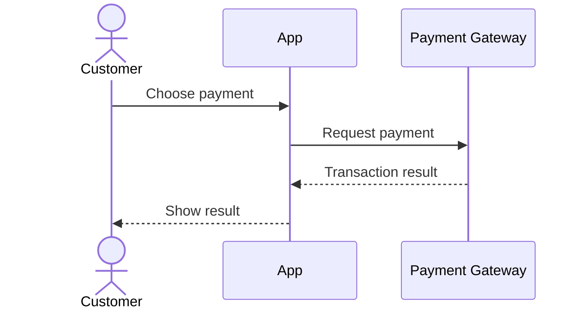
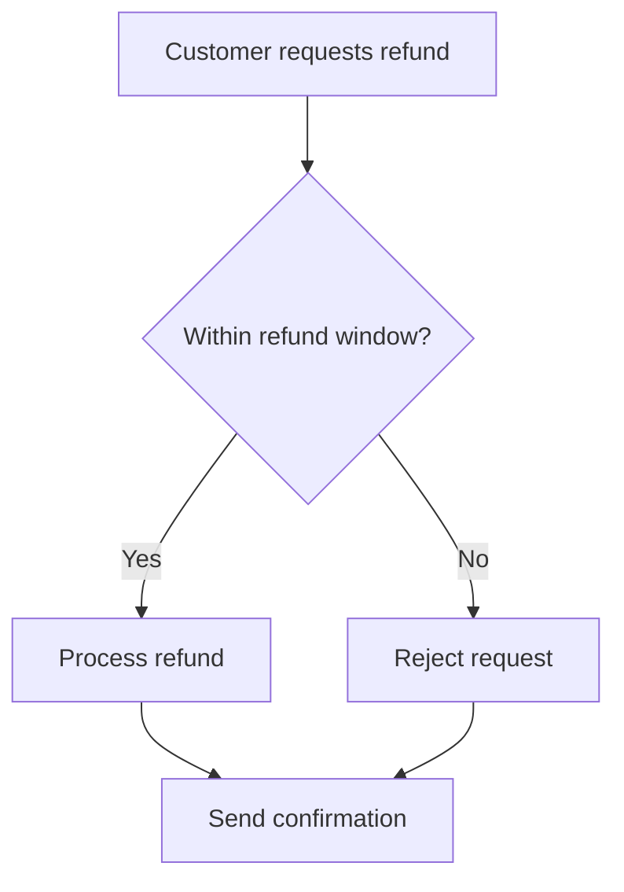
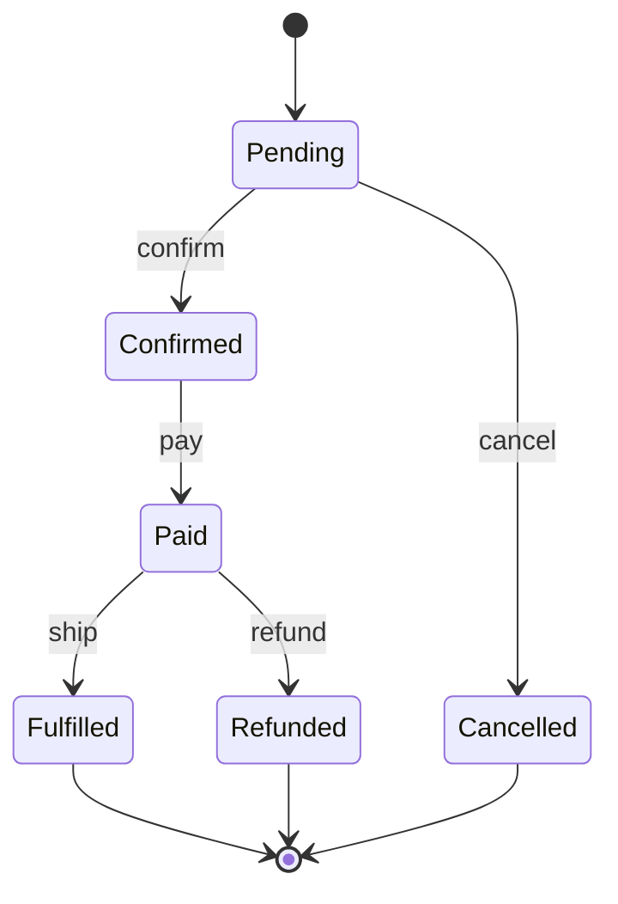
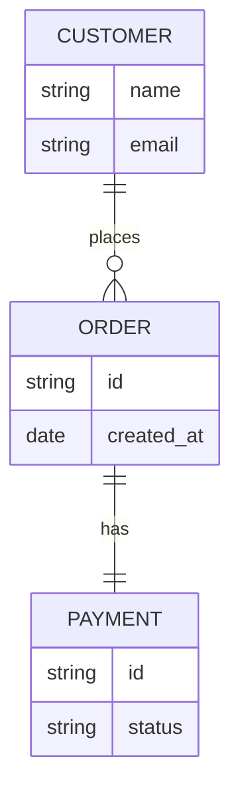

# Dev-Diagram Kit

Diagram and documentation skills for developers doing BA work, packaged as a [Claude Code](https://docs.claude.com/en/docs/claude-code) plugin. Describe a system or process in plain language — or point the kit at a codebase — and it produces the right diagram (Mermaid, PlantUML, D2, or BPMN), compile-checks it, and renders it. Output is bilingual and follows the language you write in.

[](LICENSE) &nbsp; 14 skills &nbsp;·&nbsp; Mermaid / PlantUML / D2 / BPMN &nbsp;·&nbsp; EN / VI

**English** · [Tiếng Việt](README.vi.md)

---

## Skills

Fourteen skills: twelve draw diagrams from a description or interview; two work from your codebase and docs.

| Skill | Output | Engine | Use for |
|---|---|---|---|
| `/sequence` | Sequence diagram — who calls whom, over time | Mermaid | Login, payment, webhook, OAuth callback |
| `/activity` | Activity / flowchart with decision branches | Mermaid | Simple 1–2 role flows, inline in GitHub/Obsidian |
| `/activity-swimlane` | Activity diagram with real swimlanes (one lane per role) | PlantUML | Default for multi-role processes with cross-lane steps |
| `/bpmn` | BPMN 2.0 (OMG standard), editable in the browser | Node engine | Import into Camunda/Bizagi, or OMG notation |
| `/state` | State diagram — entity lifecycle | Mermaid | Order/Account/Subscription with several states |
| `/erd` | Entity-relationship diagram, inline in Markdown | Mermaid | Data model read inside docs |
| `/d2-erd` | Standalone ERD with clear PK/FK | D2 | Data model for slides / export |
| `/dbdiagram` | DBML schema + SQL export | DBML CLI | Dev handoff, dbdiagram.io / dbdocs.io, enums/indexes |
| `/d2-activity` | Standalone activity diagram | D2 | Multi-branch flow needing a clean image |
| `/d2-architect` | System architecture — a single context picture | D2 | Nested components / services / DB / external services |
| `/system-design` | Multi-level **C4** (Context → Container → Component) + HTML deck | D2 + HTML | Larger systems needing zoom + PNG/PDF export |
| `/usecase-diagram` | Use case diagram (actors + use cases) | PlantUML | Kickoff, system scope, include/extend |
| `/scan-project` | **Scan a codebase** → a full architecture set (C4 + module map + ERD + sequences) | D2 + Mermaid | Reverse-engineering an existing (brownfield) project |
| `/sync-confluence` | **Sync code changes or a conversation** into a Confluence page (in-place, preview first) | Atlassian MCP | Keeping docs in step with the latest code |

Not sure which to use? `rules/diagram-selection.md` is a decision guide that maps a situation to the right diagram type — the reason fourteen skills stay manageable.

## Examples

Sample output for a small *payment* domain. D2, PlantUML, and BPMN diagrams are pre-rendered; Mermaid renders natively on GitHub. Architecture diagrams add technology icons automatically when a component maps to a known stack.

**System Context (C4 L1)** — `/system-design`, `/scan-project`


**Containers (C4 L2)** — `/system-design`


**System architecture** — `/d2-architect`


**Sequence** — `/sequence` (Mermaid):



**Activity / flowchart** — `/activity` (Mermaid):



**Activity with swimlanes** — `/activity-swimlane` (PlantUML):


**BPMN 2.0** — `/bpmn` (editable in the browser):


**State** — `/state` (Order lifecycle, Mermaid):



**ERD, inline** — `/erd` (Mermaid):



**ERD, standalone** — `/d2-erd`


**DBML schema** — `/dbdiagram` (+ SQL export):

```dbml
Table customers {
  id uuid [pk]
  email varchar [unique, not null]
}

Table orders {
  id uuid [pk]
  customer_id uuid [ref: > customers.id]
  status varchar [note: 'pending | paid | refunded']
  created_at timestamp
}

Table payments {
  id uuid [pk]
  order_id uuid [ref: > orders.id]
  gateway varchar [note: 'momo | vnpay']
  amount decimal
}
```

**Standalone activity diagram** — `/d2-activity`


**Use case diagram** — `/usecase-diagram` (PlantUML):


The C4 HTML deck (dark theme, one-click PNG/PDF export) is written to `docs/{feature}/system-design/`.

## Getting started

The kit targets Claude Code. There are two ways to install it.

### As a plugin (recommended)

```
/plugin marketplace add <path to this repo | owner/repo>
/plugin install dev-diagram-kit
```

All 14 commands become available immediately. The BPMN engine installs its Node dependencies on first session via a hook — nothing to run by hand.

### By copy (any setup, or other tools)

```bash
./install.sh <workspace>     # defaults to the current directory
```

This copies the skills into `<workspace>/.claude/`, installs the BPMN engine, and runs `scripts/doctor.sh` to check your render tools. Skills resolve shared paths through `${CLAUDE_PLUGIN_ROOT:-.claude}`, so both install methods work unchanged.

### Render tools

Install only what the skills you use need (`scripts/doctor.sh` reports what's missing):

- **Mermaid** (`/sequence`, `/activity`, `/state`, `/erd`) — Node, `@mermaid-js/mermaid-cli`, and Chrome.
- **D2** (`/d2-*`, `/system-design`, `/scan-project`) — the `d2` binary.
- **PlantUML** (`/activity-swimlane`, `/usecase-diagram`) — internet access (renders via plantuml.com).
- **DBML** (`/dbdiagram`) — `@dbml/cli`. **BPMN** (`/bpmn`) — Node (installed automatically).
- **`/sync-confluence`** — an authenticated Atlassian MCP connection.

### Try it

```
/sequence "Customer places an order, the system calls the payment gateway, the restaurant confirms" --feature food-delivery
/system-design "Ordering system: web/mobile, backend, DB, payment gateway" --feature food-delivery
/scan-project              # reverse-engineer diagrams from the current codebase
```

## How it works

- **No syntax to memorize.** You describe the domain; the skill writes the Mermaid/PlantUML/D2/BPMN.
- **Bilingual output.** Labels, questions, and reports follow the language of your input; force it with `--lang en|vi` (see `rules/language.md`). Syntax keywords and real identifiers stay in English.
- **Automatic technology icons.** Architecture diagrams and `/scan-project` add logos (Redis, Postgres, Kafka, AWS, nginx, React, …) when a node maps to a known technology — Devicon bundled offline with a CDN fallback (`rules/icon-map.md`). Disable with `--no-icons`.
- **The right level of detail.** The audience is developers, so technical detail (columns, endpoints, schema) is welcome where it fits; the kit chooses the altitude from the diagram type and reader, not by forbidding it.
- **Self-checking.** Mermaid is compile-checked (`mermaid-verify.mjs`), D2/DBML validate through their CLIs, BPMN runs a semantic coverage check, and D2/C4 diagrams are reviewed from the rendered image before being reported as done.
- **Human in the loop.** Skills never write silently — every change is previewed and confirmed first (`rules/approval-gate.md`). `/sync-confluence` always shows a diff and asks before touching a page.

## Repository layout

```
dev-diagram-kit/
├── .claude-plugin/plugin.json     Plugin manifest (/plugin install)
├── marketplace.json               Marketplace catalog (/plugin marketplace add)
├── install.sh                     Copy-mode installer (no plugin needed)
├── skills/                        14 skills
├── agents/                        diagram-reviewer
├── rules/                         Shared rules (approval-gate, diagram-selection, language, icon-map, …)
├── scripts/                       mermaid-verify.mjs · doctor.sh · icon-path.sh · render helpers
├── templates/                     Diagram file templates
├── hooks/                         SessionStart hook (auto-installs the BPMN engine)
├── assets/icons/                  Bundled technology icons (Devicon MIT, Simple Icons CC0)
├── example/                       Worked example: the food-delivery feature
├── explain-skills/                Per-skill deep dives (bilingual: `*.md` English, `*.vi.md` Vietnamese)
├── guides/ · huong-dan/           Getting-started guide (English / Vietnamese)
└── INSTALL-*.md · PROMPT-*.md      Porting to Codex CLI and Antigravity IDE
```

## Design principle: keep the developer in control

The kit does not replace judgment with automation. A generated diagram is a high-quality draft to be reviewed, not ground truth: compile and coverage checks catch syntax and completeness, but whether the diagram is *correct for the domain* is your call. You supply context, you approve every write, and you own the result. The kit removes the mechanical work — remembering syntax, laying things out, catching errors — so you can spend attention on the parts only a person can do.

## Porting to other tools

The kit is written for Claude Code, with guides to port it to other agent tools:

- **Codex CLI** — `INSTALL-CODEX.md` (detailed) and `PROMPT-CODEX.md` (a copy-paste prompt).
- **Google Antigravity IDE** — `INSTALL-ANTIGRAVITY.md` and `PROMPT-ANTIGRAVITY.md`.

## License

MIT — see [LICENSE](LICENSE). Third-party attributions (Cocoon AI, Devicon, Simple Icons) are listed in [NOTICE](NOTICE).
