# Dev BA Kit

Bộ skill vẽ sơ đồ và làm tài liệu cho **dev làm công việc BA**, đóng gói thành plugin [Claude Code](https://docs.claude.com/en/docs/claude-code). Mô tả hệ thống hoặc quy trình bằng lời — hoặc trỏ vào một codebase — kit sẽ vẽ đúng loại sơ đồ (Mermaid, PlantUML, D2 hoặc BPMN), tự kiểm cú pháp rồi render. Output song ngữ, tự bám theo ngôn ngữ bạn gõ.

[](LICENSE) [](https://github.com/nv-minh/dev-ba-kit/actions/workflows/ci.yml) &nbsp; 48 skill &nbsp;·&nbsp; Mermaid / PlantUML / D2 / BPMN / draw.io &nbsp;·&nbsp; EN / VI

[English](README.md) · **Tiếng Việt**

---

## Danh sách skill

Bốn mươi tám skill. Hai mươi skill viết tài liệu BA (chuỗi discovery, các wave tiếp theo đang lên sóng — xem `rules/doc-selection.md`); hai mươi hai skill vẽ sơ đồ (gồm bốn skill **draw.io** vẽ kiến trúc cloud với stencil AWS/Azure/GCP/Databricks thật + một skill **draw.io** vẽ sequence UML); `/scan-project` và `/code-flow` đọc code; hai router tự chọn skill cho bạn — `/diagram` (sơ đồ) và `/ba` (tài liệu BA); `/gallery` gom thành một file bàn giao; `/sync-confluence` sync sang Confluence. Mọi sản phẩm đều qua cổng validate thống nhất trước khi báo xong — `diagram-validate` cho sơ đồ, `doc-validate` cho tài liệu.

### Tài liệu — discovery & requirements

| Skill | Viết gì | ID sinh ra | Khi nào dùng |
|---|---|---|---|
| `/brainstorm` | Tài liệu khai phá ý tưởng, kèm quyết định + Open Questions | OQ | Ý tưởng thô, chưa có gì cấu trúc — gốc của chuỗi |
| `/urd` | User Requirements Document — persona, bối cảnh sử dụng, nhu cầu | `UN-` | Người dùng là ai và họ cần gì |
| `/brd` | Business Requirements Document — mục tiêu, phạm vi, chi phí-lợi ích, rủi ro | `BO-` | Bài toán kinh doanh: vì sao làm, đo bằng gì |
| `/prd-epic` | PRD 1 feature — capability P0/P1/P2, goal/non-goal, kế hoạch release | `CAP-` | Sẽ xây GÌ cho MỘT feature |
| `/prd` | PRD sản phẩm (singleton, `docs/_product/`) — pitch, theme, Feature Map | — | Định nghĩa TOÀN BỘ sản phẩm |
| `/roadmap` | Roadmap (singleton) — điểm RICE-lite, Now/Next/Later, phụ thuộc | — | Sắp thứ tự và ưu tiên feature |
| `/srs` | SRS — FR kiểm thử được, NFR, business rule, ma trận lỗi + menu sơ đồ | `FR- NFR- BR- E-` | Hành vi hệ thống chính xác, nguồn cho mọi thứ phía sau |

### Tài liệu — specification

| Skill | Viết gì | ID sinh ra | Khi nào dùng |
|---|---|---|---|
| `/usecase` | Use case Cockburn đầy đủ + index (ma trận traceability của feature) | `UC-` | Kịch bản actor-goal kèm extension; chạy được cả trước lẫn sau SRS |
| `/userstory` | Story INVEST cắt từ FR + story index (status/priority/jira-key) | `US-` | Backlog item sẵn sàng cho dev; cần SRS |
| `/ac` | Tiêu chí Given-When-Then thêm TRONG story có sẵn (luôn là L2 diff) | `AC-` | Làm mọi story kiểm chứng được — happy path, lỗi, biên |
| `/user-flow` | Bản đồ điều hướng màn hình Mermaid, màn hình đánh số, chia theo flow | màn hình `[n]` | Nguồn DUY NHẤT chia flow mà wireframe (wave 3) đọc |

Chuỗi: `/brainstorm → /urd → /brd → /prd-epic → /srs` theo feature, rồi `/usecase → /userstory → /ac` cắt nhỏ, `/user-flow` vẽ màn hình, và họ wireframe vẽ chúng; `/prd → /roadmap` ở mức sản phẩm. Open Questions tự cascade xuôi dòng (`rules/resolve-oqs.md`); mọi ID truy vết được về nguồn (UN → BO → CAP → FR → UC/US → AC).

### Tài liệu — thiết kế UI

| Skill | Viết gì | ID / sản phẩm | Khi nào dùng |
|---|---|---|---|
| `/wireframe-ascii` | Khung ASCII + bảng mô tả 5 cột theo flow + screen index | màn hình `[n]` | Phác màn hình xem ngay trong chat (L3); cần user flow |
| `/wireframe-html` | HTML tĩnh đen-trắng theo flow + entry điều hướng + index | màn hình `[n]` | Wireframe xem trên trình duyệt đúng độ rộng device; ngang tầm ASCII |
| `/prototype-html` | Một prototype clickable tự chứa | cạnh điều hướng | Demo click-through, navigation chạy thật; cần wireframe |
| `/figma` | Frame Figma (không file local — URL vào screen index) | URL Figma | Đẩy wireframe lên Figma qua MCP (cổng external-write) |

### Tài liệu — testing & traceability

| Skill | Viết gì | ID sinh ra | Khi nào dùng |
|---|---|---|---|
| `/test-checklist` | Đề cương test (phân loại: functional/boundary/error/NFR) | `CHK-` | Đề cương để `/test-cases` nở; cần SRS |
| `/test-cases` | Test case đầy đủ (steps/data/expected) | `TC-` | Nở từng `CHK-`; không có checklist thì từ chối |
| `/gap` | Ma trận traceability cross-doc + báo cáo coverage | — | Chứng minh spine (UN→…→TC) đầy đủ; chỉ đọc |
| `/cr` | Change Request (Impact Matrix + Rollback + apply có hướng dẫn) | `CR-` | Ghi thay đổi scope + áp dụng thành L2 diff từng doc |
| `/reverse-doc` | Tái dựng tài liệu BA từ nguồn cũ (docx/pdf/code) | — | Tài liệu brownfield với confidence 3 mức (✅/🔵/🟡) |

### Sơ đồ

| Skill | Vẽ gì | Engine | Khi nào dùng |
|---|---|---|---|
| `/sequence` | Sequence diagram — ai gọi ai theo thời gian | Mermaid | Login, thanh toán, webhook, OAuth callback |
| `/activity` | Activity / flowchart có nhánh quyết định | Mermaid | Flow gọn 1–2 vai, nhúng inline GitHub/Obsidian |
| `/activity-swimlane` | Activity **swimlane thật** — mỗi vai một lane | PlantUML | Mặc định cho quy trình đa vai trò nhiều tương tác chéo |
| `/bpmn` | BPMN 2.0 chuẩn OMG, sửa được ngay trên trình duyệt | Engine Node | Import Camunda/Bizagi, hoặc cần ký hiệu OMG |
| `/state` | State diagram — vòng đời entity | Mermaid | Order/Account/Subscription nhiều trạng thái |
| `/code-flow` | Trace 1 function/module trong code → flow (seq/activity/state) + provenance `file:line` | Mermaid | Giải thích cách hoạt động của 1 hàm cụ thể, từ source |
| `/dfd` | Data Flow Diagram — dữ liệu đi đâu (L0 bối cảnh + L1) | D2 | Góc nhìn DỮ LIỆU (entity ↔ process ↔ store) |
| `/mindmap` | Cây phân rã scope/ý tưởng | Mermaid | Discovery — bẻ scope thành cây trước khi viết SRS |
| `/journey` | User journey kèm mức hài lòng 1–5 | Mermaid | Trải nghiệm qua các touchpoint + pain point |
| `/timeline` | Mốc roadmap theo thời gian (PM-light, không phải Gantt) | Mermaid | Mốc dự án/feature theo giai đoạn |
| `/erd` | ERD nhúng inline trong Markdown | Mermaid | Data model đọc ngay trong tài liệu |
| `/d2-erd` | ERD standalone, PK/FK rõ | D2 | Data model cho slide / export |
| `/dbdiagram` | Schema DBML + export SQL | DBML CLI | Bàn giao dev, dbdiagram.io / dbdocs.io, enum/index |
| `/d2-activity` | Activity diagram standalone | D2 | Flow nhiều nhánh cần hình đẹp |
| `/d2-architect` | Kiến trúc hệ thống — một hình bối cảnh | D2 | Component / service / DB / dịch vụ ngoài lồng nhau |
| `/system-design` | **C4 đa tầng** (Context → Container → Component) + runtime view + bản HTML | D2 + HTML | Hệ thống lớn cần zoom nhiều mức + export PNG/PDF |
| `/usecase-diagram` | Use case diagram (actor + use case) | PlantUML | Kickoff, phạm vi hệ thống, include/extend |
| `/orgchart` | Sơ đồ tổ chức / reporting (+ tuỳ chọn bản power/interest) | D2 (+ Mermaid) | Kickoff — ai báo cáo ai, phân tích stakeholder |
| `/drawio-aws` · `/drawio-azure` · `/drawio-gcp` · `/drawio-databricks` | **Kiến trúc cloud với stencil cloud thật** (icon dịch vụ chính chủ, đã validate) | draw.io | Review kiến trúc / Well-Architected — đúng thương hiệu, không phải hộp chung chung |
| `/drawio-sequence` | **Sơ đồ sequence UML** (lifeline × message theo thời gian: sync / return / async) | draw.io | Flow request/response + tích hợp, dạng `.drawio` sửa được |
| `/scan-project` | **Scan codebase** → bộ sơ đồ kiến trúc (C4 + module + ERD + sequence) | D2 + Mermaid | Reverse-engineer project có sẵn (brownfield) |
| `/diagram` | **Router** — mô tả nhu cầu, tự chọn + chạy đúng skill | — | "Nên dùng cái nào trong đám này?" |
| `/ba` | **Router (tài liệu)** — mô tả tài liệu BA cần viết, tự chọn + chạy đúng skill tài liệu | — | Requirements, spec, test, bàn giao — "skill tài liệu nào?" |
| `/gallery` | **Bộ bàn giao 1 file** — mọi sơ đồ của 1 feature, tab, có toolbar export | HTML | Bàn giao stakeholder (Copy/PNG/PDF) |
| `/sync-confluence` | **Sync code/hội thoại** vào trang Confluence (sửa in-place, preview trước) | Atlassian MCP | Giữ tài liệu khớp logic code mới nhất |

Không biết chọn skill nào? Chạy **`/diagram`** — mô tả muốn thể hiện gì, nó tự chọn (và chạy) đúng skill. `rules/diagram-selection.md` là ma trận quyết định phía sau.

## Ví dụ output

Sơ đồ mẫu cho domain *payment* nhỏ. Ảnh D2, PlantUML, BPMN được render sẵn; Mermaid GitHub tự render. Sơ đồ kiến trúc tự chèn icon công nghệ khi nhận ra tech.

**System Context (C4 L1)** — `/system-design`, `/scan-project`

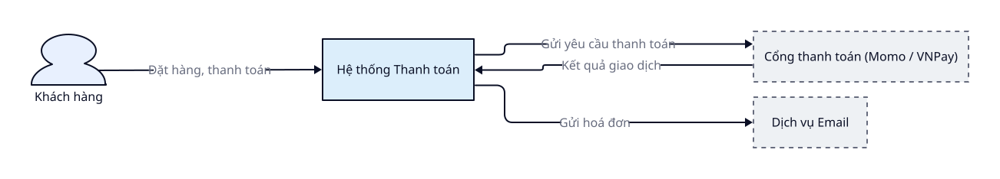

**Container (C4 L2)** — `/system-design`

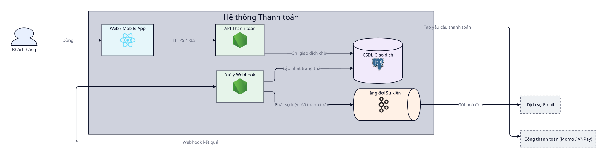

**Kiến trúc hệ thống** — `/d2-architect`

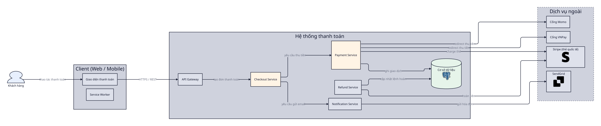

**Sequence** — `/sequence` (Mermaid):

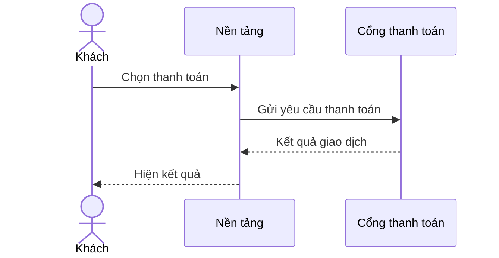

**Activity / flowchart** — `/activity` (Mermaid):

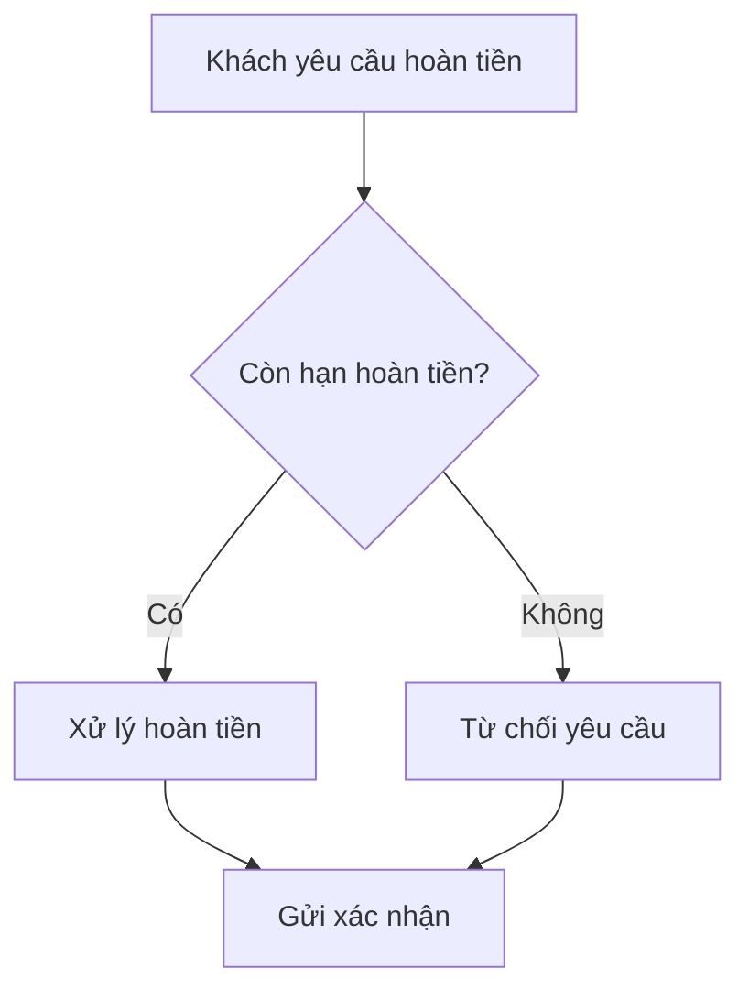

**Activity có swimlane** — `/activity-swimlane` (PlantUML):

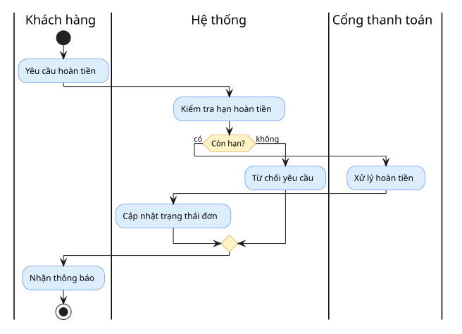

**BPMN 2.0** — `/bpmn` (sửa được ngay trên trình duyệt):

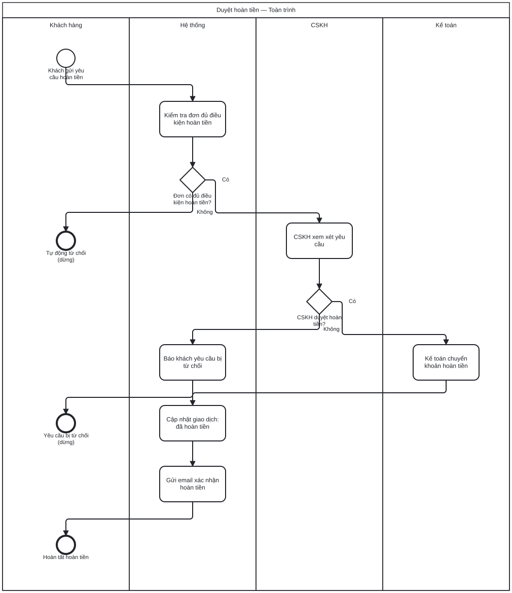

**State** — `/state` (vòng đời Order, Mermaid):

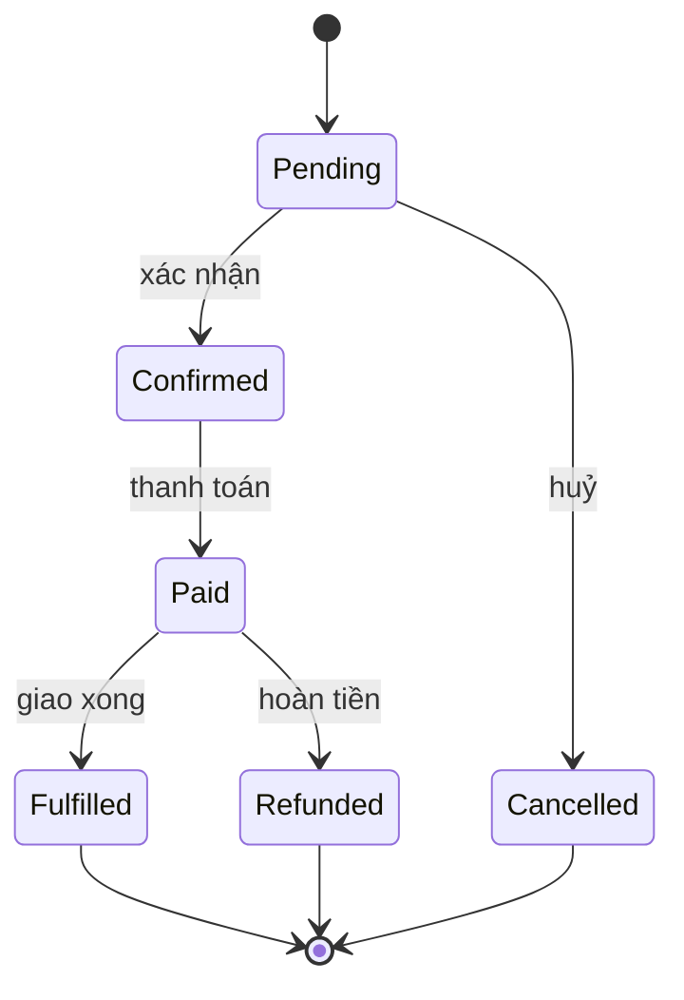

**ERD, nhúng inline** — `/erd` (Mermaid):

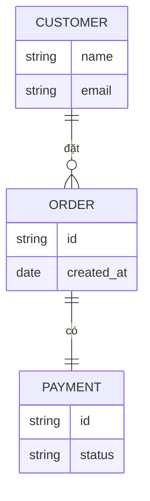

**ERD, đứng riêng** — `/d2-erd`

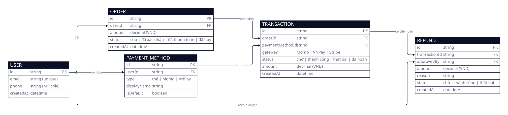

**Schema DBML** — `/dbdiagram` (+ export SQL):

```dbml
Table customers {
  id uuid [pk]
  email varchar [unique, not null]
}

Table orders {
  id uuid [pk]
  customer_id uuid [ref: > customers.id]
  status varchar [note: 'trạng thái: pending | paid | refunded']
  created_at timestamp
}

Table payments {
  id uuid [pk]
  order_id uuid [ref: > orders.id]
  gateway varchar [note: 'cổng: momo | vnpay']
  amount decimal
}
```

**Sơ đồ activity đứng riêng** — `/d2-activity`

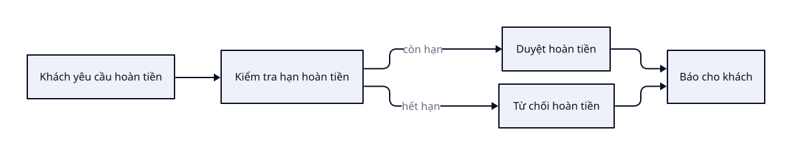

**Use case** — `/usecase-diagram` (PlantUML):

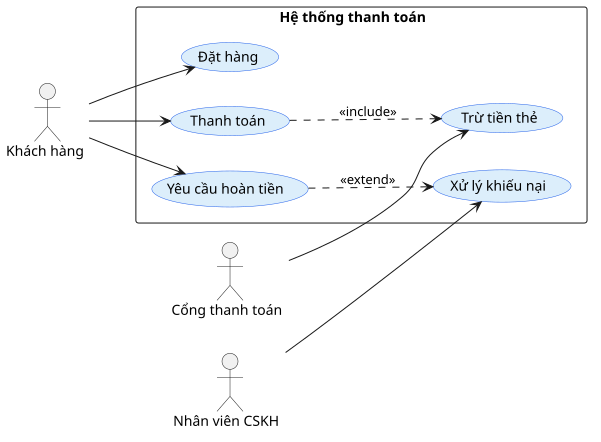

Bản trình bày C4 (dark theme, export PNG/PDF một chạm) ghi ở `docs/{feature}/system-design/`.

## Ví dụ làm sẵn — Atlas Re

Một nền tảng underwriting tái bảo hiểm *giả định, ẩn danh* (mô phỏng theo codebase NestJS + React thật — không tên/field/path thật). **Mỗi skill diagram có một ví dụ render sẵn**, sinh bằng pipeline thật. Xem [`example/atlas-re/README.md`](example/atlas-re/README.md) cho danh sách đầy đủ + [`DOMAIN.md`](example/atlas-re/DOMAIN.md) cho domain.

**Kiến trúc hệ thống** — `/d2-architect` (mọi khối đều có icon tech: React, nginx, NestJS, Postgres, Redis, Kafka, Azure; gateway = hexagon, cache = `stored_data`, DB = cylinder, queue = `queue`):

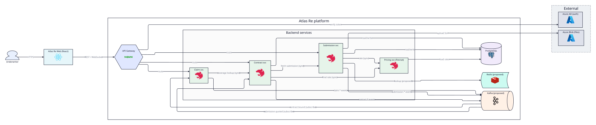

**C4 Container (L2)** — `/system-design` (cấp Context + Container):

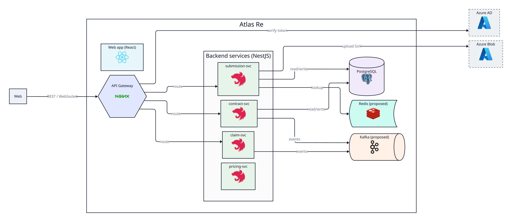

**Data model** — `/d2-erd` (cũng có DBML + `/erd` inline):

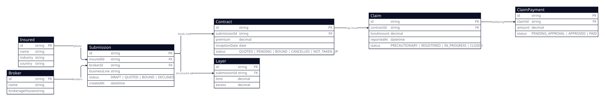

**Hành vi + con người** — `/sequence` · `/state` · `/erd` (Mermaid inline trong [`srs/`](example/atlas-re/srs/)), `/activity-swimlane` & `/usecase-diagram` (PlantUML):

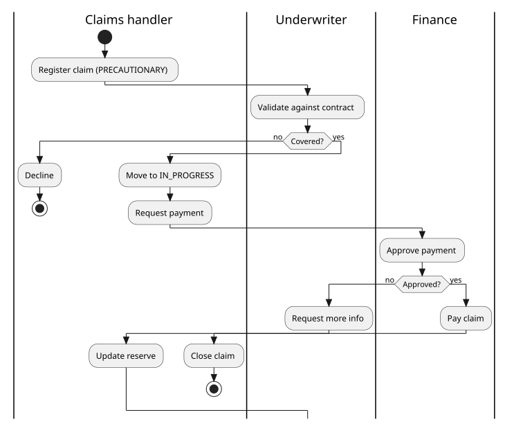 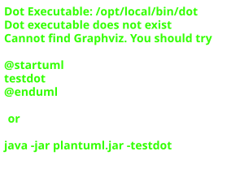

**Cloud (draw.io, stencil thật)** — `/drawio-azure` (cloud chính), cộng fabricated `/drawio-aws` · `/drawio-gcp` · `/drawio-databricks`. Click ảnh để mở file `.drawio` nguồn (sửa được bằng [draw.io](https://app.diagrams.net)):

<a href="example/atlas-re/drawio/atlas-re-azure.drawio">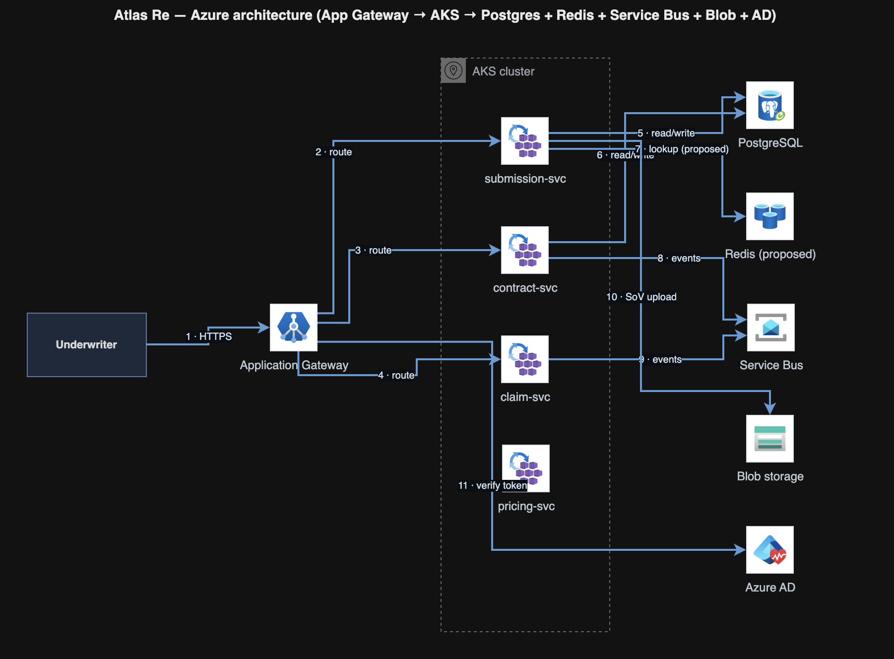</a>
<a href="example/atlas-re/drawio/atlas-re-aws.drawio">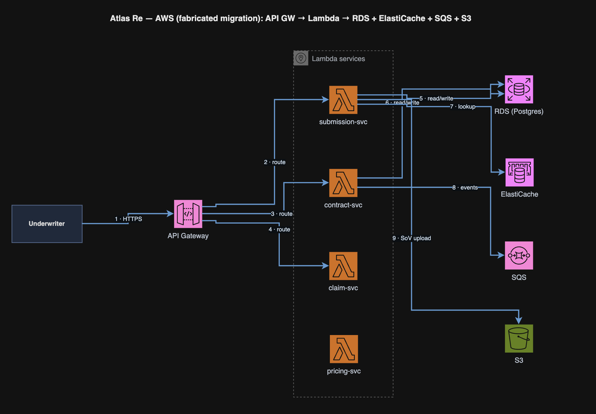</a>
<a href="example/atlas-re/drawio/atlas-re-gcp.drawio">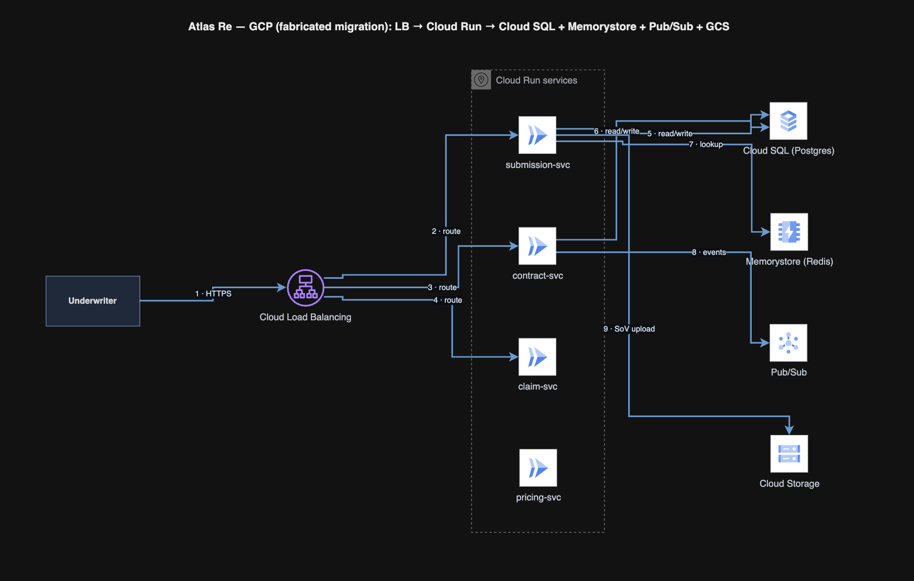</a>
<a href="example/atlas-re/drawio/atlas-re-databricks.drawio">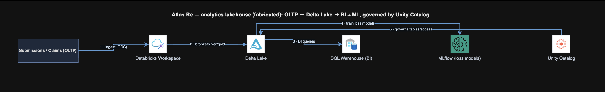</a>

**Sequence UML (draw.io)** — `/drawio-sequence` — luồng bind dạng lifeline × message theo thời gian (các service gọi nhau; bus phát event ra nhiều consumer). <a href="example/atlas-re/drawio/atlas-re-sequence.drawio">Mở `atlas-re-sequence.drawio`</a> bằng [draw.io](https://app.diagrams.net) (xuất PNG cần app desktop).

Trong example còn: `/dfd`, `/journey`, `/mindmap`, `/timeline`, `/orgchart`, `/bpmn`, `/code-flow`. Sinh lại bằng lệnh trong [`example/atlas-re/README.md`](example/atlas-re/README.md).

## Bắt đầu

Kit viết cho Claude Code. Có hai cách cài.

### Cài bằng plugin (khuyên dùng)

```
/plugin marketplace add https://github.com/nv-minh/dev-ba-kit
/plugin install dev-ba-kit
```

Cả 48 lệnh có sẵn ngay. BPMN engine tự cài dependency Node ở phiên đầu qua hook — không phải làm tay.

### Nâng cấp từ dev-diagram-kit 1.x

Plugin đổi tên ở bản 2.0.0 (kit giờ phủ cả tài liệu BA, không chỉ diagram). Cài kiểu plugin không tự cập nhật khi đổi tên:

```
/plugin uninstall dev-diagram-kit
/plugin marketplace add https://github.com/nv-minh/dev-ba-kit
/plugin install dev-ba-kit
```

Cài kiểu copy chỉ cần chạy lại `./install.sh`. Mọi thứ đã sinh trong `docs/` vẫn dùng bình thường — không cần migrate.

### Cài kiểu copy (mọi trường hợp / tool khác)

```bash
./install.sh <workspace>     # mặc định: thư mục hiện tại
```

Script copy skill vào `<workspace>/.claude/`, cài BPMN engine, rồi chạy `scripts/doctor.sh` để kiểm công cụ render. Skill resolve đường dẫn dùng chung qua `${CLAUDE_PLUGIN_ROOT:-.claude}` nên cả hai cách cài đều chạy như nhau.

### Công cụ render

Chỉ cài thứ skill bạn dùng cần (`scripts/doctor.sh` báo cái nào thiếu):

- **Mermaid** (`/sequence`, `/activity`, `/state`, `/erd`) — Node, `@mermaid-js/mermaid-cli`, Chrome.
- **D2** (`/d2-*`, `/system-design`, `/scan-project`) — binary `d2`.
- **PlantUML** (`/activity-swimlane`, `/usecase-diagram`) — render **offline** qua `plantuml.jar` (chạy `scripts/plantuml-ensure.sh` một lần; cần Java), hoặc qua plantuml.com (gửi nội dung ra mạng).
- **DBML** (`/dbdiagram`) — `@dbml/cli`. **BPMN** (`/bpmn`) — Node (tự cài).
- **`/sync-confluence`** — kết nối Atlassian MCP đã xác thực.

### Chạy thử

```
/sequence "Underwriter nộp rủi ro, engine định giá, hợp đồng được bind" --feature atlas-re
/system-design "Nền tảng underwriting: web, API gateway, services, Postgres, Azure AD" --feature atlas-re
/scan-project              # reverse-engineer sơ đồ từ codebase hiện tại
```

## Cách hoạt động

- **Không cần nhớ cú pháp.** Bạn mô tả nghiệp vụ; skill lo cú pháp Mermaid/PlantUML/D2/BPMN.
- **Output song ngữ.** Nhãn, câu hỏi, báo cáo bám theo ngôn ngữ input; ép bằng `--lang en|vi` (xem `rules/language.md`). Keyword cú pháp và tên định danh thật giữ nguyên tiếng Anh.
- **Icon công nghệ tự động.** Sơ đồ kiến trúc và `/scan-project` tự chèn logo (Redis, Postgres, Kafka, AWS, nginx, React, …) khi node khớp một công nghệ — Devicon bundle offline + fallback CDN (`rules/icon-map.md`). Tắt bằng `--no-icons`.
- **Đúng mức chi tiết (altitude).** Audience là dev nên chi tiết kỹ thuật (column, endpoint, schema) được dùng khi hợp; kit chọn mức theo loại sơ đồ và người đọc, không cấm đoán.
- **Tự bắt lỗi.** Mọi sơ đồ qua một cổng validate thống nhất (`scripts/diagram-validate.ts`) trước khi báo xong — compile-check qua Mermaid / D2 / PlantUML / BPMN / draw.io, cộng audit stencil-catalog + design-principle của draw.io (không icon bịa, không edge đứt, lời khuyên AWS Well-Architected). Mermaid compile-check (`mermaid-verify.ts`); D2/DBML validate qua CLI; BPMN semcheck kiểm phủ; sơ đồ D2/C4 tự soi lại từ ảnh render.
- **Engine có test, example có gate chống drift.** Engine vẽ sơ đồ có bộ unit test (`npm test`), code TypeScript kit-native được type-check (`npm run typecheck`); CI rebuild toàn bộ example `.src.ts` và fail nếu output engine lệch so với file `.drawio` đã commit.
- **Router + bộ bàn giao.** `/diagram` chọn đúng skill cho một nhu cầu (hỏi tối đa 2 câu rồi chạy); `/gallery` gom mọi sơ đồ của 1 feature thành một HTML tabbed self-contained (Copy/PNG/PDF) để bàn giao stakeholder.
- **Human-in-the-loop.** Skill không tự ghi im lặng — mọi thay đổi đều preview và xác nhận trước (`rules/approval-gate.md`). `/sync-confluence` luôn hiện diff và hỏi trước khi đụng trang.

## Cấu trúc repo

```
dev-ba-kit/
├── .claude-plugin/plugin.json     Manifest plugin (/plugin install)
├── marketplace.json               Catalog marketplace (/plugin marketplace add)
├── install.sh                     Installer kiểu copy (không cần plugin)
├── skills/                        48 skill
├── agents/                        diagram-reviewer
├── rules/                         Rule dùng chung (approval-gate, diagram-selection, diagram-style, language, icon-map, …)
├── scripts/                       mermaid-verify.ts · diagram-validate.ts · doctor.sh · plantuml-ensure.sh · drawio-catalog-ensure.sh · icon-path.sh · tsrun.sh · render helper
├── tests/                         Unit test cho engine (vitest — `npm test`)
├── .github/workflows/             CI: typecheck · test · gate chống drift example
├── templates/                     Khung file diagram
├── hooks/                         SessionStart hook (tự cài BPMN engine)
├── assets/icons/                  Icon công nghệ bundle sẵn (Devicon MIT, Simple Icons CC0)
├── example/                       Ví dụ đầy đủ: feature atlas-re
├── explain-skills/                Giải thích từng skill, đủ 28/48 skill (song ngữ: `*.md` tiếng Anh, `*.vi.md` tiếng Việt)
├── guides/ · huong-dan/           Hướng dẫn bắt đầu (tiếng Anh / tiếng Việt)
└── CHANGELOG.md · CONTRIBUTING.md Lịch sử phiên bản · hướng dẫn đóng góp
```

## Triết lý: dev vẫn là người điều khiển

Kit không thay tư duy bằng tự động hoá. Sơ đồ do AI vẽ là **bản nháp chất lượng cao để thẩm định**, không phải chân lý: compile-check và coverage bắt lỗi cú pháp và độ phủ, nhưng *đúng-sai nghiệp vụ* là quyết định của bạn. Bạn cung cấp ngữ cảnh, bạn duyệt mọi lần ghi, bạn chịu trách nhiệm với kết quả. Kit lo phần máy móc — nhớ cú pháp, dàn layout, bắt lỗi — để bạn tập trung vào phần chỉ con người làm được.

## Đóng góp

Xem [CONTRIBUTING.md](CONTRIBUTING.md) — tóm tắt: `npm run typecheck` + `npm test` phải xanh, sửa engine thì phải rebuild example trong cùng commit (CI fail nếu lệch), và mọi tài liệu tiếng Anh sửa cùng lúc với bản tiếng Việt tương ứng. Lịch sử phát hành ở [CHANGELOG.md](CHANGELOG.md).

## License

MIT — xem [LICENSE](LICENSE). Ghi nguồn bên thứ ba (Cocoon AI, Devicon, Simple Icons) ở [NOTICE](NOTICE).
