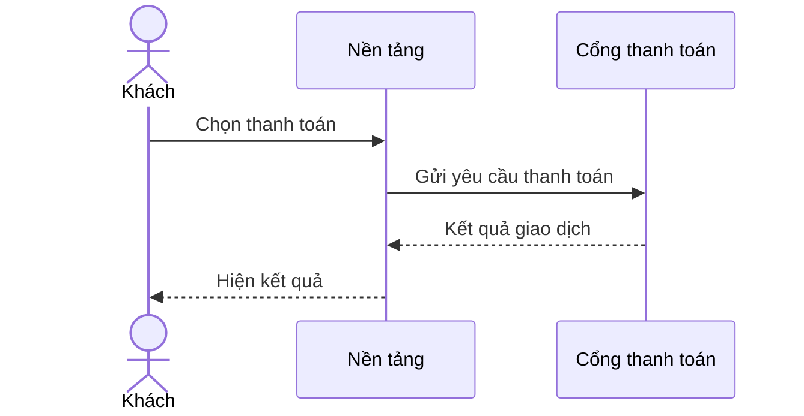
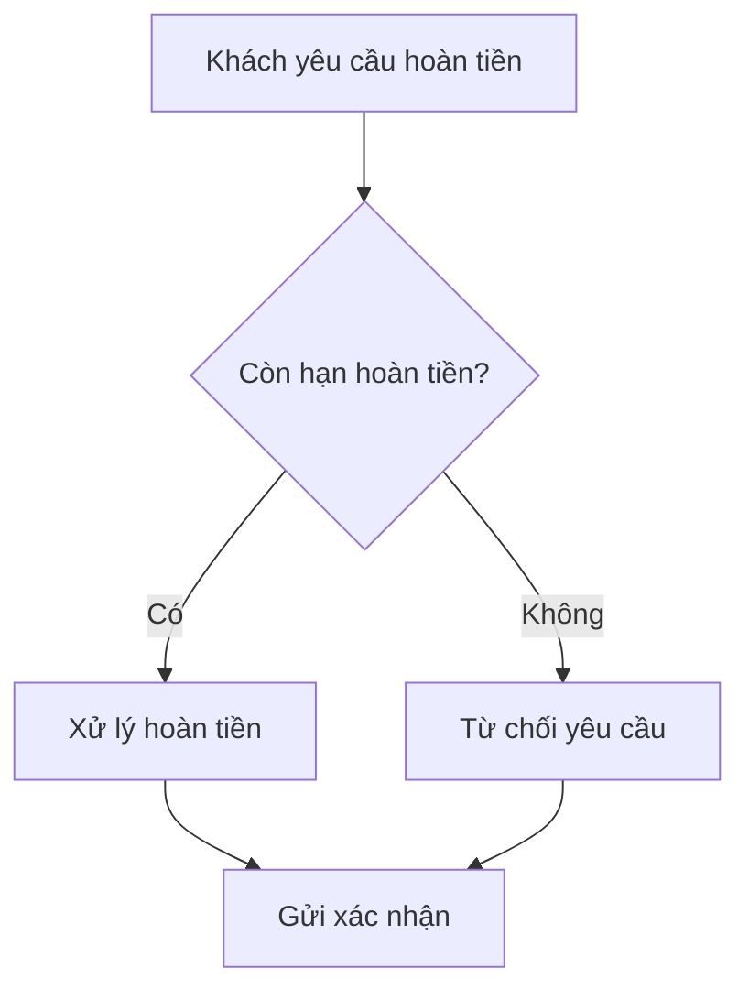
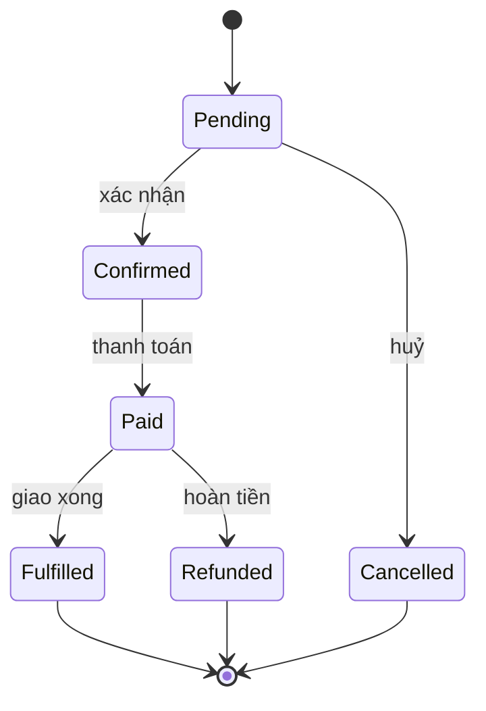
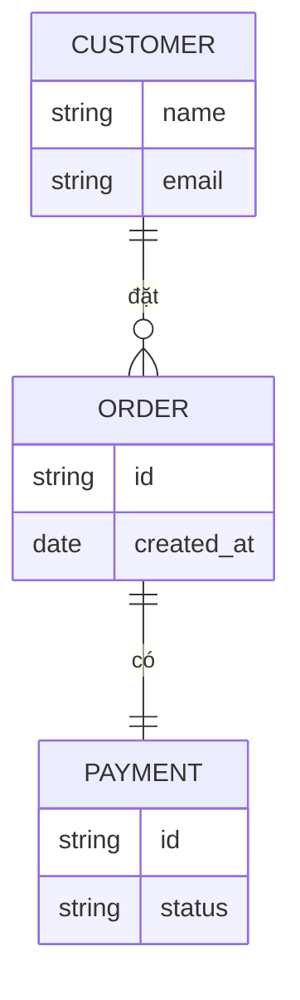

# Dev-Diagram Kit

Bộ skill vẽ sơ đồ và làm tài liệu cho **dev làm công việc BA**, đóng gói thành plugin [Claude Code](https://docs.claude.com/en/docs/claude-code). Mô tả hệ thống hoặc quy trình bằng lời — hoặc trỏ vào một codebase — kit sẽ vẽ đúng loại sơ đồ (Mermaid, PlantUML, D2 hoặc BPMN), tự kiểm cú pháp rồi render. Output song ngữ, tự bám theo ngôn ngữ bạn gõ.

[](LICENSE) &nbsp; 14 skill &nbsp;·&nbsp; Mermaid / PlantUML / D2 / BPMN &nbsp;·&nbsp; EN / VI

[English](README.md) · **Tiếng Việt**

---

## Danh sách skill

Mười bốn skill: mười hai skill vẽ sơ đồ từ mô tả hoặc phỏng vấn; hai skill làm việc từ codebase và tài liệu của bạn.

| Skill | Vẽ gì | Engine | Khi nào dùng |
|---|---|---|---|
| `/sequence` | Sequence diagram — ai gọi ai theo thời gian | Mermaid | Login, thanh toán, webhook, OAuth callback |
| `/activity` | Activity / flowchart có nhánh quyết định | Mermaid | Flow gọn 1–2 vai, nhúng inline GitHub/Obsidian |
| `/activity-swimlane` | Activity **swimlane thật** — mỗi vai một lane | PlantUML | Mặc định cho quy trình đa vai trò nhiều tương tác chéo |
| `/bpmn` | BPMN 2.0 chuẩn OMG, sửa được ngay trên trình duyệt | Engine Node | Import Camunda/Bizagi, hoặc cần ký hiệu OMG |
| `/state` | State diagram — vòng đời entity | Mermaid | Order/Account/Subscription nhiều trạng thái |
| `/erd` | ERD nhúng inline trong Markdown | Mermaid | Data model đọc ngay trong tài liệu |
| `/d2-erd` | ERD standalone, PK/FK rõ | D2 | Data model cho slide / export |
| `/dbdiagram` | Schema DBML + export SQL | DBML CLI | Bàn giao dev, dbdiagram.io / dbdocs.io, enum/index |
| `/d2-activity` | Activity diagram standalone | D2 | Flow nhiều nhánh cần hình đẹp |
| `/d2-architect` | Kiến trúc hệ thống — một hình bối cảnh | D2 | Component / service / DB / dịch vụ ngoài lồng nhau |
| `/system-design` | **C4 đa tầng** (Context → Container → Component) + bản HTML | D2 + HTML | Hệ thống lớn cần zoom nhiều mức + export PNG/PDF |
| `/usecase-diagram` | Use case diagram (actor + use case) | PlantUML | Kickoff, phạm vi hệ thống, include/extend |
| `/scan-project` | **Scan codebase** → bộ sơ đồ kiến trúc (C4 + module + ERD + sequence) | D2 + Mermaid | Reverse-engineer project có sẵn (brownfield) |
| `/sync-confluence` | **Sync code/hội thoại** vào trang Confluence (sửa in-place, preview trước) | Atlassian MCP | Giữ tài liệu khớp logic code mới nhất |

Không biết chọn skill nào? `rules/diagram-selection.md` là kim chỉ nam ánh xạ tình huống sang đúng loại sơ đồ — đây là lý do 14 skill vẫn dễ dùng.

## Ví dụ output

Sơ đồ mẫu cho domain *payment* nhỏ. Ảnh D2, PlantUML, BPMN được render sẵn; Mermaid GitHub tự render. Sơ đồ kiến trúc tự chèn icon công nghệ khi nhận ra tech.

**System Context (C4 L1)** — `/system-design`, `/scan-project`


**Container (C4 L2)** — `/system-design`


**Kiến trúc hệ thống** — `/d2-architect`


**Sequence** — `/sequence` (Mermaid):



**Activity / flowchart** — `/activity` (Mermaid):



**Activity có swimlane** — `/activity-swimlane` (PlantUML):


**BPMN 2.0** — `/bpmn` (sửa được ngay trên trình duyệt):


**State** — `/state` (vòng đời Order, Mermaid):



**ERD, nhúng inline** — `/erd` (Mermaid):



**ERD, đứng riêng** — `/d2-erd`


**Schema DBML** — `/dbdiagram` (+ export SQL):

```dbml
Table customers {
  id uuid [pk]
  email varchar [unique, not null]
}

Table orders {
  id uuid [pk]
  customer_id uuid [ref: > customers.id]
  status varchar [note: 'trạng thái: pending | paid | refunded']
  created_at timestamp
}

Table payments {
  id uuid [pk]
  order_id uuid [ref: > orders.id]
  gateway varchar [note: 'cổng: momo | vnpay']
  amount decimal
}
```

**Sơ đồ activity đứng riêng** — `/d2-activity`


**Use case** — `/usecase-diagram` (PlantUML):


Bản trình bày C4 (dark theme, export PNG/PDF một chạm) ghi ở `docs/{feature}/system-design/`.

## Bắt đầu

Kit viết cho Claude Code. Có hai cách cài.

### Cài bằng plugin (khuyên dùng)

```
/plugin marketplace add https://github.com/nv-minh/dev-diagram-kit
/plugin install dev-diagram-kit
```

Cả 14 lệnh có sẵn ngay. BPMN engine tự cài dependency Node ở phiên đầu qua hook — không phải làm tay.

### Cài kiểu copy (mọi trường hợp / tool khác)

```bash
./install.sh <workspace>     # mặc định: thư mục hiện tại
```

Script copy skill vào `<workspace>/.claude/`, cài BPMN engine, rồi chạy `scripts/doctor.sh` để kiểm công cụ render. Skill resolve đường dẫn dùng chung qua `${CLAUDE_PLUGIN_ROOT:-.claude}` nên cả hai cách cài đều chạy như nhau.

### Công cụ render

Chỉ cài thứ skill bạn dùng cần (`scripts/doctor.sh` báo cái nào thiếu):

- **Mermaid** (`/sequence`, `/activity`, `/state`, `/erd`) — Node, `@mermaid-js/mermaid-cli`, Chrome.
- **D2** (`/d2-*`, `/system-design`, `/scan-project`) — binary `d2`.
- **PlantUML** (`/activity-swimlane`, `/usecase-diagram`) — internet (render qua plantuml.com).
- **DBML** (`/dbdiagram`) — `@dbml/cli`. **BPMN** (`/bpmn`) — Node (tự cài).
- **`/sync-confluence`** — kết nối Atlassian MCP đã xác thực.

### Chạy thử

```
/sequence "Khách đặt món, hệ thống gọi cổng thanh toán, nhà hàng xác nhận" --feature food-delivery
/system-design "Hệ thống đặt món: web/mobile, backend, DB, cổng thanh toán" --feature food-delivery
/scan-project              # reverse-engineer sơ đồ từ codebase hiện tại
```

## Cách hoạt động

- **Không cần nhớ cú pháp.** Bạn mô tả nghiệp vụ; skill lo cú pháp Mermaid/PlantUML/D2/BPMN.
- **Output song ngữ.** Nhãn, câu hỏi, báo cáo bám theo ngôn ngữ input; ép bằng `--lang en|vi` (xem `rules/language.md`). Keyword cú pháp và tên định danh thật giữ nguyên tiếng Anh.
- **Icon công nghệ tự động.** Sơ đồ kiến trúc và `/scan-project` tự chèn logo (Redis, Postgres, Kafka, AWS, nginx, React, …) khi node khớp một công nghệ — Devicon bundle offline + fallback CDN (`rules/icon-map.md`). Tắt bằng `--no-icons`.
- **Đúng mức chi tiết (altitude).** Audience là dev nên chi tiết kỹ thuật (column, endpoint, schema) được dùng khi hợp; kit chọn mức theo loại sơ đồ và người đọc, không cấm đoán.
- **Tự bắt lỗi.** Mermaid compile-check (`mermaid-verify.mjs`); D2/DBML validate qua CLI; BPMN semcheck kiểm phủ; sơ đồ D2/C4 tự soi lại từ ảnh render trước khi báo xong.
- **Human-in-the-loop.** Skill không tự ghi im lặng — mọi thay đổi đều preview và xác nhận trước (`rules/approval-gate.md`). `/sync-confluence` luôn hiện diff và hỏi trước khi đụng trang.

## Cấu trúc repo

```
dev-diagram-kit/
├── .claude-plugin/plugin.json     Manifest plugin (/plugin install)
├── marketplace.json               Catalog marketplace (/plugin marketplace add)
├── install.sh                     Installer kiểu copy (không cần plugin)
├── skills/                        14 skill
├── agents/                        diagram-reviewer
├── rules/                         Rule dùng chung (approval-gate, diagram-selection, language, icon-map, …)
├── scripts/                       mermaid-verify.mjs · doctor.sh · icon-path.sh · render helper
├── templates/                     Khung file diagram
├── hooks/                         SessionStart hook (tự cài BPMN engine)
├── assets/icons/                  Icon công nghệ bundle sẵn (Devicon MIT, Simple Icons CC0)
├── example/                       Ví dụ đầy đủ: feature food-delivery
├── explain-skills/                Giải thích từng skill (song ngữ: `*.md` tiếng Anh, `*.vi.md` tiếng Việt)
├── guides/ · huong-dan/           Hướng dẫn bắt đầu (tiếng Anh / tiếng Việt)
└── INSTALL-*.md · PROMPT-*.md      Port sang Codex CLI và Antigravity IDE
```

## Triết lý: dev vẫn là người điều khiển

Kit không thay tư duy bằng tự động hoá. Sơ đồ do AI vẽ là **bản nháp chất lượng cao để thẩm định**, không phải chân lý: compile-check và coverage bắt lỗi cú pháp và độ phủ, nhưng *đúng-sai nghiệp vụ* là quyết định của bạn. Bạn cung cấp ngữ cảnh, bạn duyệt mọi lần ghi, bạn chịu trách nhiệm với kết quả. Kit lo phần máy móc — nhớ cú pháp, dàn layout, bắt lỗi — để bạn tập trung vào phần chỉ con người làm được.

## Port sang công cụ khác

Kit viết cho Claude Code, kèm hướng dẫn port sang tool agent khác:

- **Codex CLI** — `INSTALL-CODEX.md` (chi tiết) + `PROMPT-CODEX.md` (prompt copy-paste).
- **Google Antigravity IDE** — `INSTALL-ANTIGRAVITY.md` + `PROMPT-ANTIGRAVITY.md`.

## License

MIT — xem [LICENSE](LICENSE). Ghi nguồn bên thứ ba (Cocoon AI, Devicon, Simple Icons) ở [NOTICE](NOTICE).
