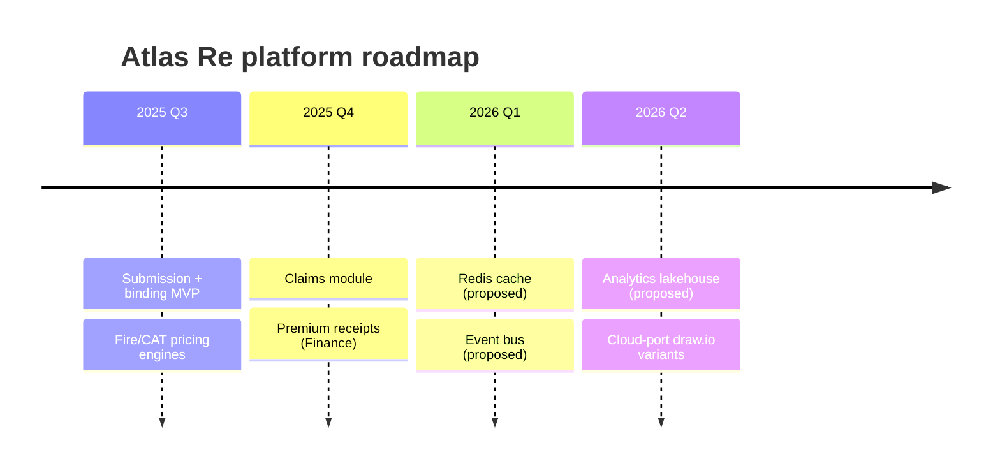

# Atlas Re — roadmap timeline (Mermaid, PM-light)

> Milestones, not a Gantt. Anonymized + illustrative. See [`./DOMAIN.md`](./DOMAIN.md).

%%{init: {'theme':'base', 'themeVariables': {'fontFamily':'JetBrains Mono, ui-monospace, monospace', 'primaryColor':'#F1F5F9', 'primaryTextColor':'#0F172A', 'primaryBorderColor':'#94A3B8', 'lineColor':'#64748B', 'background':'#FFFFFF'}}}%%

