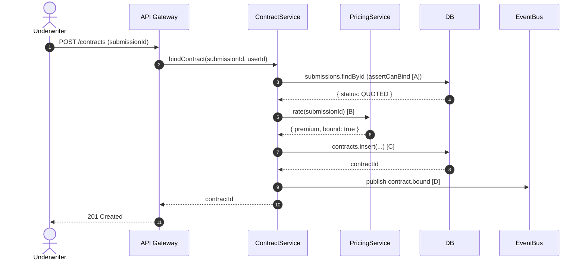

# Atlas Re — code-flow: `bindContract()` (sample)

> `/code-flow` output for the **anonymized sample** at [`sample/contract.service.ts`](./sample/contract.service.ts)
> (NOT real source — written for this example; no real paths). See [`../DOMAIN.md`](../DOMAIN.md).

**Auto-pick:** call-chain across 3 collaborators over time → **sequence**.

%%{init: {'theme':'base', 'themeVariables': {'fontFamily':'JetBrains Mono, ui-monospace, monospace', 'primaryColor':'#F1F5F9', 'primaryTextColor':'#0F172A', 'primaryBorderColor':'#94A3B8', 'lineColor':'#64748B', 'background':'#FFFFFF'}}}%%

## Code provenance

| Step | Symbol | Location | Confidence |
|---|---|---|---|
| [A] | `assertCanBind` → `submissions.findById` + status guard | `sample/contract.service.ts:28-31` | ✅ read |
| [B] | `pricing.rate(submissionId)` → returns `Quote` | `sample/contract.service.ts:19` | ✅ read |
| [C] | `db.contracts.insert({… status: "BOUND" …})` | `sample/contract.service.ts:21-26` | ✅ read |
| [D] | `bus.publish("contract.bound", …)` | `sample/contract.service.ts:27` | ✅ read |
| 1–2 | `POST /contracts` → `bindContract` (controller→service) | *(controller omitted in sample — inferred)* | 🔵 inferred |

**Legend:** ✅ read from source · 🔵 inferred · 🟡 uncertain. The guard at [A] throws if the submission
isn't `QUOTED` — matching the Contract state machine in [`../srs/atlas-re-states.md`](../srs/atlas-re-states.md).
