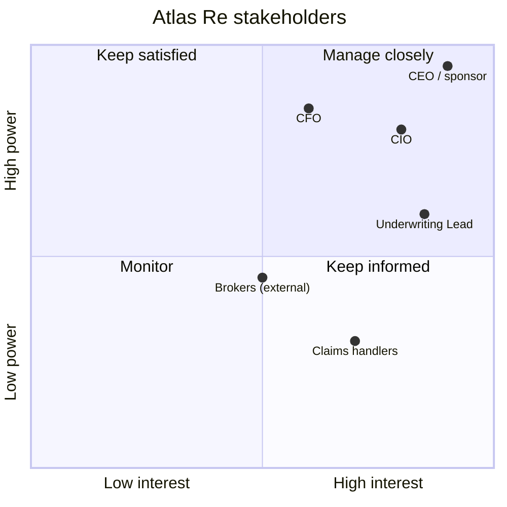

# Atlas Re — stakeholder power / interest

> Companion to [`atlas-re-orgchart.d2`](./atlas-re-orgchart.d2). Coordinates are [interest, power] in 0..1.

%%{init: {'theme':'base', 'themeVariables': {'fontFamily':'JetBrains Mono, ui-monospace, monospace', 'primaryColor':'#F1F5F9', 'primaryTextColor':'#0F172A', 'primaryBorderColor':'#94A3B8', 'lineColor':'#64748B', 'background':'#FFFFFF'}}}%%

- **Manage closely:** CEO/sponsor, CIO — co-own roadmap.
- **Keep satisfied:** CFO — brief on finance milestones.
- **Keep informed:** Underwriting Lead, Claims handlers — share release notes.
- **Monitor:** Brokers — periodic feedback.
