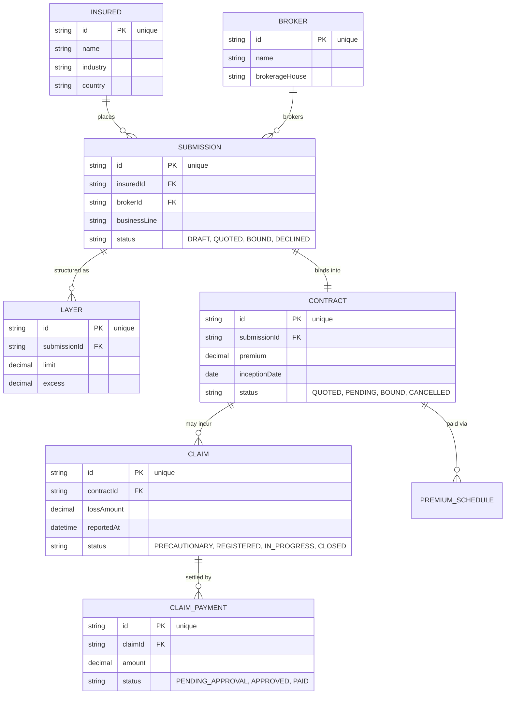

# Atlas Re — data model (ERD, Mermaid inline)

> Anonymized reinsurance underwriting model. See [`../DOMAIN.md`](../DOMAIN.md). Inline so it renders on GitHub/Obsidian.

%%{init: {'theme':'base', 'themeVariables': {'fontFamily':'JetBrains Mono, ui-monospace, monospace', 'primaryColor':'#F1F5F9', 'primaryTextColor':'#0F172A', 'primaryBorderColor':'#94A3B8', 'lineColor':'#64748B', 'background':'#FFFFFF'}}}%%

**Reads:** an Insured (via a Broker) places a **Submission** → structured into **Layers** → bound into a **Contract** → which may incur **Claims** (settled by payments) and is paid via a **Premium schedule**. Cardinality is read off the crow's-foot. Compare with the standalone `/d2-erd` version for a nicer export image.
