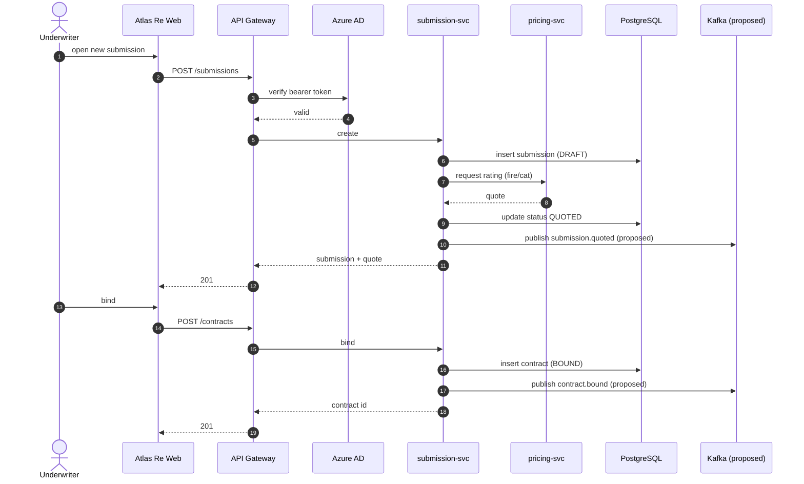

# Atlas Re — flows (sequence + activity, Mermaid inline)

> Anonymized. See [`../DOMAIN.md`](../DOMAIN.md). Inline so it renders on GitHub/Obsidian.

%%{init: {'theme':'base', 'themeVariables': {'fontFamily':'JetBrains Mono, ui-monospace, monospace', 'primaryColor':'#F1F5F9', 'primaryTextColor':'#0F172A', 'primaryBorderColor':'#94A3B8', 'lineColor':'#64748B', 'background':'#FFFFFF'}}}%%

## Submission → Quote → Bind (sequence)

**Reads:** the underwriter drives the submission through quote → bind; auth is checked at the gateway; pricing is async-capable; domain events are published to Kafka (proposed). Kafka + the WebSocket live-pricing path are exercised in `/system-design` and `/dfd`.

## Claim registration (compact activity / flowchart)

**Reads:** a loss is validated against the contract; covered losses become a precautionary claim then
registered; declined claims close. The multi-role approval depth is in `/activity-swimlane` + `/bpmn`.
