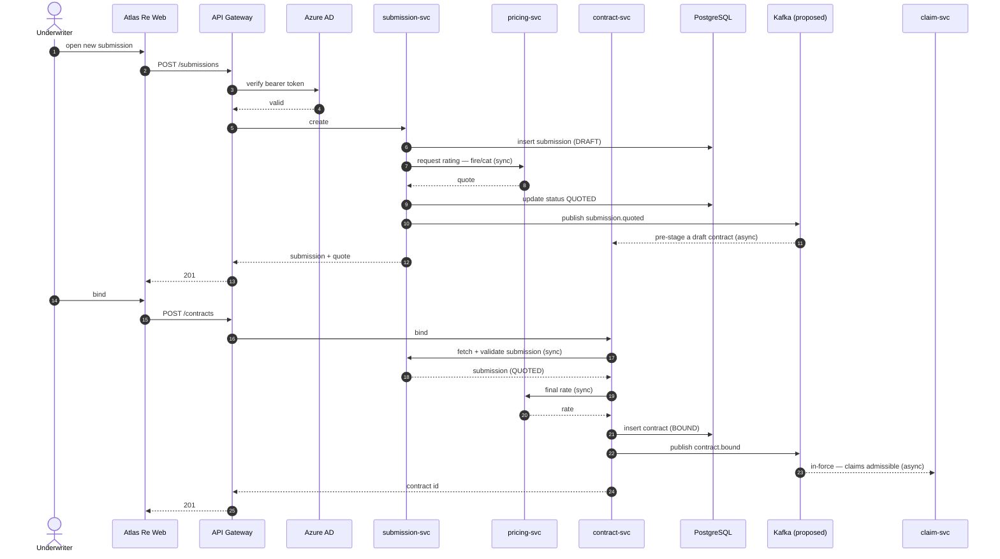
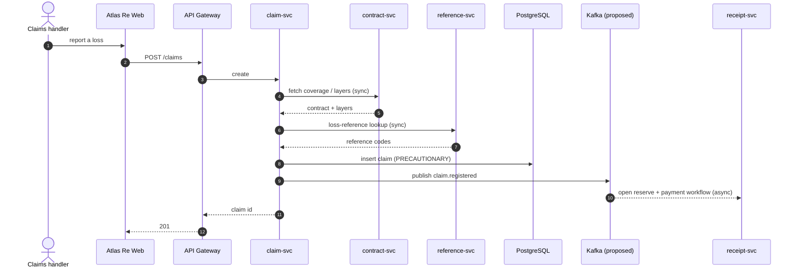
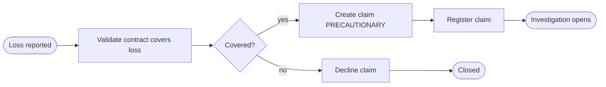

# Atlas Re — flows (sequence + activity, Mermaid inline)

> Anonymized. See [`../DOMAIN.md`](../DOMAIN.md). Inline so it renders on GitHub/Obsidian.

%%{init: {'theme':'base', 'themeVariables': {'fontFamily':'JetBrains Mono, ui-monospace, monospace', 'primaryColor':'#F1F5F9', 'primaryTextColor':'#0F172A', 'primaryBorderColor':'#94A3B8', 'lineColor':'#64748B', 'background':'#FFFFFF'}}}%%

## Submission → Quote → Bind (sequence)

> Realistic inter-service flow: services call each other (sync REST) and the bus fans events out to consumers —
> see [`../DOMAIN.md`](../DOMAIN.md) "Service interactions". The bind is driven by **contract-svc** (it owns the
> Contract entity), not submission-svc.

**Reads:** the underwriter drives submission → quote → bind. Services call each other synchronously —
`submission-svc → pricing-svc` for the quote, `contract-svc → submission-svc` to fetch the bound submission,
`contract-svc → pricing-svc` for the final rate. Domain events fan out asynchronously on Kafka (proposed):
`submission.quoted` → `contract-svc`, `contract.bound` → `claim-svc` (the bus is a backbone with consumers,
not a sink). The WebSocket live-pricing path is exercised in `/system-design` and `/dfd`.

## Claim validation (sequence)

**Reads:** when a loss is reported, `claim-svc` calls `contract-svc` (sync) for the coverage/layers that decide
whether the loss is covered, and `reference-svc` for loss-reference codes, before persisting a precautionary
claim. `claim.registered` is published and consumed by `receipt-svc`/finance. The human approval depth is in
`/activity-swimlane` + `/bpmn`.

## Claim registration (compact activity / flowchart)

**Reads:** a loss is validated against the contract; covered losses become a precautionary claim then
registered; declined claims close. The multi-role approval depth is in `/activity-swimlane` + `/bpmn`.
