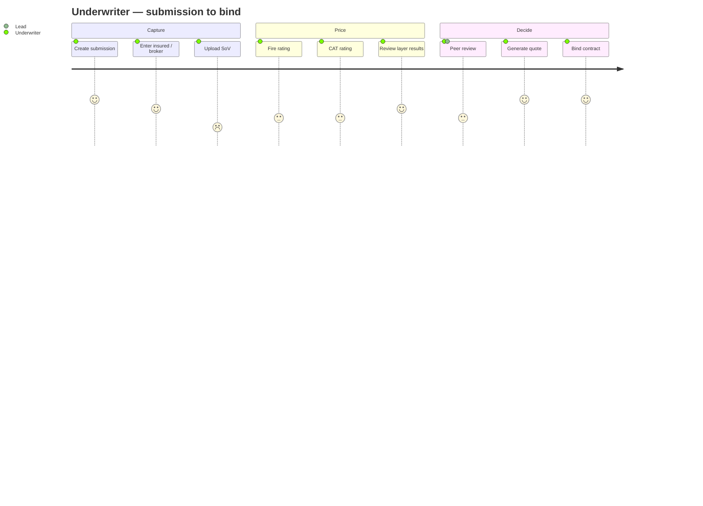

# Atlas Re — underwriter journey (Mermaid inline)

> The underwriter's submission-to-bind experience across the 10 workflow tabs, with a satisfaction
> rating (1 low – 5 high). Anonymized. See [`../DOMAIN.md`](../DOMAIN.md).

%%{init: {'theme':'base', 'themeVariables': {'fontFamily':'JetBrains Mono, ui-monospace, monospace', 'primaryColor':'#F1F5F9', 'primaryTextColor':'#0F172A', 'primaryBorderColor':'#94A3B8', 'lineColor':'#64748B', 'background':'#FFFFFF'}}}%%

**Pain points (low ratings):** *Upload SoV* (2) — manual file prep + validation; *Fire/CAT rating* (3) —
slow async waits. These are the journey's improvement candidates.
