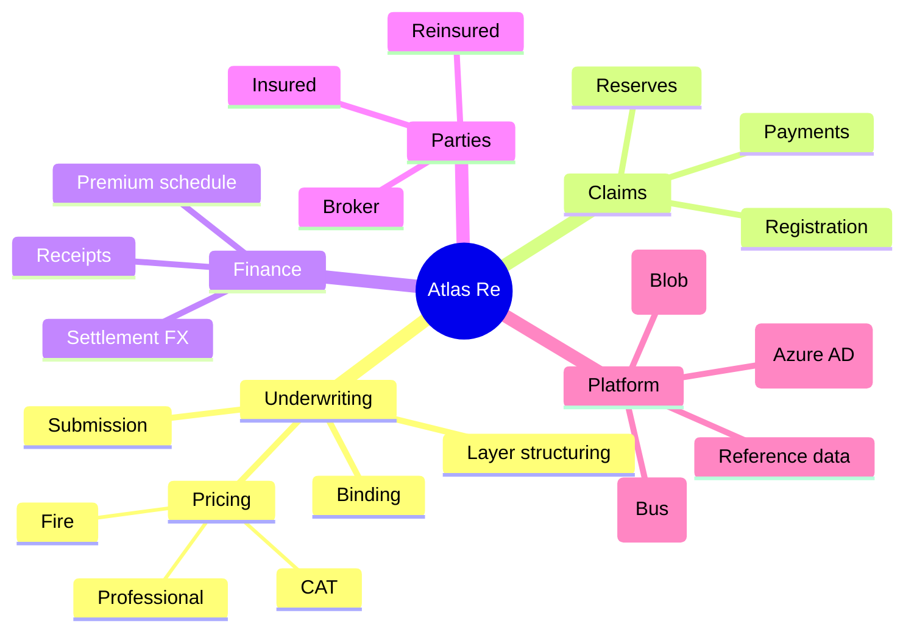

# Atlas Re — scope decomposition (Mermaid mindmap)

> Discovery view: what the platform covers, before the SRS. Anonymized. See [`../DOMAIN.md`](../DOMAIN.md).

%%{init: {'theme':'base', 'themeVariables': {'fontFamily':'JetBrains Mono, ui-monospace, monospace', 'primaryColor':'#F1F5F9', 'primaryTextColor':'#0F172A', 'primaryBorderColor':'#94A3B8', 'lineColor':'#64748B', 'background':'#FFFFFF'}}}%%

