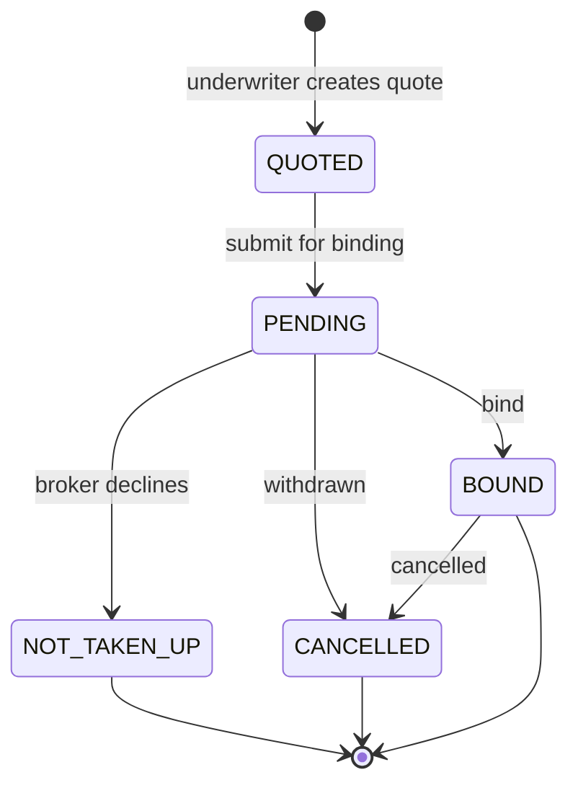
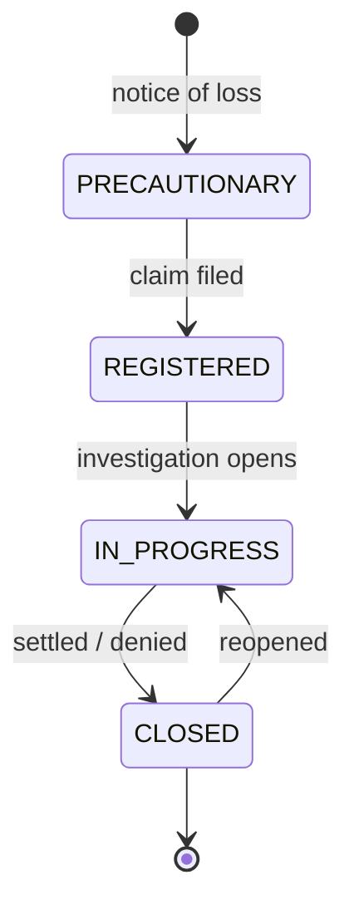

# Atlas Re — state machines (Mermaid inline)

> Anonymized. See [`../DOMAIN.md`](../DOMAIN.md). Inline so it renders on GitHub/Obsidian.

%%{init: {'theme':'base', 'themeVariables': {'fontFamily':'JetBrains Mono, ui-monospace, monospace', 'primaryColor':'#F1F5F9', 'primaryTextColor':'#0F172A', 'primaryBorderColor':'#94A3B8', 'lineColor':'#64748B', 'background':'#FFFFFF'}}}%%

## Contract lifecycle

## Claim lifecycle

**Reads:** a Contract moves QUOTED → PENDING → BOUND (or NOT_TAKEN_UP / CANCELLED); a Claim moves PRECAUTIONARY → REGISTERED → IN_PROGRESS → CLOSED and may REOPEN. These match the `status` enums in [`atlas-re-erd.md`](./atlas-re-erd.md) and [`../dbdiagram/atlas-re.dbml`](../dbdiagram/atlas-re.dbml).
