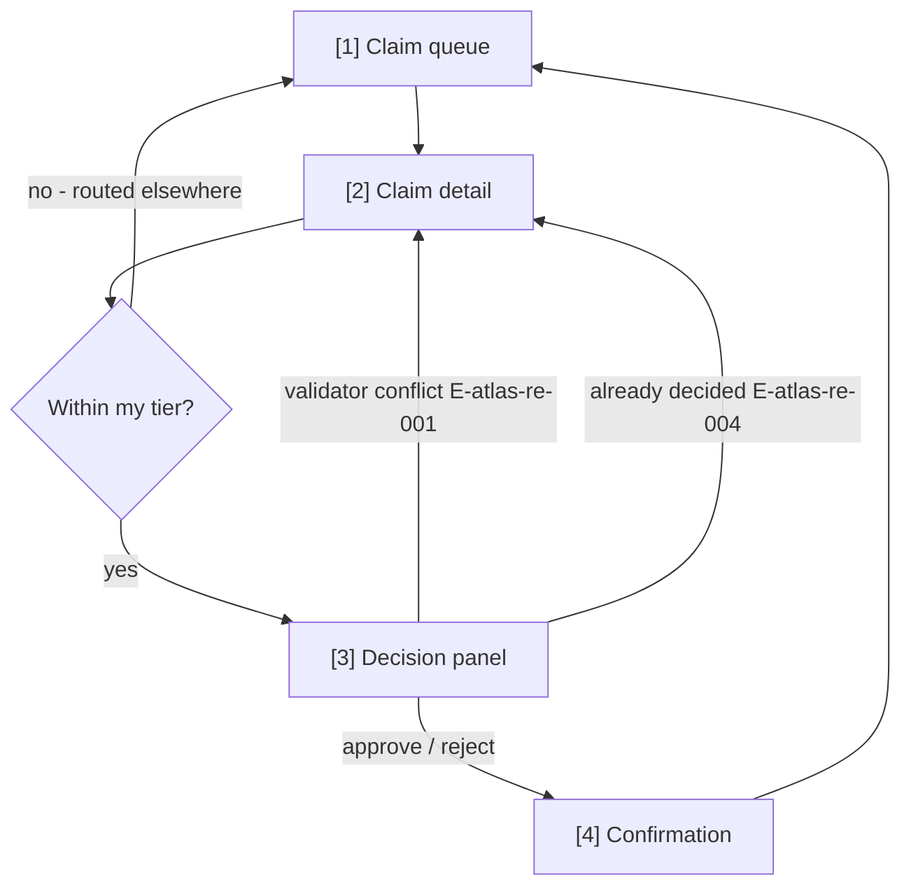
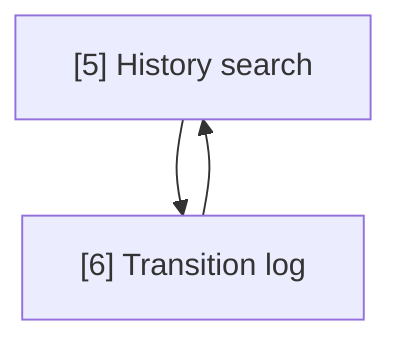

# Atlas Re claim approval — User Flow

## Flow: approve-claim

Screens: `[1] Claim queue` — tier-filtered work list · `[2] Claim detail` — amount, reserve check, history · `[3] Decision panel` — approve/reject with note · `[4] Confirmation` — recorded decision + next claim

## Flow: review-history

Screens: `[5] History search` — filter by contract/cedent/period · `[6] Transition log` — the append-only trail

