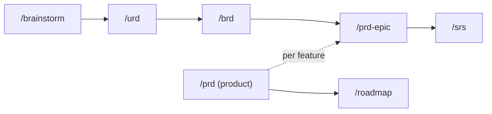

---
paths:
  - ".claude/skills/ba/**"
  - ".claude/skills/brainstorm/**"
  - ".claude/skills/urd/**"
  - ".claude/skills/brd/**"
  - ".claude/skills/prd-epic/**"
  - ".claude/skills/prd/**"
  - ".claude/skills/roadmap/**"
  - ".claude/skills/srs/**"
  - ".claude/skills/usecase/**"
  - ".claude/skills/userstory/**"
  - ".claude/skills/ac/**"
  - ".claude/skills/user-flow/**"
  - ".claude/skills/wireframe-ascii/**"
  - ".claude/skills/wireframe-html/**"
  - ".claude/skills/prototype-html/**"
  - ".claude/skills/figma/**"
  - ".claude/skills/api-assess/**"
  - ".claude/skills/api-doc/**"
  - ".claude/skills/api-design/**"
  - ".claude/skills/api-map/**"
  - ".claude/skills/api-checklist/**"
  - ".claude/skills/api-test/**"
  - ".claude/skills/api-readiness/**"
  - ".claude/skills/test-checklist/**"
  - ".claude/skills/test-cases/**"
  - ".claude/skills/gap/**"
  - ".claude/skills/cr/**"
  - ".claude/skills/reverse-doc/**"
  - ".claude/skills/jira/**"
  - ".claude/skills/confluence/**"
  - ".claude/skills/export/**"
  - ".claude/skills/userguide/**"
  - ".claude/skills/meeting/**"
  - ".claude/skills/inbox/**"
  - ".claude/skills/doc-review/**"
  - ".claude/skills/dashboard/**"
  - "docs/**/*-urd.md"
  - "docs/**/*-brd.md"
  - "docs/**/*-prd.md"
  - "docs/**/brainstorms/**"
  - "docs/**/srs/*-spec.md"
  - "docs/**/usecases/**"
  - "docs/**/userstories/**"
  - "docs/_product/**"
  - "docs/cr/**"
---

# Doc Selection — Which document skill to use when

> Guide for developers doing BA work: pick the right **document** skill for each situation. This is the source of truth behind the `/ba` router — the same way `rules/diagram-selection.md` backs `/diagram`.

## Document or diagram? (level-1 fork)

- Producing **prose / tables / specs / tests / sync to external tools** → this file (router `/ba`).
- Producing a **picture** (sequence, activity, ERD, architecture, BPMN, wireframe is NOT a picture skill — it is a doc skill) → `rules/diagram-selection.md` (router `/diagram`).
- **Both** — an SRS embeds diagrams: the doc skill orchestrates and calls the diagram skills (e.g. `/srs` offers a menu of `/sequence` `/state` `/erd` after the spec is written).

## Status column

`✓` = the skill exists and can be routed to. `planned (wave N)` = the slot is reserved by the roadmap but the skill has not landed — the router must tell the user "coming in wave N" instead of delegating. Flip the row to `✓` in the same PR that lands the skill.

## Decision matrix — Discovery & requirements

| Business situation | Skill | Output file | Status | Reason |
|---|---|---|---|---|
| Explore one raw idea — nothing structured yet, need OQs surfaced | `/brainstorm` | `docs/{feature}/brainstorms/{idea-slug}.md` | ✓ | The root of the discovery chain; OQ cascade starts here (`resolve-oqs.md`) |
| What USERS need — personas, pains, context of use | `/urd` | `docs/{feature}/{feature}-urd.md` | ✓ | User altitude; mints `UN-{feature}-{NNN}` |
| The BUSINESS case — objectives, scope, cost-benefit, risks | `/brd` | `docs/{feature}/{feature}-brd.md` | ✓ | Money/why altitude; mints `BO-{feature}-{NN}` |
| What we'll build for ONE feature — capabilities P0/P1/P2 | `/prd-epic` | `docs/{feature}/{feature}-prd.md` | ✓ | Feature altitude; mints `CAP-{feature}-{NN}` |
| Define the WHOLE product — pitch, problem, themes, Feature Map | `/prd` | `docs/_product/prd.md` (singleton) | ✓ | Product altitude, project-level |
| Sequence/prioritize features — RICE-lite, Now/Next/Later | `/roadmap` | `docs/_product/roadmap.md` (singleton) | ✓ | Prioritized plan doc; `/timeline` is the visual milestones diagram |
| Precise SYSTEM behavior — FR/NFR/BR/error matrix | `/srs` | `docs/{feature}/srs/{feature}-spec.md` | ✓ | System-shall altitude; mints `FR-/NFR-/BR-/E-`; offers the diagram menu after |

## Decision matrix — Specification

| Business situation | Skill | Output file | Status | Reason |
|---|---|---|---|---|
| Actor-goal narrative with extensions (Cockburn fully-dressed) | `/usecase` | `docs/{feature}/usecases/uc-{slug}.md` + `{feature}-usecase-index.md` | planned (wave 2) | Text detail; the visual scope stays `/usecase-diagram` |
| Dev-ready backlog items (INVEST slices of FRs) | `/userstory` | `docs/{feature}/userstories/us-{NNN}.md` + `{feature}-story-index.md` | planned (wave 2) | Mints `US-{NNN}`; needs the SRS |
| Pass/fail conditions per story (Given-When-Then) | `/ac` | edits `us-{NNN}.md` in place | planned (wave 2) | Mints `AC-{NNN}`; pure edit skill, always L2 |
| Screen-navigation flowchart (the SOLE source of flow division) | `/user-flow` | `docs/{feature}/srs/{feature}-userflow.md` | planned (wave 2) | Prerequisite for every wireframe skill |

## Decision matrix — UI design

| Business situation | Skill | Output file | Status | Reason |
|---|---|---|---|---|
| Sketch screens, review in chat (ASCII + 5-column description) | `/wireframe-ascii` | `docs/{feature}/ascii-wireframe/{flow-slug}.md` + `{feature}-wireframe-index.md` | planned (wave 3) | L3-capable (renders in chat); `ba-conventions.md` §6–8 |
| B&W static HTML wireframes, browser review | `/wireframe-html` | `docs/{feature}/html-wireframe/{flow-slug}.html` + entry `{feature}-wireframe.html` | planned (wave 3) | Renderer on par with ascii, browser fidelity |
| Clickable multi-screen demo | `/prototype-html` | `docs/{feature}/html-design/{feature}-prototype.html` | planned (wave 3) | Navigation actually works |
| Push wireframes to Figma frames | `/figma` | Figma URLs in `{feature}-wireframe-index.md` (no local file) | planned (wave 3) | External-write hard gate |

## Decision matrix — API integration (7-step chain)

Shared rule: `rules/api-integration.md`. Chain order with skip conditions lives there.

| Step | Skill | Output file | Status |
|---|---|---|---|
| [0] Build-vs-buy / provider selection (skip when provider fixed) | `/api-assess` | `docs/{feature}/integration/api-assess.md` | planned (wave 5) |
| [1] Digest the 3rd-party contract | `/api-doc` | `docs/{feature}/integration/api-summary.md` | planned (wave 5) |
| [2] Integration Blueprint (orchestration/webhook/retry/reconciliation) | `/api-design` | `docs/{feature}/integration/api-design.md` | planned (wave 5) |
| [3] 3-layer field mapping | `/api-map` | `docs/{feature}/integration/api-map.md` | planned (wave 5) |
| [4] Integration test outline | `/api-checklist` | `docs/{feature}/test/api/api-checklist.md` | planned (wave 5) |
| [5] Bruno collection + test table | `/api-test` | `docs/{feature}/test/api/api-tests.md` + `bruno/` | planned (wave 5) |
| [6] Go-live gate + go/no-go | `/api-readiness` | `docs/{feature}/integration/api-readiness.md` | planned (wave 5) |

## Decision matrix — Testing

| Business situation | Skill | Output file | Status | Reason |
|---|---|---|---|---|
| Test-coverage OUTLINE from FR/BR/E/AC | `/test-checklist` | `docs/{feature}/test/checklist/{feature}-checklist-index.md` | planned (wave 4) | Mints `CHK-{NNN}` |
| Full test cases (steps/data/expected) from the checklist | `/test-cases` | `docs/{feature}/test/testcases/{feature}-testcase-index.md` | planned (wave 4) | Mints `TC-{NNN}`; refuses without a checklist |

## Decision matrix — Traceability & change

| Business situation | Skill | Output file | Status | Reason |
|---|---|---|---|---|
| What's missing/orphaned ACROSS docs (coverage matrix) | `/gap` | `docs/_shared/traceability.md` | planned (wave 4) | Cross-doc; the per-feature matrix lives in `{feature}-usecase-index.md` |
| Scope changed — record + impact + rollback + guided apply | `/cr` | `docs/cr/CR-{YYYYMMDD}-{NNN}.md` | planned (wave 4) | Self-contained CR file |
| Reconstruct BA docs from LEGACY sources (docx/pdf/code) | `/reverse-doc` | `docs/{feature}/reverse-{feature}.md` | planned (wave 4) | Source-driven; code diagrams → `/scan-project` |

## Decision matrix — Delivery & sync

| Business situation | Skill | Output file | Status | Reason |
|---|---|---|---|---|
| Push/sync user stories to Jira issues | `/jira` | sync-state + `jira-key` column in story index | planned (wave 6) | Hard HITL gate per `atlassian-sync.md` |
| Publish vault docs as a Confluence page tree | `/confluence` | sync-state `mappings.confluence` | planned (wave 6) | For docs→pages; code-diff→existing page = `/sync-confluence` (exists) |
| Sync a code diff / conversation into an EXISTING Confluence page | `/sync-confluence` | in-place page update | ✓ | Already shipped in 1.x |
| Stakeholder package (md/html/pdf/docx) | `/export` | `docs/exports/{date}-{scope}-package.{ext}` | planned (wave 6) | Snapshot with change history |
| End-user manual | `/userguide` | `docs/userguide/…` | planned (wave 6) | Entry `.html` + bundle |
| Meeting minutes (decisions/blockers/actions as tables) | `/meeting` | `docs/meetings/YYYY-MM-DD-{type}-{slug}.md` | planned (wave 6) | Structured capture |
| Zero-friction capture + later triage | `/inbox` | `docs/inbox/YYYY-MM-DD-{slug}.md` | planned (wave 6) | Raw capture; triage routes via `/ba` |
| Multi-agent doc quality review + apply accepted fixes | `/doc-review` | edits target docs | planned (wave 6) | Renamed from the declared `/review` slot (ecosystem collision) |
| One-file HTML vault status | `/dashboard` | `docs/_shared/dashboard.html` | planned (wave 6) | Status view; coverage = `/gap` |

## Disambiguation

### `/usecase` vs `/usecase-diagram`
`/usecase` = the fully-dressed Cockburn TEXT document per use case (Main Success Scenario, Extensions). `/usecase-diagram` = the visual actor/UC scope picture (PlantUML). They share `{feature}-usecase-index.md`.

### `/confluence` vs `/sync-confluence`
`/confluence` (wave 6) publishes kit-generated vault docs as new/owned Confluence pages with mapping state. `/sync-confluence` (exists) updates an EXISTING page from a code diff or conversation, in place. Pushing your BA docs → `/confluence`; keeping a known page current with code → `/sync-confluence`.

### `/prd` vs `/prd-epic`
`/prd` = the product-level singleton (`docs/_product/prd.md`): pitch, problem, users, themes, Feature Map. `/prd-epic` = one feature's PRD (`docs/{feature}/{feature}-prd.md`): capabilities P0/P1/P2. "PRD for the checkout feature" → `/prd-epic`; "PRD for the whole product" → `/prd`.

### `/gap` vs the per-feature use-case matrix
The `## Use cases` table in `{feature}-usecase-index.md` is the quick per-feature UC↔FR↔Screen↔Error↔OQ read. `/gap` aggregates ACROSS features and docs into `docs/_shared/traceability.md` (orphans, uncovered IDs, stale chains).

### `/reverse-doc` vs `/scan-project`
Both are brownfield. `/reverse-doc` reconstructs BUSINESS documents (12-section framework, confidence levels) from any legacy source (docx/pdf/images/code). `/scan-project` generates the architecture DIAGRAM set from source code only.

### `/roadmap` vs `/timeline`
`/roadmap` = the prioritized plan document (RICE-lite scores, Now/Next/Later, dependency map). `/timeline` = the visual milestone diagram (Mermaid). A roadmap doc can embed a timeline.

## One-line summary

> **Raw idea → Brainstorm. User needs → URD. Business case → BRD. One feature's what → PRD-epic. Whole product → PRD. Prioritize → Roadmap. System-shall → SRS. Actor narrative → Usecase (w2). Backlog → Userstory (w2). Pass/fail → AC (w2). Screen nav → User-flow (w2). Sketch screens → Wireframe-* (w3). Third-party API → api-* chain (w5). Test outline/cases → test-* (w4). Cross-doc coverage → Gap (w4). Scope change → CR (w4). Legacy docs → Reverse-doc (w4). Jira/Confluence/export/guide/minutes → delivery skills (w6). Anything visual → `/diagram`. Not sure → `/ba`.**
