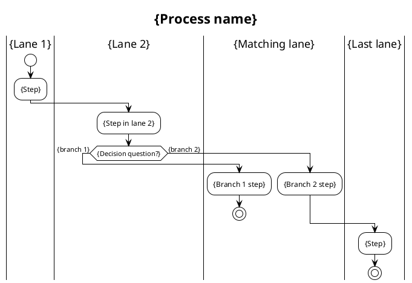

# /activity-swimlane — Activity Diagram with True Swimlanes (PlantUML)

> Three activity-diagram choices: `/activity` (Mermaid, inline auto-render in GitHub/Obsidian) · `/d2-activity` (D2+ELK, pretty standalone image) · `/activity-swimlane` (PlantUML, **true swimlanes** for multi-role flows with many cross-lanes). Need the OMG standard for Camunda import → `/bpmn`.

## Goal

Draw a multi-role business process as an activity diagram with **true swimlanes** using [PlantUML](https://plantuml.com) `|Lane|` syntax: each role in a fixed column lane, nodes "jump" to the lane of the responsible actor, decisions as standard UML hexagons. Render via plantuml.com (no local Java needed).

**Why this skill is needed alongside `/activity` + `/d2-activity`:** multi-role flows with lots of back-and-forth (e.g. refund: Customer ↔ System ↔ Agent ↔ Manager continuously) make **Mermaid subgraph** skew (a subgraph is just a decorative frame, nodes drift freely) and **D2/ELK** pull lanes apart, cramming edges into "spaghetti". PlantUML `|Lane|` keeps lanes in **fixed** columns, and its layout engine is dedicated to swimlane activity — this is the right tool for this kind of flow.

**Output** (2 places, per user's choice on 2026-07-12):
1. Source + image in `srs/`: `docs/{feature}/srs/{feature}-{slug}-swimlane.puml` (source, git-tracked) + `.svg` (pre-rendered).
2. An image-embedding section in `srs/{feature}-flows.md`: `## Flow: {title} (Swimlane)` containing `` + Trigger/Related — same file as `/activity`, `/sequence`.

## Constraints

- **Fixed output**: `.puml`+`.svg` in `srs/`, an image-embedding section in `srs/{feature}-flows.md`. NO layout/theme/direction flags.
- **Render via plantuml.com** (`render.sh`) — this machine has NO Java. **TRADE-OFF**: the diagram content (lane/step names) is sent over the internet on each render. Sensitive content → do not use this skill (see Gotchas).
- **AI writes the .puml source, does NOT compute coordinates** — the PlantUML layout engine handles that. The AI's role = describe the business correctly (lanes/steps/branches/loops).
- **Compile must PASS** before reporting done. `render.sh` catches both HTTP errors and "Syntax Error" embedded in the SVG. Fail → fix the source, re-render (up to 2 times).
- **REVIEW THE IMAGE YOURSELF after rendering** (mandatory step — see Approach 7) — render `.png`, Read the image, and inspect arrows/lanes/dead-ends **before** reporting to the user. This is how to catch "arrows displayed incorrectly" errors that the compile check misses.
- **L1 approval** before Write — BA-friendly prose (see `ba-conventions.md` Section 5), in business terms (steps / branches / roles), do NOT dump the PlantUML source.
- **NO L3 iterate** — PlantUML does not render in chat; the user reviews from the `.svg`. (The skill reviews via the PNG image itself in step 7 on the user's behalf.)
- **Bilingual (mirror input — @../../rules/language.md)** in labels (PlantUML supports Unicode); syntax keywords in English.
- **`--feature` optional** — auto-detect from context; only ask when ambiguous. **Feature does not exist + arg is a process description → auto-derive slug + create feature** (entry point, `feature-bootstrap.md` group A).
- **Idempotent** — slug already exists → enter update mode automatically (L2 diff for the .puml + the flows.md section), re-render.

## Standard formula (mandatory requirements for every diagram — distilled from the standard IT-BA prompt)

Every swimlane diagram the skill produces MUST satisfy:

1. **Swimlanes by role** — each role in a lane `|Lane name|`, propose lanes from the process + user flow.
2. **Clear start** (`start`) + **every branch has an end** (`stop` or `end`) — NO loose ends.
3. **Cover** every activity, decision, outcome from the business source.
4. **Yes/no decisions** (`if (...) then (...) else (...) endif`) at every branch point.
5. **Inter-lane interactions** shown by nodes switching lanes (`|Other lane|` before the activity).
6. **Logical + complete flow, no loose ends** — every node has an outgoing path to an end.
7. **Note for complex steps** (`note right: ...`) when clarification is needed.
8. **Default colors** — NO custom coloring (use `!theme plain` for a clean background).
9. **AVOID double quotes `"..."`** in the syntax — PlantUML activity does not need quoted labels; quotes cause parse errors. Leave labels with spaces/diacritics unquoted.
10. **Clean, uncluttered layout** — place nodes logically, minimize crossing arrows (see the arrow Gotchas).

## Inputs

```
/activity-swimlane "<process description>" --feature <slug>     # create new
/activity-swimlane --feature <slug>                          # interactive: ask which process to draw
/activity-swimlane "<new feature process description>"        # feature doesn't exist → derive slug + interview + create (entry point)
```

Matching existing slug → the skill enters update mode automatically (L2 diff), no extra typing needed.

## Context (dynamic)

```bash
echo "Today: $(date +%F)"
echo "Available features:"; ls -d docs/*/ 2>/dev/null | sed 's|docs/||;s|/||' | grep -v '^_'
echo "Features with swimlane .puml:"; ls docs/*/srs/*-swimlane.puml 2>/dev/null | sed 's|docs/\([^/]*\)/.*|\1|' | sort -u || echo "(none yet)"
echo "python3:"; command -v python3 >/dev/null && echo "✅" || echo "❌ MISSING — the skill needs python3 to encode"
echo "internet plantuml.com:"; curl -s -o /dev/null -w "%{http_code}" --max-time 5 https://www.plantuml.com/plantuml/ 2>/dev/null || echo "unreachable"
```

## Flow runtime (how the skill runs)

```
User calls /activity-swimlane "<description>" --feature X
   │
   ▼
1. Resolve feature + process slug (verb-object kebab-case from the description, max 40 chars)
   │  ┌─ Feature does not match any docs/{feature}/ (entry point, feature-bootstrap.md group A):
   │  │  arg is a process description → derive feature slug, confirm at L1, create docs/{feature}/srs/ on Write.
   │  │  arg is a 1-word unknown slug → ask "new feature or typo?" (list existing features).
   │  └─ python3/internet missing → stop, report 1 line (see Context). Do NOT write an empty file.
   ▼
2. Read the business source:
   │  ┌─ Exists: read brainstorms/*.md (Decision Points, State Transitions), srs/{feature}-spec.md,
   │  │  usecases/uc-*.md → get steps/branches/lanes/loops, no-re-ask what already exists.
   │  └─ NO source yet: interview EXACTLY the scope (feature-bootstrap.md group A step 3), 1 batch of
   │     business-language: sequential steps · decision points (question + yes/no branches) · lanes
   │     (who does which step) · loops (retry/go back). Do NOT ask about DB/SDK. Do NOT fabricate.
   ▼
3. Determine: lanes | steps per lane | decisions (yes/no) | loop/parallel | outcome per branch
   ▼
3.5. Confirm lanes BEFORE drawing (MANDATORY if ≥1 lane) — print "Detected {N} roles: {list}. Complete?"
   │  An actor hidden/implied in the text is easily missed — wait for the user to confirm/add.
   ▼
4. Extract a fact-list (keep in context): lanes · each decision + branches · each branch outcome must reach a stop.
   ▼
5. Write the .puml source (formula below) — the AI describes structure, NO coordinates. Follow the 10 "Standard formula" points.
   ▼
6. L1 plan preview (BA-friendly prose: N steps, M decisions, K lanes). User Y → continue.
   ▼
7. Write .puml → render.sh --png → SVG + PNG.
   │  compile/syntax fail? → read the error, fix the source, re-render (up to 2 times).
   │  → THEN Read the .png file: SELF-INSPECT arrows point the right way? lanes correct? every branch reaches a stop? no overlaps?
   │    Spot a display error → fix .puml, re-render, re-inspect (up to 2 rounds). See the step 7 checklist.
   ▼
8. Append a section to srs/{feature}-flows.md (embed ). flows.md missing → create a skeleton.
   ▼
9. Coverage-verify: does each fact-list decision become an if/else? each lane a |Lane|? every branch reaches a stop?
   │  Missing → add to .puml, re-render + re-inspect, up to 2 times.
   ▼
10. Update srs/{feature}-flows.md updated + env note → activity.log. Tell the user to open the .svg.
```

## How to build (build step-by-step)

### Step 1 — Formula for writing the .puml source (swimlane activity)



**GOLDEN rules for correct arrows/lanes (this is the most error-prone part):**

- **Place `|Lane|` RIGHT BEFORE the `:activity;` that belongs to that lane** — do NOT place it after, do NOT bunch several `|Lane|` together. Wrong position = arrows jump to the wrong lane.
- **Inside each if/else branch, you MUST re-declare `|Lane|`** before the activity if that step is in a different lane — PlantUML does not remember the lane inside a branch.
- **Every branch must end with `stop`** (if it is its own end) OR converge naturally after `endif` (flow continues downward). Do NOT leave a branch empty.
- **An `if` with `stop` on only one side**: the other branch does NOT need `stop` — it flows on after `endif`. Put `stop` on both branches when both are real ends.
- **Loop (retry)** — use `repeat`/`repeat while (...)` for retry-until, or `while (...) is (...) ... endwhile`. AVOID manually wiring a backward `->` (prone to messy arrows). Simple retry template:
  ```plantuml
  repeat
    :Call Stripe refund;
  repeat while (Failed and fewer than 3 tries?) is (Yes) not (No)
  ```
- **Loop with a PROCESSING STEP on the way back** (e.g. "seat already booked → show error → re-select") — use `backward:` inside the repeat block to draw the step on the return path:
  ```plantuml
  repeat
    :Select seat;
    backward:Show error Seat unavailable, re-select;
  repeat while (Seat already booked?) is (Booked) not (Available)
  ```
  `backward:` renders a compact loop arrow + a step label, nicer than wiring it yourself. (See `references/example-movie-booking.puml`.)
- **ABSOLUTELY do NOT use `goto`/`label`** — a beta feature that does NOT render connecting arrows (verified: `goto` creates dangling nodes/dead-ends). A branch that needs to "jump" to a shared segment (e.g. both D5 rejection branches lead to "notify customer + quota") → ACCEPT duplicating the shared segment's code in each branch; better to duplicate than to dead-end. Don't try `goto`.
- **Switching lanes inside a loop** also requires declaring `|Lane|` each time.
- **Decision with >2 branches** — PlantUML activity if/else has only 2 branches; for ≥3 branches use `if ... elseif (...) then ... else ... endif`.
- **Do NOT wrap labels in `"..."`** (requirement #9). Special characters in a label like `«»`, `:` — `«»` is OK unquoted; a `:` in a label MUST be escaped or avoided (an activity ends with `;`, but a `:` mid-label is usually OK — if compile fails because of `:`, change it to a dash).
- **`note`** for a complex step: `note right`\n`multi-line content`\n`end note` — place it right after the activity being annotated.

### Step 2 — Render + self-verify

```bash
"${CLAUDE_PLUGIN_ROOT:-.claude}/skills/activity-swimlane/render.sh" docs/{feature}/srs/{feature}-{slug}-swimlane.puml --png
# fail → read the error (HTTP or "Syntax Error" in the SVG), fix the source, re-run.
# PASS → Read the .png file, self-inspect (step 7 checklist). Display error → fix .puml, re-render.
```

### Step 3 — Section in flows.md

```markdown
## Flow: {Title} (Swimlane)
**Trigger**: {1-line}
**Related UC**: [[../usecases/uc-{slug}.md]] (if present, else TBD)
**Related FR**: {ids or TBD}


> PlantUML source: `{feature}-{slug}-swimlane.puml`. Edit .puml → run `render.sh` to regenerate .svg.
```

## Step 7 — SELF-REVIEW IMAGE checklist (solves "arrows displayed incorrectly")

After render PASS, Read the `.png` file and self-inspect EACH item (this is what the user requested: check → demo → self-review → update):

- [ ] **Arrow direction**: every arrow flows in the correct process direction (no abnormal reverse arrows except intentional loops).
- [ ] **Lane matches the subject**: each node sits in the lane of the actor who ACTUALLY performs that step (e.g. "Call Stripe" must be in the System lane, not the Customer lane).
- [ ] **No dead-ends**: every path leads to a `stop`/`end`. In the image, no node is "dangling" without an outgoing path.
- [ ] **Decisions have both branches**: each hexagon has exactly 2 (or n) labeled outgoing paths.
- [ ] **Correct loop**: the retry arrow returns to the correct node, with an exit condition.
- [ ] **No heavy overlap/clutter**: edges do not overlap to the point of being unreadable. If too cluttered → consider splitting into 2 diagrams or reducing cross-lane edges.

Any item fails → fix `.puml`, re-render `--png`, re-inspect. Up to 2 rounds. Still failing after 2 rounds → tell the user exactly which item did not pass + a suggestion (split the diagram / revise the description), do NOT silently report "done".

## L1 plan preview (BA-friendly template)

> I will draw a **swimlane diagram** for the **{name}** process (PlantUML, true lanes):
>
> **Content:**
> - {K} role lanes: {list}
> - {N} processing steps, {M} decision branches (e.g. "Order valid?", "Stripe succeeded?")
> - Start point: {...}; end points: {...}
> - {loop/note if any}
>
> **Write to:** source `srs/{feature}-{slug}-swimlane.puml` + `.svg` image, embed a section in `srs/{feature}-flows.md`.
>
> **Logged:** activity log "{note}".
>
> Apply? (Y / edit)

## Output report

```
✅ Swimlane diagram: docs/{feature}/srs/{feature}-{slug}-swimlane.svg
   Lanes: {K} | Steps: {N} | Decisions: {M} | Compile: OK | Image self-review: PASS
   Embedded section: docs/{feature}/srs/{feature}-flows.md → ## Flow: {title} (Swimlane)

Open the .svg (or the section in flows.md) to see the rendered swimlane.
Need changes? /activity-swimlane "<change>" --feature {feature} (the skill enters update mode automatically).
```

## Gotchas

- **python3 / internet missing** → stop right at step 1, print exactly 1 line. Do NOT write an empty file.
- **Sensitive content** — rendering sends lane/step names via plantuml.com. Sensitive → do NOT use this skill (install Java + plantuml.jar locally for offline, out of scope for the skill).
- **Arrows jump to the wrong lane** (the #1 common bug) — caused by `|Lane|` placed wrong (must be RIGHT BEFORE the activity) or forgetting to re-declare `|Lane|` inside an if/else branch. See the "Golden rules" in step 1. The step 7 image self-review catches this.
- **Dead-ends** — an if/else missing `stop` on an end branch, or forgetting `endif`. Compile may still PASS but the image exposes a dangling node → step 7 catches it.
- **Messy loops** — manually wiring a backward `->` easily produces overlapping arrows. Use `repeat/repeat while` or `while/endwhile` (step 1). ≥2 nested loops → split into 2 diagrams.
- **`"..."` causes errors** — PlantUML activity does NOT need quotes. Quoting a Vietnamese label = compile fail or wrong render. Leave labels unquoted (requirement #9).
- **A `:` in a label** — an activity opens with `:` and closes with `;`. A `:` IN THE MIDDLE of a label is usually OK, but if compile fails → replace it with a dash/word.
- **Syntax Error embedded in the SVG** — plantuml.com returns HTTP 200 with an image containing the error text. `render.sh` already greps for "Syntax Error" → exit non-0. Don't ignore it.
- **Don't lock in lanes from the heuristic** — step 3.5 mandatorily asks the user to confirm lanes before drawing.
- **Don't over-engineer** — a linear 3-4 step, 1-lane flow does not need swimlanes; `/activity` or numbered steps suffice. Swimlanes shine with ≥2 lanes + many cross-lane edges.
- **Don't mix/delete other versions** — if the feature already has `/activity` (Mermaid) or `/d2-activity` in flows.md/d2, this skill adds a separate section, does NOT delete the other version. Multiple views of the same flow are valid.
- **Update mode (slug exists)** → Read the old .puml, L2 diff the changed part, re-render after user Y, and update the flows.md section too.
- **Image path in flows.md** — write it relative to the flows.md location (in `srs/`), i.e. `` (same folder). `/preview` and `/export` handle this image AUTOMATICALLY:
  - `/preview` + `/export --format html`: inline the SVG into HTML (self-contained, path-proof, with a zoom modal). The SVG is normalized (removing `preserveAspectRatio="none"` + hard width/height, keeping viewBox) so it does NOT distort when displayed inline.
  - `/export --format pdf|docx`: convert `.svg` → `.png` in assets (prefer an existing PNG next to the .svg — so do NOT delete the .png after render; else convert via Chrome). pandoc embeds the PNG into PDF/DOCX.
  - **KEEP the `.png` file next to the `.svg`** (render.sh --png produces both) — PDF/DOCX export reuses this PNG, avoiding re-conversion.

## References

- @../../rules/ba-conventions.md
- @../../rules/approval-gate.md
- @../../rules/naming-conventions.md
- @../../rules/changelog.md
- @../../rules/diagram-selection.md
- @../../rules/feature-bootstrap.md
- @../../rules/language.md
- @./render.sh (render via plantuml.com — step 7)
- @./plantuml_encode.py (encode PlantUML text → URL, used by render.sh)
- @./references/example-movie-booking.puml (verified reference: 2 lanes, 3 retry loops using `repeat while` + `backward:`, every branch reaching a stop — reference for writing loops with a mid-way processing step)
