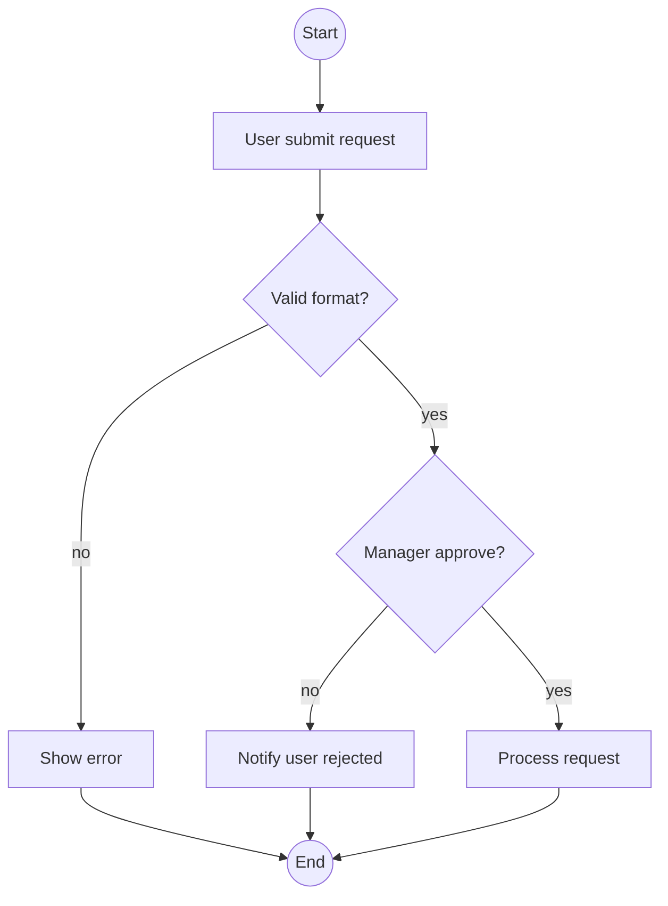
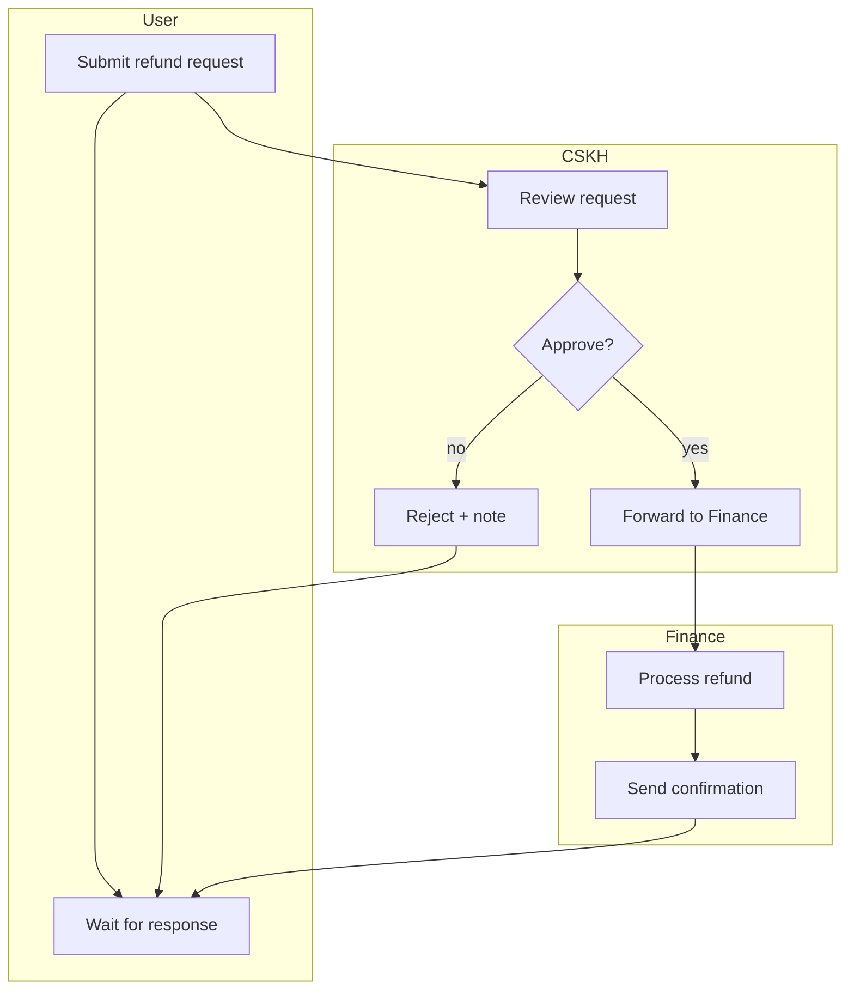

# /activity — Activity / Flowchart Diagram

## Goal

Produce a mermaid `flowchart` for a business process — show decisions, parallels, sub-processes, loops. Suitable when a sequence is too linear or when the process is a business workflow (same abstraction level as a UC). **Single output**: append a section to `docs/{feature}/srs/{feature}-flows.md` (same file as sequence, separate section).

> **Positioning (per `diagram-selection.md`):** `/activity` (Mermaid) is the choice for a **compact 1-2 role flow** that needs **inline auto-render embedding** in GitHub/Obsidian. A **multi-role process with many cross-lane interactions** (refund, multi-level approval) → default to **`/activity-swimlane`** (PlantUML true swimlane — Mermaid subgraph skews with many cross-edges). If you detect ≥3 lanes with many cross-lane edges, suggest the user switch to `/activity-swimlane` at L1 before drawing.

## Constraints

- **1 fixed output** — `docs/{feature}/srs/{feature}-flows.md` in append mode. NO `--uc`, `--standalone`, `--system-flow`, `--lanes` flags.
- **L1 approval** before Write — BA-friendly prose.
- **NO L3 iterate** — mermaid does not render in chat. The user reviews from the rendered file; to change, they call the skill again and state what needs changing.
- **Auto-detect lanes/roles** from the description: scan role keywords (admin, user, system, approver, manager, customer support). If ≥2 lanes → use `subgraph` to split lanes. **But if ≥3 lanes + many cross-lane interactions → Mermaid subgraph skews, suggest `/activity-swimlane` (PlantUML) at L1** — the user may still choose to stay on Mermaid if inline embedding is needed.
- **Direction chosen by complexity** — default TB (top-bottom); a process with many/wide lanes auto-switches to LR. If the user wants horizontal, they say "draw horizontally" in the command or reply.
- **`--feature` optional** — auto-detect from context/the feature in progress; only ask via picker when ambiguous. **Feature does not exist + arg is a process description → auto-derive slug + create feature** (entry point, see `feature-bootstrap.md` group A). Do NOT require going through `/brainstorm` first.
- **Bilingual (mirror input — @../../rules/language.md)** in labels (mermaid supports Unicode); syntax keywords in English.
- **Per @../../rules/diagram-selection.md** — check the process has ≥3 decisions or has parallels; if simple and linear → suggest `/sequence`.
- **flows.md does not exist** → create new with frontmatter + bare heading `# {Feature} — Flows` (NO intro sentence/meta blockquote), then the first `## Flow:` section.

## Inputs

```
/activity "<description>" --feature <slug>       # append section to flows.md
/activity "<description>"                          # feature auto-detected from context, ask only when ambiguous
/activity "<new feature process description>"       # feature doesn't exist → derive slug + interview + create feature (group A)
```

Want horizontal instead of the default top-bottom → say "draw horizontally". A section already exists for that process → call the skill again with the changed description; the skill enters update mode automatically (match slug) + L2 diff.

## Context (dynamic)

Today: !`date +%Y-%m-%d`
Available features: !`ls -d docs/*/ 2>/dev/null | xargs -I{} basename {} | head -20`
Features with flows.md: !`for d in docs/*/srs/*-flows.md; do [ -f "$d" ] && echo "$d"; done | head -10`

## Approach

1. **Resolve feature + process slug** — process slug auto-derived from the description (verb-object kebab-case, max 40 chars).
   - **Feature does not exist (entry point, per `feature-bootstrap.md` group A):** if the arg is a raw process description with no matching `docs/{feature}/` (e.g. `/activity "user submits a request, manager approves, finance disburses"`) → `/activity` IS ALLOWED to bootstrap: derive the feature slug from the description (kebab-case, ASCII, ≤50 chars), confirm the slug at L1 (user can override), create `docs/{feature}/srs/` on Write. Do NOT require the user to run `/brainstorm` first.
   - **Business source:** feature already has UC/SRS/flows → read them for steps/decisions/lanes, do not re-ask what already exists (no-re-ask). **New feature (or old one lacking a source)** → **interview EXACTLY the scope the activity needs** (per `feature-bootstrap.md` group A step 3), asking in one business-language batch (do NOT ask about DB/SDK): **sequential steps** · **decision points** (question + yes/no branches) · **lanes** if multi-role (who does which step) · **loops** (retry/go back) if any. Do NOT fabricate — ask about whatever is missing. Clarify just enough to draw correctly, not exhaustively like `/brainstorm`.
   - **Ambiguous description even though the feature has a source** (e.g. process description too short, decision points/roles unclear, or the readable UC/SRS also lacks detail) → **MUST ask clarifying questions before generating**, do NOT guess and generate right away. Minimum questions: "Are there any decision points (yes/no) to represent?", "How many roles participate in the process?". This is not a bootstrap interview (the feature exists) — just 1-2 short questions to fill the gaps.
2. **Validate target** `docs/{feature}/srs/{feature}-flows.md`:
   - Exists + matching slug → enter update mode automatically (L2 diff for that section).
   - Exists, new slug → append a `## Flow: {title}` section.
   - Missing → create new: slim frontmatter (`type: srs-flows`, `feature`, `updated`) + bare heading `# {Feature title} — Flows`, then append the first `## Flow:` section directly. Do NOT insert an intro sentence/blockquote describing "what this file contains / where the source is / writing rules" (meta-text — violates `ba-conventions.md` Section 0). The doc contains only real business content.
3. **Auto-detect lanes/roles** from the description prose (scan role keywords). If ambiguous, ask clarifying questions (see step 1).
3.5. **Confirm lanes before generating (MANDATORY if ≥1 lane detected)** — the keyword heuristic scan is only an initial suggestion, do NOT lock it in automatically. Print: "Detected {N} participating roles: {list}. Is that complete, or are there other roles?" — wait for the user to confirm/add before moving to step 4. Purpose: an actor hidden/implied in the text (not named explicitly) is easily missed by the heuristic, dropping a whole lane that no one notices. If 0 lanes are detected (single-role process) → skip this step, no need to ask.
4. **Identify decisions + parallels** from the description ("if... then...", "meanwhile...", "at the same time", "in parallel", "if/else").
4.5. **Extract a fact-list (coverage checklist)** — BEFORE generating, list briefly (keep in context, no separate file needed):
   - **Lanes/roles** confirmed in step 3.5.
   - **Decision points**: each decision point + its branches (yes/no or multi-way).
   - **Loose ends check**: every node must have at least 1 outgoing path leading to an end node — no dead-end branches (per the common "no loose ends" requirement in standard BA prompts).
   The fact-list is used as the reconciliation checklist in step 9.6.
5. **Generate mermaid flowchart:**
   - `flowchart TB` (default); a process with many lanes/parallel branches → auto-switch to `LR` for compactness. User says "draw horizontally" → use `LR`.
   - Node shapes: `[]` rectangle (process), `{}` diamond (decision), `(())` circle (start/end), `[/...\]` parallelogram (input/output).
   - Subgraph for lanes if there are ≥2 roles.
   - Edge labels for decision branches: `-->|yes|`, `-->|no|`.
6. **L1 plan preview** — BA-friendly prose: "I will append a flowchart for process {name} to docs/{feature}/srs/{feature}-flows.md with N decisions + M lanes. Apply? (Y / edit)".
7. **Write** — Read flows.md, append the section after the last `## Flow:`. Each section format:
   ```markdown
   ## Flow: {Title} (Activity)
   **Trigger**: {1-line}
   **Related UC**: [[../usecases/uc-{slug}.md]] (if detectable, else "TBD")
   **Related FR**: FR-{feature}-NNN, ...
   **Related E**: E-{feature}-NNN, ... (error path in the flow, else "—")

   \`\`\`mermaid
   flowchart TB
     ...
   \`\`\`
   ```
   > **Full-form IDs mandatory** in the 3 Related lines — always `FR-{feature}-NNN` / `E-{feature}-NNN`, NOT short-form `FR-001` (edge source for the KG; short-form causes phantom features + lost traces).
8. **Call again with a matching slug** (automatic update mode) → L2 diff for that section.
9. **Activity log** — set env `CLAUDE_SKILL_NAME=/activity` + `CLAUDE_CHANGELOG_NOTE` (note: `added {process-title} activity diagram`) BEFORE Write — the hook appends to `docs/_shared/activity.log` (independent of whether spec.md exists, no more routing/fallback). Update flows.md `updated: {date}`.
9.5. **Render-verify (MANDATORY, run right after Write)** — `bash "${CLAUDE_PLUGIN_ROOT:-.claude}/scripts/tsrun.sh" scripts/mermaid-verify.ts --file docs/{feature}/srs/{feature}-flows.md`. Mermaid does not render in chat (this is why L3 is skipped), so this is the only way to catch syntax errors BEFORE reporting "done" instead of letting the user discover them when opening the IDE.
   - **Pass** → continue to step 10, the report includes a "compile OK" line.
   - **Fail** (usually nested quotes inside `[...]`/`{}` — see Mermaid syntax safety in `diagram-selection.md`) → read the line/column error the script returns, fix the just-appended section (do NOT touch other sections), re-verify. Up to 2 self-fix attempts.
   - **Still failing after 2 attempts** → report the specific error + the mermaid snippet to the user, suggest pasting into mermaid.live to debug manually. Do NOT silently leave a broken file and report "done" as usual.
9.6. **Coverage-verify (MANDATORY, run right after 9.5 passes)** — reconcile the just-written diagram against the fact-list from step 4.5:
   - **Decision coverage**: does each decision point in the fact-list appear as a diamond with all branches (yes/no) in the diagram.
   - **Lane coverage**: does each lane confirmed in 3.5 appear as a `subgraph`.
   - **No loose ends**: every node has at least 1 outgoing edge leading to an end node (`((End))` or equivalent) — no mid-flow dead-ends.
   This is a check DIFFERENT from step 9.5 — 9.5 only catches syntax errors, 9.6 catches **missing business content or dead-ends**.
   - **Complete** → continue to step 10, the report adds a line "Coverage: {N}/{N} decisions, {M}/{M} lanes, no loose ends".
   - **Missing** (e.g. a lane is dropped, or a "no" branch leads nowhere) → add it to the just-written section, re-verify 9.5 then 9.6. Up to 2 self-fix attempts.
   - **Still missing after 2 attempts** → tell the user exactly which decision/lane/branch could not be represented, ask whether to skip or add more description. Do NOT silently report "done" when coverage is incomplete.
9.7. **Diagram_Reviewer gate (ONLY when complexity thresholds are exceeded)** — spawn an agent via the Task tool, `subagent_type: diagram-reviewer`, passing: the just-written mermaid section + the step 4.5 fact-list, when any threshold is exceeded (measured by **total complexity**): **≥3 lanes** OR **≥5 decision points** OR **decision nesting ≥2 levels** OR a **loop/retry back-edge**. Below all these thresholds, the step 9.6 self-reconciliation (no agent) is enough — SKIP 9.7, go straight to step 10.
   - **Task tool unavailable** (not provided by the runtime) → do NOT implicitly treat it as reviewed; the report states `reviewer skipped (Task unavailable)` so the user knows the complex diagram has not passed the gate.
   - Receive findings (format `review-format.md` + a "Coverage checklist" section). If BLOCKING → add the missing lane/branch to the section, re-verify 9.5+9.6, then continue to step 10.
   - Loop up to 2 rounds — if round 2 is still BLOCKING → report the outstanding findings to the user and let them decide before issuing the report.
   - Verdict `approve`/only WARNING/SUGGESTION → continue straight to step 10.
10. **Output report:**
    ```
    ✅ Activity diagram appended: docs/{feature}/srs/{feature}-flows.md → ## Flow: {title} (Activity)
       Decisions: {N} | Lanes: {M} | Direction: {TB|LR} | Mermaid compile: OK | Coverage: {N}/{N} decisions, {M}/{M} lanes, no loose ends{reviewed_note}

    Open the file in IDE/Obsidian/GitHub preview to see the rendered diagram.
    Need changes? Call /activity "<change>" --feature {feature} again; I enter update mode automatically.
    ```
    `{reviewed_note}` = ` | Reviewed by Diagram_Reviewer` if step 9.7 ran, else empty.

## Mermaid syntax reference

**Simple flowchart:**


**Multi-lane (swimlane via subgraph):**


## Gotchas

- **Don't over-engineer** — a 3-4 step linear process: use a sequence or numbered steps.
- **Subgraph naming** — a lane name with a space uses `subgraph "Customer Support"`.
- **Loop** — `A --> B --> A` is OK, but ≥2 different loops render messily; split into 2 diagrams.
- **Decision with >3 branches** — Mermaid has no native multi-way; use several diamonds in sequence.
- **Mermaid syntax failure** — step 9.5 catches errors via `mermaid-verify.ts` RIGHT after Write, self-fixing up to 2 times. No more silent "write anyway, warn" — only tell the user to paste into mermaid.live if 2 self-fix attempts still fail.
- **Missing coverage ≠ syntax error** — step 9.5 (compile) and 9.6 (coverage + no-loose-ends) are two different things. A diagram that compiles OK can still miss a lane or have a dead-end branch — don't mistake "compile OK" for "done".
- **Don't lock in lanes from the heuristic** — step 3.5 mandatorily asks the user to confirm the detected role list before generating, because keyword scanning easily misses actors hidden/implied in the text.
- **Sub-process** — not native in Mermaid; use a node label "[Sub: refund-eligibility-check]" + comment.
- **UC embed** — if the user asks to "draw the activity into UC X" → allowed (activity is at the same business level as a UC), but it is still NOT this skill's responsibility. Suggest writing it by hand in UC Section e if inline is truly needed. Default remains flows.md.

## References

- @../../rules/ba-conventions.md
- @../../rules/approval-gate.md
- @../../rules/naming-conventions.md
- @../../rules/changelog.md
- @../../rules/diagram-selection.md
- @../../rules/feature-bootstrap.md
- @../../rules/language.md
- @../../templates/diagram-activity.md
- @../../scripts/mermaid-verify.ts (render-verify after Write — step 9.5)
- @../../agents/diagram-reviewer.md (Diagram_Reviewer — reviews coverage when complexity thresholds are exceeded, step 9.7)
