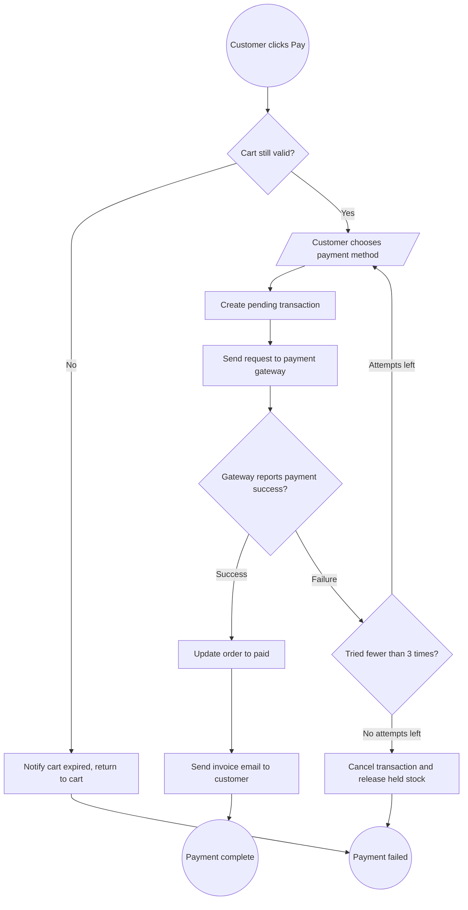

<!--
REFERENCE for /activity (not a real doc). Points to imitate:
- File shared with /sequence: slim frontmatter (type/feature/updated) + bare heading "# {Feature} — Flows", NO intro sentence/meta blockquote.
- Each flow = 1 APPENDED "## Flow:" section (activity marked "(Activity)").
- Mermaid flowchart: shape ((...)) start/end, {...} decision, [...] process, [/.../] input/output; branch labels -->|Yes|/-->|No|.
- Syntax-safety (per diagram-selection.md): NO double-quotes inside a shape, do NOT use & / < / >, break lines with  , avoid bare () in a label.
- ≥2 decisions + every branch leads to an end node (no loose ends).
-->

# Payment — Flows

## Flow: Order Payment (Activity)
**Trigger**: The customer clicks "Pay" on the cart screen after selecting products.
**Related UC**: [[../usecases/uc-checkout.md]]
**Related FR**: FR-payment-001, FR-payment-003
**Related E**: E-payment-001, E-payment-002

## Notes

- **Time-limited stock hold** — if the cart expires (hold time exceeded), stop the payment flow and send the customer back to the cart to retry (E-payment-001).
- **Retry the method only, never charge twice** — when the gateway reports failure, the customer may retry up to 3 times; when attempts run out, cancel the pending transaction and release the held stock (E-payment-002).
- **Email does not block the outcome** — sending the invoice is a secondary step; the order still counts as paid even if the email is sent later.

**Reference:**
- FR-payment-001, FR-payment-003 (spec Section 2).
- E-payment-001, E-payment-002 (spec Section 5 — Error Matrix).
