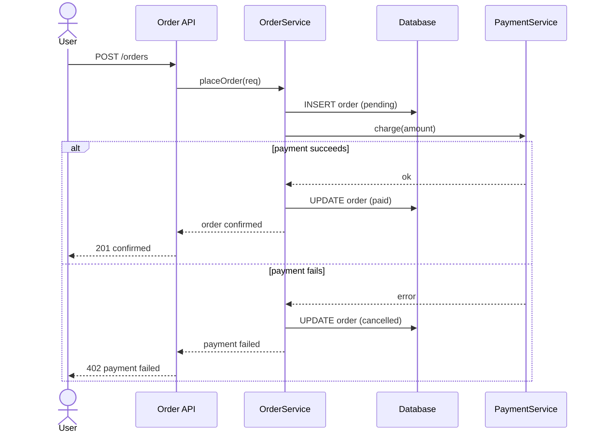

# Example code-flow — `placeOrder` handler (online-shop)

> What `/code-flow src/orders/placeOrder.ts` produces in `code-flow/{slug}-flow.md`:
> a traced sequence diagram (call chain across layers) + a Code provenance table with `file:line`.
> Real identifiers stay AS-IS; only notes mirror the input language.

## Flow: placeOrder

**Target**: `src/orders/placeOrder.ts` → `placeOrder(req)` (resolved `src/orders/placeOrder.ts:18`)
**Trigger**: POST /orders
**Auto-pick**: call chain across User → API → Service → DB → Payment → sequence.

### Code provenance

| Diagram element | Code location | Confidence |
|---|---|---|
| API → Svc: placeOrder(req) | src/orders/placeOrder.ts:22 | ✅ |
| Svc → DB: INSERT order (pending) | src/orders/placeOrder.ts:31 | ✅ |
| Svc → Pay: charge(amount) | src/orders/placeOrder.ts:37 | ✅ |
| alt payment succeeds / else fails | src/orders/placeOrder.ts:40 | ✅ |
| → PaymentService.charge (internal) | src/orders/placeOrder.ts:37 → payment/payment.ts:58 | 🔵 inferred (dynamic wiring) |
