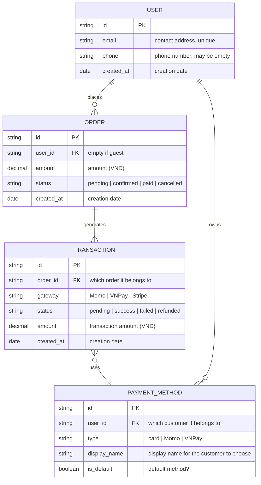

# /erd — Mermaid Entity-Relationship Diagram

## Goal

Create a Mermaid `erDiagram` for a per-feature data model. **Single output**: `docs/{feature}/srs/{feature}-erd.md`. Project-wide ERD is dropped (the old singleton exception) — if a cross-feature data view is needed, the user gathers it manually.

## Constraints

- **1 fixed output** — `docs/{feature}/srs/{feature}-erd.md`. NO `--scope project` flag.
- **NO L3 iteration** — Mermaid does not render in chat. Go straight from L1 plan → Write. The user reviews the rendered ERD from the file (IDE/Obsidian/GitHub) → to change it, call the skill again and say what needs to change.
- **L1 approval** before Write.
- **`--feature` optional** — auto-detect from context/the in-progress feature; only ask via picker when ambiguous. **Feature does not exist + arg is a data-model description → derive the slug and create the feature yourself** (entry point, see `feature-bootstrap.md` group A). Do NOT force `/brainstorm` first.
- **File already exists** → automatically switch to update mode (L2 diff), do not refuse.
- **Auto-detect entities** from SRS Section 6 if present.
- **Bilingual (mirror input — @../../rules/language.md)** in the description; Mermaid keywords in English.
- **Inheritance limitation** — Mermaid `erDiagram` does not fully support inheritance; note the limitation, suggest an FK workaround.

## Inputs

```
/erd --feature <slug>       # create new, or auto-enter update mode if erd.md already exists
/erd                        # feature auto-detected from context, ask only when ambiguous
/erd "<data-model description of a new feature>"   # feature does not exist → derive slug + interview + create feature (group A)
```

To use entity descriptions from another source instead of answering directly → tag `@file` or paste the content in chat.

## Context (dynamic)

Today: !`date +%Y-%m-%d`
Features with SRS: !`for d in docs/*/srs/*-spec.md; do [ -f "$d" ] && dirname "$d" | xargs dirname | xargs basename; done | head -20`
Features with ERD: !`for d in docs/*/srs/*-erd.md; do [ -f "$d" ] && grep -l "erDiagram" "$d" 2>/dev/null && dirname "$d" | xargs dirname | xargs basename; done | head -10`
Project context: !`bash "${CLAUDE_PLUGIN_ROOT:-.claude}/scripts/context-load.sh"`

**IMPORTANT:** before drawing, read `docs/_shared/context/entities.md` if it exists (the `/discover` profile) — reuse the established entity set + names; do not re-ask or invent identifiers.

## Approach

1. **Resolve feature.** `--feature` explicit if present; else auto-detect (single in-progress) or prompt picker.
   - **Feature does not exist (entry point, per `feature-bootstrap.md` group A):** if the arg is a raw data-model description with no matching `docs/{feature}/` (e.g. `/erd "customers, orders, payment transactions"`) → `/erd` IS ALLOWED to bootstrap itself: derive the feature slug from the description (kebab-case, ASCII, ≤50 chars), confirm the slug at L1 (user can override), create `docs/{feature}/srs/` on Write. Do NOT force the user to run `/brainstorm` first.
2. **Validate existing.** `erd.md` already exists → switch to update mode (L2 diff), tell the user it is updating.
3. **Auto-detect upstream entities** — scan the `docs/{feature}/srs/{feature}-spec.md` Section 6 Data Entities bullet list. Present → use it, do not re-ask what is already known (no-re-ask).
4. **Interview to EXACTLY the SCOPE the erd needs** (when no source exists — a new feature, or an old one missing spec.md, per `feature-bootstrap.md` group A step 3). Ask in one batched business-language pass, **do NOT ask about DB types** (varchar/int...) — only the business meaning of each attribute:
   1. List the main **entities** (1 line/entity: name + 1-sentence purpose).
   2. **Business attributes** of each entity (name + meaning, e.g. "email — contact address", "status — order status"; PK/FK marker if clear). **Do NOT ask about DB data types** ("varchar or text?" is a dev question) — the skill ASSIGNS a concise technical type itself (`string`/`int`/`decimal`/`date`/`boolean`) when drawing, since an ERD is inherently a technical artifact (see Gotchas). The user only describes business meaning.
   3. **Relationships** between entities (cardinality 1:1 / 1:N / N:N + a label describing the nature of the relationship).
   4. Inheritance/specialization (if any) — flag the Mermaid limitation.
4.5. **Ambiguous description even with a source** (e.g. `spec.md` Section 6 only lists entity names without clear attributes/relationships, or the user's description is too short) → **MUST ask clarifying questions before generating**, do NOT invent attributes/cardinality. Minimum questions: "What business attributes does entity {X} have?", "Is the relationship between {X} and {Y} 1:1, 1:N, or N:N?".
5. **Generate Mermaid `erDiagram`:**
   - UPPERCASE entity names (convention).
   - Attributes inside the `{}` block: `type name [PK|FK]`.
   - Relationships: `||--o{` (one-to-many), `||--||` (one-to-one), `}o--o{` (many-to-many).
   - Self-reference: `ENTITY ||--o{ ENTITY : "label"`.
6. **L1 approval** plan table — show path + summarized entity/relationship count. **NO L3 iteration in chat** — Mermaid cannot render in chat; reviewing from the rendered file is more effective.
7. **Write** from `templates/diagram-erd.md` (slim frontmatter `type: srs-erd`/`feature`/`updated`). Fill `mermaid_code`, `entity_descriptions`, `notes`.
8. **Update mode (file already exists)** → L2 diff. Update `updated: {date}`.
9. **Activity log** — set env `CLAUDE_SKILL_NAME=/erd` + `CLAUDE_CHANGELOG_NOTE` (note: `{N} entities, {M} relationships — {note}`) BEFORE Write — the hook appends to `docs/_shared/activity.log` (independent of whether spec.md exists yet, no more routing/fallback). Update erd.md `updated: {date}`.
9.5. **Render-verify + SELF-VIEW THE IMAGE (MANDATORY, run immediately after Write)** — `bash "${CLAUDE_PLUGIN_ROOT:-.claude}/scripts/tsrun.sh" scripts/mermaid-verify.ts --file docs/{feature}/srs/{feature}-erd.md --png <scratchpad>/erd-review`. The `--png` flag both compile-checks and exports a PNG per block so the skill can **Read and view the image itself**. Mermaid does not render in chat (this is why L3 is skipped), so this is the only way to catch errors BEFORE reporting "done".
   - **Compile fail** (usually an attribute missing its type token — see the "2-token" gotcha — or a relationship label missing quotes) → read the line/column error the script returns, fix the block just written, re-verify. At most 2 self-fix attempts.
   - **Compile pass** → **Read the PNG** (`<scratchpad>/erd-review/block-0.png`) and self-review the business content (compile-check does NOT catch content errors):
     - [ ] All entities present? No entity from the source/description is missing.
     - [ ] Cardinality in the right direction? `USER ||--o{ ORDER` = 1 user has many orders — do not draw it backwards.
     - [ ] Type column not clumsily repeated (e.g. `id id`)? Concise technical type, meaningful name.
     - [ ] Relationship labels readable, not wrapping so long they obscure the diagram.
     - Any error → fix the .md, re-render + re-view. At most 2 rounds.
   - **Still failing after 2 attempts** → report the specific error + the mermaid snippet to the user, suggest pasting into mermaid.live to debug by hand. Do NOT silently leave a broken/ugly file and report "done" as usual.
9.6. **Coverage-verify (MANDATORY, run immediately after 9.5 passes)** — reconcile the ERD against the entities + relationships gathered in step 4. This is DIFFERENT from 9.5 — 9.5 catches syntax + visual errors, 9.6 catches **missing entities/relationships vs the source**: does each entity from the source have a block? does each relationship (1:1 / 1:N / N:N) have an edge with the **right cardinality direction** (`USER ||--o{ ORDER` = 1 user has many orders)? A many-to-many / self-reference / inheritance the source mentioned → must be drawn (with its documented workaround) or noted as missing.
   - **Complete** → continue to step 9.7/10.
   - **Missing** → add it, re-verify 9.5 then 9.6. At most 2 self-fix attempts.
   - **Still missing after 2 attempts** → tell the user which entity/relationship could not be shown. Do NOT silently report "done" when coverage is incomplete.
9.7. **Diagram_Reviewer gate (ONLY when over the complexity threshold)** — if the ERD has **≥6 entities**, OR **≥8 relationships**, OR a **many-to-many**, OR **self-reference**, OR an **inheritance limitation flagged**, spawn an agent via the Task tool, `subagent_type: diagram-reviewer`, passing: the erDiagram block just written + the entity/relationship facts from step 4. Below every threshold → SKIP 9.7, go straight to step 10.
   - **Task tool unavailable** → the report states `reviewer skipped (Task unavailable)`.
   - Any BLOCKING (missing entity/relationship, no PK, backwards cardinality) → fix the block just written, re-verify 9.5+9.6, then continue.
   - Loop at most 2 rounds. Verdict `approve`/only WARNING/SUGGESTION → continue straight to step 10.
10. **Output report:**
   ```
   ✅ ERD written: docs/{feature}/srs/{feature}-erd.md
      Entities: {N} | Relationships: {M} | Mermaid compile: OK

   Open the file in IDE/Obsidian/GitHub preview to see the rendered diagram.
   Need changes? Call /erd --feature {feature} again, I'll enter update mode.
   ```

## Mermaid syntax reference



> **Type** = concise technical (`string`/`int`/`decimal`/`date`/`datetime`/`boolean`). **Comment `"..."`** = business meaning (mirror input language) + enum list. NO `uuid`/`jsonb`/`varchar(255)`, NO indexes/PCI tokens (dev work in `/srs`).

## Gotchas

- **An ERD is inherently a technical artifact — type/PK/FK are its essence, NOT a role violation.** The vault's no-dev rule (`ba-conventions.md` Section 3) targets *interviewing* the user in DB language ("varchar or text?") and over-detail (indexes, migration, denormalization, PCI tokens, `jsonb`/`uuid`/`varchar(255)`) — it does NOT forbid concise technical types on the ERD itself. **Types to use:** `string` / `int` / `decimal` / `date` / `datetime` / `boolean`. The comment (`"..."`) is where business meaning (mirror input language) + enum values go. **Do NOT use** `uuid`/`jsonb`/`varchar(255)`, NO "Indexes to plan" section, NO PCI/encryption notes — that is dev/DBA work in `/srs`, not a business ERD.
- **Mermaid `erDiagram` REQUIRES each attribute to have exactly 2 tokens `type name` (+optional comment).** Writing only `name` (dropping the type) → parse fail `Expecting 'ATTRIBUTE_WORD', got 'ATTRIBUTE_KEY'`. So a PK must be `string id PK`, not `id PK`. Do not try to drop the type column to "make it business-y" — Mermaid won't allow it. A concise type (`string`/`decimal`/`date`) is enough.
- **Do not clumsily repeat the type column** — `string id` is OK, but `id id` (both type and name = `id`) reads absurdly. Step 9.5's self-view catches this.
- **Mermaid relationship cardinality syntax is tricky** — remember the order: `LEFT ||--o{ RIGHT` reads as "1 LEFT has many RIGHT". Don't confuse the direction.
- **Self-reference needs a label** — `EMPLOYEE ||--o{ EMPLOYEE : "manages"` to render OK.
- **Inheritance is not native** — e.g. "Admin extends User", Mermaid has no syntax for it. Workaround: create an ADMIN entity with an FK `user_id` pointing to USER + note "ISA relationship via FK". Document it in the Notes section.
- **Self-referential many-to-many** (e.g. "friends" between Users) — use a junction entity: `USER ||--o{ FRIENDSHIP }o--|| USER`. Mermaid cannot draw an m:n loop directly.
- **Long entity names** — render poorly if >15 chars. Abbreviate: `PAYMENT_METHOD` → `PMT_METHOD` (note the full name in the Entity Reference section).
- **PK/FK markers optional** but recommended for audit/migration planning.
- **Composite PK** — Mermaid doesn't render it clearly. Note: `(user_id, role_id) PK` in the attribute description.
- **Soft-deleted column convention** — `deleted_at timestamp "nullable, soft-delete"`.
- **Update mode** with new entities → preserve existing layout, add new entities at the end of the block.
- **Mermaid syntax fail** — step 9.5 catches errors via `mermaid-verify.ts` RIGHT after Write, self-fix at most 2 times. Do NOT write then abandon — only tell the user to paste into mermaid.live if 2 self-fix attempts still fail.

## References

- @../../rules/ba-conventions.md
- @../../rules/project-context.md (consume the /discover profile — entities)
- @../../rules/approval-gate.md
- @../../rules/naming-conventions.md
- @../../rules/changelog.md
- @../../rules/diagram-selection.md
- @../../rules/feature-bootstrap.md
- @../../rules/language.md
- @../../templates/diagram-erd.md
- @./references/example-erd.md
- @../../scripts/mermaid-verify.ts (render-verify after Write — step 9.5)
- @../../agents/diagram-reviewer.md (Diagram_Reviewer — coverage review when over the complexity threshold, step 9.7)
