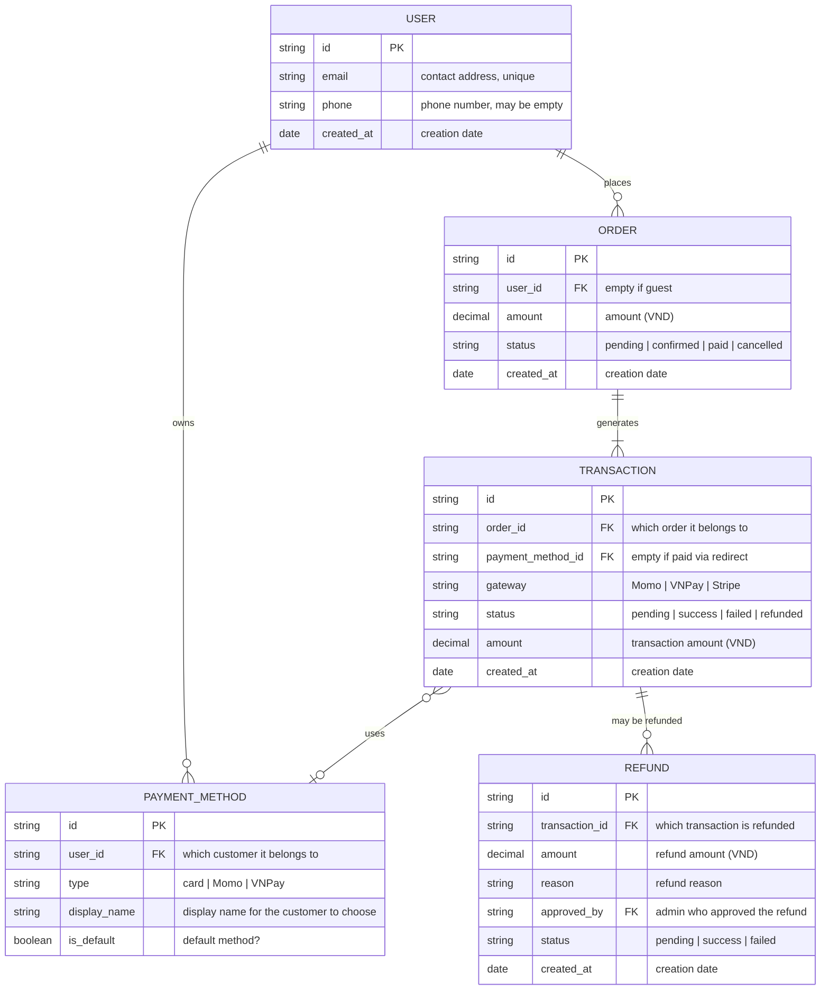

# payment — Entity Relationship Diagram

> Scope: feature payment

## Diagram

## Entity Reference

| Entity | Purpose | Key attributes |
|--------|---------|----------------|
| USER | Customer account (guests have no record) | email (unique), phone, creation date |
| ORDER | Order created from checkout | amount, order status |
| TRANSACTION | Each payment attempt for an order | payment gateway, status, amount |
| PAYMENT_METHOD | Saved method for the customer to reuse later | type, display name, default |
| REFUND | Each admin-approved refund | refund amount, reason, approving admin |

## Notes & Assumptions

- **Guests have no USER record** — `ORDER.user_id` is left empty; only logged-in customers can be tied to an account.
- **ORDER status is one-way:** pending → confirmed → paid, or branches to cancelled. No going back. (For transition details see `srs/payment-states.md`.)
- **TRANSACTION.payment_method_id is left empty** when the customer pays via redirect (Momo/VNPay redirect to the gateway page) — only the Stripe card flow records a saved method.
- **REFUND.approved_by** points to the approving admin's account — the business rule is that only an admin may create a refund order (BR-payment-004).
- **Admins share the USER table** with customers, distinguished by role — no separate ADMIN entity (Mermaid has no inheritance syntax; see the inheritance gotcha).
- **Refund v1 is full-refund only** — partial refunds deferred to Phase 1.1.
