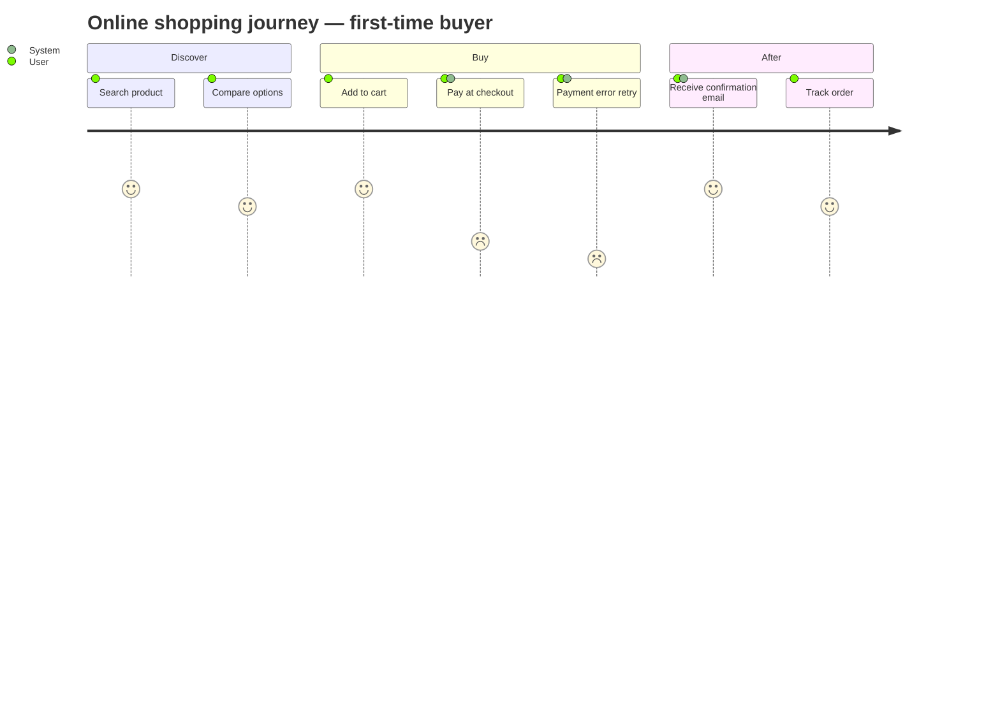

# /journey — User Journey Map (Mermaid journey)

## Goal

Produce a Mermaid `journey` block — the user's experience split into sections (phases/touchpoints), each step with a **satisfaction rating 1-5** (1 = frustrated, 5 = delighted) and the **actor(s)** who act. **Single output**: append a section to `docs/{feature}/srs/{feature}-journey.md`.

## Constraints

- **1 fixed output** — `docs/{feature}/srs/{feature}-srs/{feature}-journey.md`, append mode. (One `## Journey: {Name}` section per journey.)
- **`--feature` optional** — auto-detect; only ask when ambiguous. **Feature does not exist + an experience → derive slug + create** (entry point, `feature-bootstrap.md` group A).
- **L1 approval** before Write — show persona + section + step count.
- **NO L3 iteration** — Mermaid does not render in chat; review from the file.
- **Auto-detect the journey** from `docs/{feature}/brainstorms/*.md` + UC files if present; else interview: **persona** (whose journey), the **phases/touchpoints** in order, the **step** in each, the **satisfaction** (happy/neutral/frustrated), and **who is involved**. No-re-ask what is known.
- **Rating is the value of this diagram** — never put 5 everywhere; surface the pain points (low ratings) explicitly so they link to improvements.
- **Bilingual (mirror input — @../../rules/language.md)**; `journey`/`section`/`title` keywords stay English.
- **Idempotent** — same journey re-run → update mode (L2 diff).
- **Per `diagram-selection.md`** — journey = experience + emotion; use-case = actor + function; activity = business process (control-flow). They complement, not replace.
- **Theme** — apply the global Mermaid init from `@../../rules/diagram-style.md` (journey ignores `classDef`).

## Inputs

```
/journey "<experience>" --feature <slug>      # append a section to journey.md
/journey "<experience>"                        # feature auto-detected
/journey "<experience of a new feature>"       # feature does not exist → derive slug + create
```

## Context (dynamic)

Today: !`date +%Y-%m-%d`
Project context: !`bash "${CLAUDE_PLUGIN_ROOT:-.claude}/scripts/context-load.sh"`
Available features: !`ls -d docs/*/ 2>/dev/null | xargs -I{} basename {} | head -20`
Features with journey.md: !`for d in docs/*/srs/*-journey.md; do [ -f "$d" ] && echo "$d"; done | head -10`

## Approach

1. **Resolve feature + journey name.** Entry point if new: derive slug, confirm at L1, create `docs/{feature}/srs/` on Write.
2. **Gather the journey.** Read brainstorm/UC for persona + steps; else ask in one batched pass: persona · phases (sections) in order · step per phase · satisfaction (1-5) · actors per step.
3. **Fact-list** — every section + step + its rating (the coverage checklist).
4. **Validate target** `docs/{feature}/srs/{feature}-journey.md` — create if missing: frontmatter (`type: srs-journey`, `feature`, `updated`) + bare heading, NO meta blockquote.
5. **Generate Mermaid `journey`** — `title`, `section <Phase>`, then `step: rating: actor1, actor2`. Rating 1-5; actors comma-separated.
6. **L1 plan preview** — persona + section/step count + the lowest-rated (pain) steps.
7. **Write** — append `## Journey: {Name}` section with the ```mermaid block.
8. **Activity log** — set `CLAUDE_SKILL_NAME=/journey` + `CLAUDE_CHANGELOG_NOTE` before Write. Update `updated:`.
9. **Render-verify (MANDATORY)** — `bash "${CLAUDE_PLUGIN_ROOT:-.claude}/scripts/tsrun.sh" scripts/mermaid-verify.ts --file docs/{feature}/srs/{feature}-journey.md`. Fail → fix the section, ≤2 attempts.
10. **Output report** — call out the pain steps (rating ≤2) so they are not lost.

## Mermaid syntax reference (Claude composes it, do NOT hard-paste)



## L1 plan preview

> I'll append a journey map for **{persona}** to `docs/{feature}/srs/{feature}-journey.md`: **{N} phases**, **{M} steps**.
> Pain points (rating ≤2): {list — e.g. "Pay at checkout", "Payment error retry"}.
> Source: {brainstorm/UC | you provide}.
> Logged: activity log "added {name} journey".
> Apply? (Y / edit)

## Output report

```
✅ Journey appended: docs/{feature}/srs/{feature}-journey.md → ## Journey: {Name}
   Phases: {N} | Steps: {M} | Mermaid compile: OK
   ⚠️ Pain steps (rating ≤2): {list} — consider linking these to an improvement/FR.

Open the file in IDE/Obsidian/GitHub preview to see the rendered journey.
Need changes? /journey "{name}" --feature {feature} again → update mode.
```

## Gotchas

- **No classDef** — journey ignores `classDef`; the global init (`diagram-style.md`) is the only theme lever.
- **Rating scale** — 1 worst … 5 best; Mermaid renders low ratings redder. Don't put all 5s — that hides pain points.
- **Actors** — `step: rating: Actor A, Actor B` (comma-separated, after the rating).
- **Sections** — group steps into phases/touchpoints; too many sections → split into 2 journeys.
- **Not a process diagram** — if you mainly care about the control-flow/decisions, use `/activity` or `/activity-swimlane` instead.

## References

- @../../rules/ba-conventions.md
- @../../rules/project-context.md
- @../../rules/approval-gate.md
- @../../rules/naming-conventions.md
- @../../rules/changelog.md
- @../../rules/diagram-selection.md
- @../../rules/feature-bootstrap.md
- @../../rules/language.md
- @../../rules/diagram-style.md
- @../../templates/diagram-journey.md
- @./references/example-journey.md
- @../../scripts/mermaid-verify.ts (render-verify after Write — step 9)
