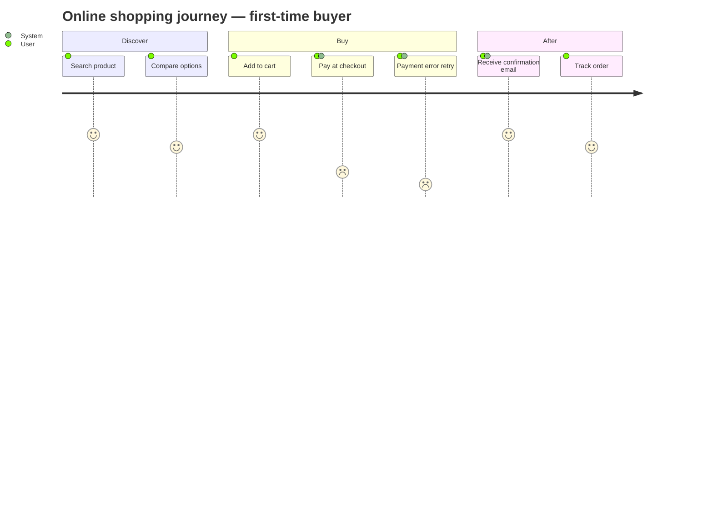

# Example journey — first-time buyer, "Online shop"

> A working `journey` block as `/journey` writes it into `srs/{feature}-journey.md`.
> Low ratings (1-2) surface pain points deliberately.

## Journey: First-time buyer

