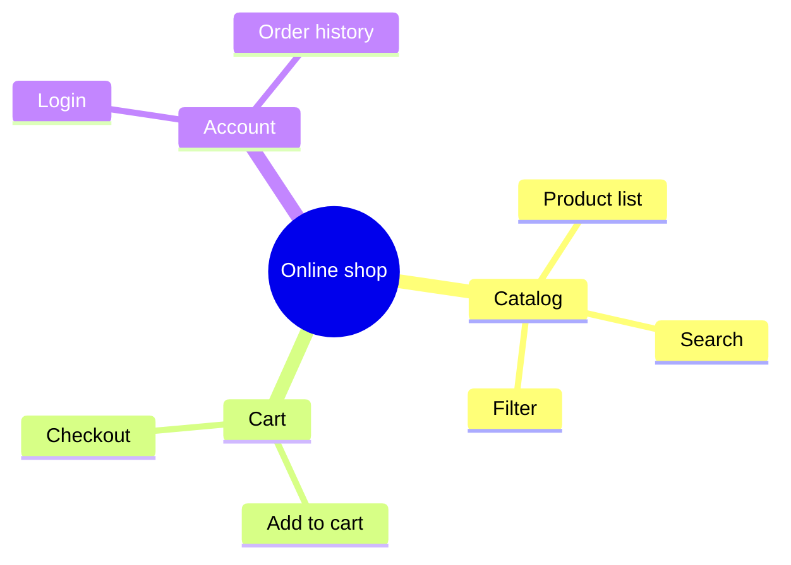

# /mindmap — Scope / Idea Decomposition Tree (Mermaid mindmap)

## Goal

Produce a Mermaid `mindmap` block that decomposes a topic into a tree of scope items / sub-ideas. **Single output**: append a section to `docs/{feature}/srs/{feature}-scope.md` (1 file, one `## Scope: {Topic}` section per mindmap).

## Constraints

- **1 fixed output** — `docs/{feature}/srs/{feature}-scope.md`, append mode.
- **`--feature` optional** — auto-detect from context; only ask when ambiguous. **Feature does not exist + a topic → derive slug + create the feature** (entry point, `feature-bootstrap.md` group A). Do NOT force `/brainstorm` first.
- **L1 approval** before Write — show topic + branch/leaf count.
- **NO L3 iteration** — Mermaid does not render in chat; the user reviews from the file.
- **Auto-detect branches** from `docs/{feature}/brainstorms/*.md` if present; else interview the scope (main areas + 2-4 items under each). No-re-ask what is already known.
- **Bilingual (mirror input — @../../rules/language.md)**; mindmap keywords stay English.
- **Idempotent** — same topic re-run → update mode (L2 diff for that section).
- **Per `diagram-selection.md`** — mindmap when decomposing scope/ideas; use-case diagram when scoping actors + functions.
- **Theme** — apply the global Mermaid init from `@../../rules/diagram-style.md` (mindmap ignores `classDef`).

## Inputs

```
/mindmap "<topic>" --feature <slug>      # append a section to scope.md
/mindmap "<topic>"                        # feature auto-detected, ask only when ambiguous
/mindmap "<topic of a new feature>"       # feature does not exist → derive slug + create
```

## Context (dynamic)

Today: !`date +%Y-%m-%d`
Available features: !`ls -d docs/*/ 2>/dev/null | xargs -I{} basename {} | head -20`
Features with scope.md: !`for d in docs/*/srs/*-scope.md; do [ -f "$d" ] && echo "$d"; done | head -10`

## Approach

1. **Resolve feature + topic.** Entry point if new: derive slug (kebab-case, ASCII, ≤50 chars), confirm at L1, create `docs/{feature}/srs/` on Write.
2. **Gather branches.** Read `docs/{feature}/brainstorms/*.md` for areas; else ask in one batched business-language pass: the main areas/domains and 2-4 items under each. Do NOT invent.
3. **Fact-list** — every branch + leaf to appear (the coverage checklist).
4. **Validate target** `docs/{feature}/srs/{feature}-scope.md` — create if missing: slim frontmatter (`type: srs-scope`, `feature`, `updated`) + a bare heading `# {Feature} — Scope`, NO meta blockquote.
5. **Generate Mermaid `mindmap`** — `root((Topic))`, then branches; shapes used sparingly; keep ≤3 levels deep.
6. **L1 plan preview** — path + branch count.
7. **Write** — append the `## Scope: {Topic}` section with the ```mermaid block.
8. **Activity log** — set env `CLAUDE_SKILL_NAME=/mindmap` + `CLAUDE_CHANGELOG_NOTE` before Write (the hook appends to `docs/_shared/activity.log`). Update `updated:`.
9. **Render-verify (MANDATORY)** — `node "${CLAUDE_PLUGIN_ROOT:-.claude}/scripts/mermaid-verify.mjs" --file docs/{feature}/srs/{feature}-scope.md`. Fail → fix the section just written, ≤2 attempts; still failing → report the snippet + suggest mermaid.live.
10. **Output report.**

## Mermaid syntax reference (Claude composes it, do NOT hard-paste)



## L1 plan preview

> I'll append a scope mindmap for **{topic}** to `docs/{feature}/srs/{feature}-scope.md` with **{N} branches** (~{M} leaves).
> Source: {brainstorm | you provide}.
> Logged: activity log "added {topic} mindmap".
> Apply? (Y / edit)

## Output report

```
✅ Mindmap appended: docs/{feature}/srs/{feature}-scope.md → ## Scope: {Topic}
   Branches: {N} | Leaves: {M} | Mermaid compile: OK

Open the file in IDE/Obsidian/GitHub preview to see the rendered tree.
Need changes? /mindmap "{topic}" --feature {feature} again → update mode.
```

## Gotchas

- **Depth** — >3 levels renders messily; collapse deep leaves into one node.
- **No classDef** — mindmap ignores `classDef`; the global init (`diagram-style.md`) is the only theme lever.
- **Shapes** — `((round))`, `[square]`, `)cloud(`, `{{hexagon}}`. Don't mix too many in one tree.
- **Update mode** — re-run the same topic → regenerate that section only (preserve other sections).
- **Mermaid syntax fail** — step 9 catches via `mermaid-verify.mjs` right after Write, self-fix ≤2 times.

## References

- @../../rules/ba-conventions.md
- @../../rules/approval-gate.md
- @../../rules/naming-conventions.md
- @../../rules/changelog.md
- @../../rules/diagram-selection.md
- @../../rules/feature-bootstrap.md
- @../../rules/language.md
- @../../rules/diagram-style.md
- @../../templates/diagram-mindmap.md
- @./references/example-mindmap.md
- @../../scripts/mermaid-verify.mjs (render-verify after Write — step 9)
