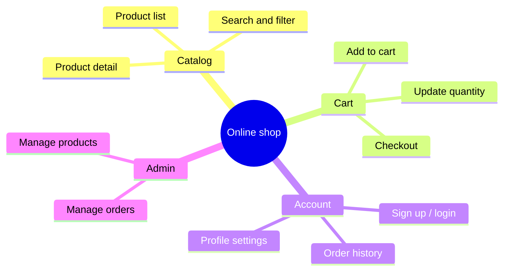

# Example mindmap — scope decomposition for "Online shop"

> A working `mindmap` block as `/mindmap` writes it into `srs/{feature}-scope.md`.
> Claude composes this from the topic + branches; it is NOT hard-pasted.

## Scope: Online shop

