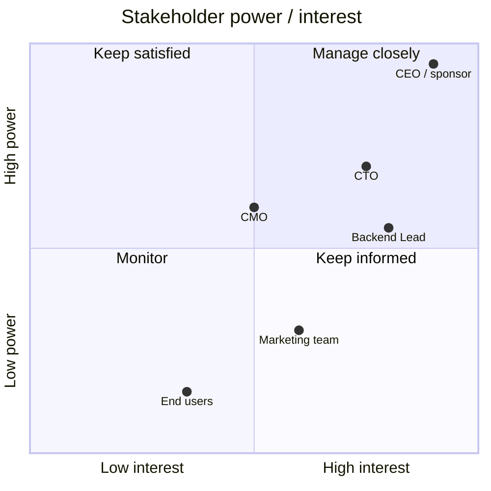

# Example orgchart --stakeholder — power / interest map (online-shop)

> What `/orgchart --feature online-shop --stakeholder` writes to `orgchart/{slug}-stakeholder.md`:
> a Mermaid `quadrantChart` plotting each stakeholder by influence (y) × interest (x).
> Coordinates are [interest, power] in 0..1. Quadrant 1 = top-right (Manage closely).

## Stakeholder power / interest

### Engagement strategy
- **Manage closely** (high power + interest): CEO/sponsor, CTO — weekly sync, co-own decisions.
- **Keep satisfied** (high power, low interest): CMO — brief on milestones, escalate blockers.
- **Keep informed** (low power, high interest): Backend Lead, Marketing — share roadmap + release notes.
- **Monitor** (low power + interest): End users — usage analytics, periodic survey.
