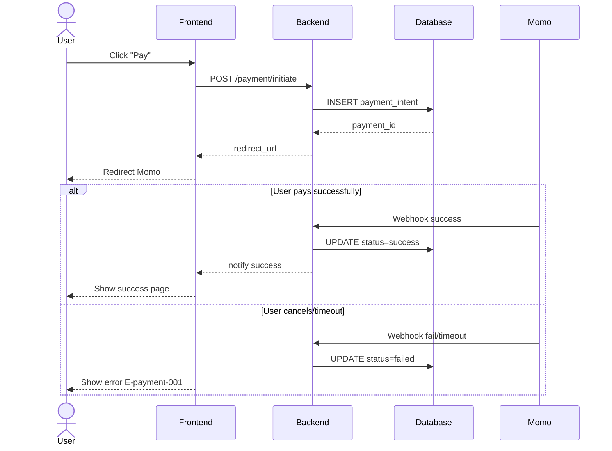

# /sequence — Mermaid Sequence Diagram Generator

## Goal

Create a Mermaid `sequenceDiagram` block for one flow in one feature. **Single output**: append a section to `docs/{feature}/srs/{feature}-flows.md`. UC files do NOT receive diagrams (a UC is a business black-box).

## Constraints

- **1 fixed output** — `docs/{feature}/srs/{feature}-flows.md`, append mode. NO `--uc`, `--standalone`, `--system-flow` flags. Too many flows → the user splits manually.
- **NO L3 iteration** — Mermaid cannot render in chat. Go straight from L1 plan → Write. The user reviews the rendered diagram from the file (IDE/Obsidian/GitHub) → to change it, call the skill again and say what needs to change (the skill enters update mode + L2 diff).
- **L1 approval** before Write.
- **`--feature` optional** — auto-detect if there is only 1 in-progress feature; only ask when ambiguous. **Feature does not exist + arg is a flow description → derive the slug and create the feature yourself** (entry point, see `feature-bootstrap.md` group A). Do NOT force `/brainstorm` first.
- **Auto-detect actors** from the description prose.
- **Mermaid syntax strict** — matched `participant`/`actor`, balanced `alt`/`end`.
- **Bilingual (mirror input — @../../rules/language.md)** in descriptions/notes; Mermaid syntax keywords stay English.
- **flows.md does not exist** → create it with frontmatter + a bare heading `# {Feature} — Flows` (NO intro sentence/meta blockquote), then the first `## Flow:` section.

## Inputs

```
/sequence "<description>" --feature <slug>       # append a section to flows.md
/sequence "<description>"                         # feature auto-detected from context, ask only when ambiguous
/sequence "<flow description of a new feature>"   # feature does not exist → derive slug + interview + create feature (group A)
```

To use another source instead of typing the description directly → tag `@file` or paste the content in chat. A section for that flow already exists → call the skill again with the changed description; the skill enters update mode (matched by slug) + L2 diff.

## Context (dynamic)

Today: !`date +%Y-%m-%d`
Features with flows.md: !`for d in docs/*/srs/*-flows.md; do [ -f "$d" ] && echo "$d"; done | head -10`
In-progress features: !`for d in docs/*/srs/*-spec.md; do grep -l "status: draft\|status: in-review" "$d" 2>/dev/null; done | head -5`

## Approach

1. **Parse args.** Description required (inline string, `@file` tag, or content pasted in chat).
2. **Resolve feature.** `--feature` explicit if present; else auto-detect (single in-progress) or prompt.
   - **Feature does not exist (entry point, per `feature-bootstrap.md` group A):** if the arg is a raw flow description with no matching `docs/{feature}/` (e.g. `/sequence "customer places an order, the system calls the payment gateway then sends a confirmation email"`) → `/sequence` IS ALLOWED to bootstrap itself: derive the feature slug from the description (kebab-case, ASCII, ≤50 chars), confirm the slug at L1 (user can override), create `docs/{feature}/srs/` on Write. Do NOT force the user to run `/brainstorm` first.
   - **Business source:** the feature already has UC/SRS/flows → read them for actors/steps, do not re-ask what is already known (no-re-ask). **New feature (or an old one missing sources)** → **interview to EXACTLY the SCOPE the sequence needs** (per `feature-bootstrap.md` group A step 3), ask in one batched business-language pass (do NOT ask about DB/SDK): which **actors** participate · the **message order** between them (who calls whom, what response) · **error branches** (alt/opt — success path vs error/timeout/cancel). Do NOT invent — ask about whatever is missing. Clarify just enough to draw correctly, do not sprawl comprehensively like `/brainstorm`.
   - **Ambiguous description even when the feature has a source** (e.g. the description is too short, does not clearly state actors/error branches, or the readable UC/SRS also lacks detail) → **MUST ask clarifying questions before generating**, do NOT guess and generate straight away. Minimum questions: "Which actors participate?", "Any error/timeout/cancel branches to show?". This is not a bootstrap interview (the feature already exists) — just 1-2 short questions to fill the gaps, not repeating no-re-ask.
2.5. **Extract a fact-list (coverage checklist)** — BEFORE generating, briefly list (no separate file needed, keep it in context):
   - **Actors**: every actor that will appear as a participant/actor in the diagram.
   - **Main flow steps**: the steps in order (corresponding to the main messages).
   - **Alternative/Error Flows**, numbered with sub-IDs like `A1`, `A1.1`, `A1.2` (per the standard BA prompt template) — each error/alt/timeout/cancel branch gets its own ID, do NOT lump them into a vague "has an error branch". If the description/UC only says vaguely "has error handling" without specifying what error → ask again (see step 2 above), do not invent a specific case.
   This fact-list is used as the reconciliation checklist in step 9.6.
3. **Derive the flow slug** from the description (verb-object kebab-case, max 40 chars).
4. **Validate the target** `docs/{feature}/srs/{feature}-flows.md`:
   - Exists + slug matches → enter update mode (L2 diff for that section).
   - Exists, new slug → **do NOT blindly append**. A slug re-derived from a changed description may drift from the old section's slug (e.g. first time `guest-checkout-momo`, later the description "fix the customer payment flow" → `guest-payment`) — appending would create a duplicate-content section instead of editing. Handling: list the **near-matching** `## Flow:` sections (same actor/topic) for the user to choose "edit which section" OR "create a new flow"; user picks edit → enter update mode for that section (L2 diff), picks new → append. Only append directly when the description is clearly a completely different flow (no section is a near match).
   - Missing → create new: slim frontmatter (`type: srs-flows`, `feature`, `updated`) + a bare heading `# {Feature title} — Flows`, then directly append the first `## Flow:` section. Do NOT insert an intro sentence/blockquote describing "what this file contains / where the source is / writing rules" (meta-text — violates `ba-conventions.md` Section 0). The doc contains only real business content.
5. **Auto-detect actors** from the description: scan capitalized nouns + common roles (User, FE/Client, BE/Backend, DB, third-party like Stripe/Momo). Person names → generalize to "User".
6. **Generate Mermaid `sequenceDiagram`:**
   - `actor User` for a human, `participant X as Y` for a system.
   - Each step → 1 message arrow: `->>` = request/call (solid line), `-->>` = result/response (dashed line) — this is a **team convention**, NOT an "async" meaning. True async (fire-and-forget) uses `-)` / `--)` (open arrowheads), only used when the business is genuinely asynchronous AND the verifier supports it.
   - Error/conditional branches → `alt ... else ... end` (2+ mutually exclusive branches) or `opt ... end` (1 may-happen segment, no else).
   - **Other fragments — only when the business genuinely needs them**: `par ... and ... end` when actions **truly run in parallel and independently** (e.g. send email + write audit at the same time); `loop ... end` for loop/polling/retry (but a loop of >2-3 iterations with complex logic → consider splitting into a separate activity); `break ... end` for an early exit on exception. Do NOT use them for ordinary sequential steps.
   - **`autonumber`** (at the top of the diagram): optional, ONLY enable when the doc narrates by step number ("step 3 sends the OTP") — so message numbers match the text. Not enabled by default.
   - **Activation bar** (`activate`/`deactivate` or `->>+`/`-->>-`): NOT used by default — it implies technical execution timing and clutters a business diagram. Only use it when one side's "processing" has business meaning worth emphasizing.
   - **`Note over`/`Note right of`**: for a business rule / SLA / assumption / FR-BR-E reference (e.g. "After 30s with no result"). Must NOT contain secrets or implementation details (keys, algorithms, endpoints).
   - **Do NOT use `ref`** — Mermaid sequence has no reliable standard `ref` fragment; to link another flow, note it in the "Related flows" metadata (Markdown), not in the diagram.
   - Concise; complex flows >15 steps, OR >8 participants, OR nesting >2 levels → warn, suggest splitting into 2-3 flows.
7. **L1 plan preview** — show path + action (append/update) + actors + step count + related UC (if detected).
8. **Write** — Read flows.md, append the section after the last `## Flow:`. Each section format:
   ```markdown
   ## Flow: {Title}
   **Trigger**: {1-line}
   **Related UC**: [[../usecases/uc-{slug}.md]] (if detected, else "TBD")
   **Related FR**: FR-{feature}-NNN, ...
   **Related E**: E-{feature}-NNN, ... (error path in the flow, else "—")

   \`\`\`mermaid
   sequenceDiagram
     ...
   \`\`\`
   ```
   > **Full-form IDs required** in the 3 Related lines — always `FR-{feature}-NNN` / `E-{feature}-NNN`, NOT the short form `FR-001` (edge source for the KG; short forms cause phantom-features + lost traceability).
9. **Activity log** — set env `CLAUDE_SKILL_NAME=/sequence` + `CLAUDE_CHANGELOG_NOTE` (note: `added {flow-title} sequence`) BEFORE Write — the hook appends to `docs/_shared/activity.log` (independent of whether spec.md exists yet, no more routing/fallback). Update flows.md `updated: {date}`.
9.5. **Render-verify (MANDATORY, run immediately after Write)** — `node "${CLAUDE_PLUGIN_ROOT:-.claude}/scripts/mermaid-verify.mjs" --file docs/{feature}/srs/{feature}-flows.md`. Mermaid does not render in chat (this is why L3 is skipped), so this is the only way to catch syntax errors BEFORE reporting "done" rather than letting the user discover them when opening the IDE.
   - **Pass** → continue to step 10, the report includes a "compile OK" line.
   - **Fail** (usually a nested quote inside `[...]`/`{...}` — see Mermaid syntax safety in `diagram-selection.md`) → read the line/column error the script returns, fix the section just appended (do NOT touch other sections), re-verify. At most 2 self-fix attempts.
   - **Still failing after 2 attempts** → report the specific error + the mermaid snippet to the user, suggest pasting into mermaid.live to debug by hand. Do NOT silently leave a broken file and report "done" as usual.
   - **PNG self-check (optional, for large diagrams)** — for a diagram over the complexity threshold (>15 steps or >8 participants), also run `--png <scratchpad>/seq-review` to export an image, then Read the image to self-review layout errors compile does not catch (clipped labels, overlapping messages, misaligned participant columns). Compile OK ≠ readable. Skip it for compact diagrams to stay light.
9.6. **Coverage-verify (MANDATORY, run immediately after 9.5 passes)** — reconcile the diagram just written against **all 3 parts** of the fact-list from step 2.5. This is a check DIFFERENT from step 9.5 — 9.5 only catches syntax errors, 9.6 catches **missing/incorrect business content** (a syntactically valid diagram that drops an actor/step/branch versus the fact-list). Check 3 dimensions:
   1. **Actor** — does each actor in the fact-list appear as a `participant`/`actor`.
   2. **Main flow steps** — does each main step in the fact-list have ≥1 corresponding message in the diagram (do NOT just count actors present — an actor appearing but missing its business step is still an error). A step that cannot be shown as a message → must live in a `Note` or metadata, it must not vanish.
   3. **Alternative/Error Flow** — does each branch (A1, A1.1...) have an `alt`/`opt` block, AND does the **branch condition/label match the description** (e.g. A1.2 "timeout" → the branch label must mention expiry/timeout, not a vague "other error"). A branch present but with a condition that drifts from the fact-list still counts as missing.
   - **Complete** → continue to step 10, report the line "Coverage: {N}/{N} actors, {S}/{S} main-steps, {M}/{M} alt-flows".
   - **Missing** (e.g. the fact-list has A1.2 "timeout" but the diagram has no timeout branch; or the "send confirmation email" step in the fact-list has no message) → add the missing part to the section just written, re-verify 9.5 then 9.6. At most 2 self-fix attempts.
   - **Still missing after 2 attempts** → tell the user which actor/step/branch could not be shown, ask whether to skip it (out-of-scope case) or add more description. Do NOT silently report "done" when coverage is incomplete.
9.7. **Diagram_Reviewer gate (ONLY when over the complexity threshold)** — if the fact-list from step 2.5 has **≥3 Alternative/Error Flows**, OR the diagram has **≥4 participants**, OR **alt/opt nesting ≥2 levels**, OR it has a **callback/timeout/webhook**, spawn an agent via the Task tool, `subagent_type: diagram-reviewer`, passing: the mermaid section just written + the step 2.5 fact-list. Measure by **total complexity** — actor count alone is not enough (a straight 3-actor flow is simple, a 2-actor 18-message 3-nested-branch flow is complex). Below every threshold above, step 9.6's self-reconciliation (no agent) is enough — SKIP 9.7, go straight to step 10 to avoid overhead for simple cases.
   - **Task tool unavailable** (not provided by the runtime) → do NOT implicitly treat it as reviewed; the report states `reviewer skipped (Task unavailable)` so the user knows a complex diagram did not pass the gate.
   - Receive findings (format `review-format.md` + a "Coverage checklist" section). Any BLOCKING → add the missing actor/branch to the section, re-verify 9.5+9.6, then continue to step 10.
   - Loop at most 2 rounds (like the `flow-reviewer` pattern of `/user-flow`) — round 2 still BLOCKING → report the outstanding findings to the user, let the user decide before the final report.
   - Verdict `approve`/only WARNING/SUGGESTION → continue straight to step 10, no fix needed.
10. **Output report:**
    ```
    ✅ Sequence diagram appended: docs/{feature}/srs/{feature}-flows.md → ## Flow: {title}
       Actors: {list} | Steps: {N} | Mermaid compile: OK | Coverage: {N}/{N} actors, {S}/{S} main-steps, {M}/{M} alt-flows{reviewed_note}

    Open the file in IDE/Obsidian/GitHub preview to see the rendered diagram.
    Need changes? Call /sequence "<change description>" --feature {feature} again, I'll enter update mode.
    ```
    `{reviewed_note}` = ` | Reviewed by Diagram_Reviewer` if step 9.7 ran, else empty.

## Mermaid syntax reference (Claude composes it, do NOT hard-paste)



## Gotchas

- **flows.md header convention** — first run: frontmatter + a bare heading `# {Feature} — Flows` (NO intro/meta blockquote), then the first `## Flow:` section. Subsequent: append after the last `## Flow:`.
- **Description vague** — `/sequence "checkout"` → ask clarifying: trigger? actors? success vs error path?
- **Diagram too large** — warn "the diagram will be dense, split into 2-3 flows?" when >15 steps, OR >8 participants, OR alt/opt nesting >2 levels (a sign of cramming too much into one diagram).
- **Advanced fragments** — `par`/`loop`/`break`/`autonumber`/activation only used when the business genuinely needs them (see step 6). By default NO activation bar (implies technical timing), NO `ref` (Mermaid has no standard ref — link flows via the "Related flows" metadata).
- **Real person names** → generalize to "User".
- **Error branch convention** — `alt` for 2-way, `opt` for optional. Nest at most 2 levels.
- **`participant X as Y`** vs `actor X`: actor for a human, participant for a system.
- **Arrows do NOT mean "async"** — `->>` (solid line) = request/call, `-->>` (dashed line) = response, this is a **team convention** for readability, NOT the UML "synchronous/asynchronous" meaning. Mermaid has separate async arrows `-)`/`--)` (open arrowheads) — only used when the business is genuinely fire-and-forget. Don't annotate `->>` as "async".
- **Mermaid syntax fail** — step 9.5 catches errors via `mermaid-verify.mjs` RIGHT after Write, self-fix at most 2 times. No more silent "write anyway, warn" — only tell the user to paste into mermaid.live if 2 self-fix attempts still fail.
- **Missing coverage ≠ syntax error** — step 9.5 (compile) and 9.6 (coverage) are two different things. A diagram can compile OK (9.5 pass) but still miss an error branch versus the fact-list (9.6 fail) — do not confuse "compile OK" with "done".
- **UC embed** — if the user asks to "draw a sequence into UC X", refuse + explain "sequences belong in flows.md, a UC contains only prose". Suggest an activity diagram if inline-in-UC is needed.

## References

- @../../rules/ba-conventions.md
- @../../rules/approval-gate.md
- @../../rules/naming-conventions.md
- @../../rules/changelog.md
- @../../rules/diagram-selection.md
- @../../rules/feature-bootstrap.md
- @../../rules/language.md
- @../../templates/diagram-sequence.md
- @./references/example-sequence.md
- @../../scripts/mermaid-verify.mjs (render-verify after Write — step 9.5)
- @../../agents/diagram-reviewer.md (Diagram_Reviewer — coverage review when over the complexity threshold, step 9.7)
