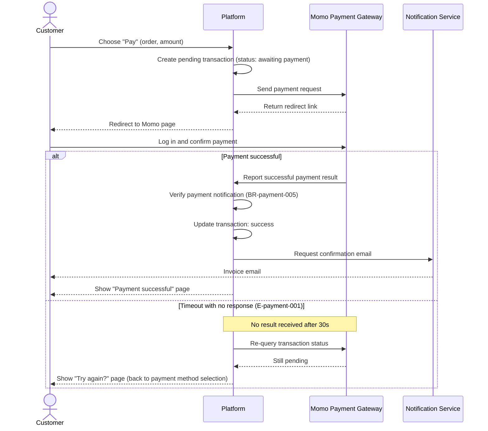

<!--
REFERENCE for /sequence (not a real doc). Points to imitate:
- Merged file: slim frontmatter (type/feature/updated) + a bare heading "# {Feature} — Flows", NO intro sentence/meta blockquote in the doc body.
- Each flow = 1 "## Flow:" section that is APPENDED (not a standalone file).
- Business-language messages: dev understands the flow but does NOT invent an endpoint/SQL/algorithm when there is no source.
-->

# Payment — Flows

## Flow: Guest Checkout via Momo
**Trigger**: A guest (not logged in) taps "Pay" on the cart screen.
**Related UC**: [[../usecases/uc-guest-checkout.md]]
**Related FR**: FR-payment-001, FR-payment-003, FR-payment-006

## Notes

- **Idempotency** — each payment notification is recorded only once; a duplicate keeps the existing status, does not add the amount twice (BR-payment-005). *The implementation (dedup lock, signature verification) is technical design — only recorded in NFR/technical design once there is an approved source, do NOT draw it as a message.*
- **Awaiting result** — if the customer returns to the app before the gateway result arrives (weak network), the app proactively re-queries the status a few times before showing "try again".
- **Email does not block payment** — sending the email is a secondary step; if the notification service fails, the payment still counts as successful for the customer, the email is resent later.

**Reference:**
- FR-payment-001, FR-payment-003, FR-payment-006 (spec Section 2).
- E-payment-001 (spec Section 5 — Error Matrix).
- BR-payment-005 (spec Section 4 — idempotency rule).
