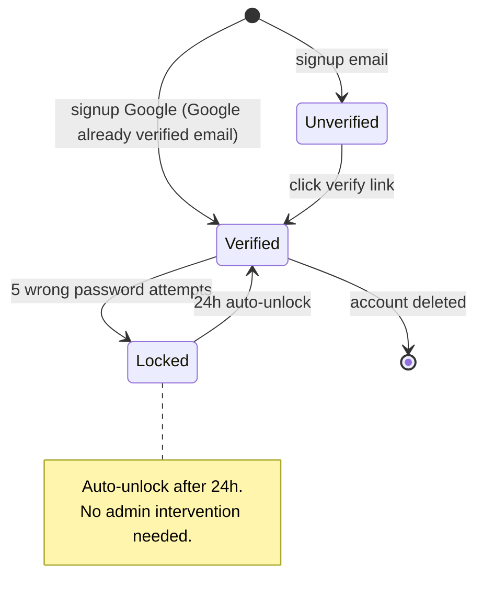

# /state — Per-entity State Diagram

## Goal

Produce a Mermaid `stateDiagram-v2` for one entity of a feature, capturing: states + transitions + triggers + invalid transitions. **Single output**: append a section to `docs/{feature}/srs/{feature}-states.md` (1 file merging all entities, each entity in its own `## State: <Entity>` section).

## Constraints

- **1 fixed output** — `docs/{feature}/srs/{feature}-states.md`, append mode. NO `--uc`, `--append`, `--system-flow` flags.
- **`--feature` optional** — auto-detect from context/the in-progress feature; only ask via picker when ambiguous. **Feature does not exist + arg indicates a new entity/feature → derive the slug and create the feature yourself** (entry point, see `feature-bootstrap.md` group A). Do NOT force `/brainstorm` first.
- **L1 approval** before Write — show entity + state count + transition count.
- **NO L3 iteration** — Mermaid does not render in chat. The user reviews from the rendered file; to change it, call the skill again and say what needs to change.
- **Auto-detect states** from:
  - `docs/{feature}/brainstorms/*.md` Section 6.3 State Transitions table.
  - `docs/{feature}/srs/{feature}-spec.md` Section 4 Business Rules if they mention a state transition.
  - If none → clarifying questions. User wants another source → tag `@file` or paste the content in chat.
- **Invalid transitions explicit** — a separate table in the section lists transitions that are NOT allowed.
- **Bilingual (mirror input — @../../rules/language.md)** in descriptions/notes, auto-detected from the seed. Want English? say "write in English". Mermaid syntax keywords stay English.
- **Per @../../rules/diagram-selection.md** — entity ≥3 states before proceeding; <3 → warn "a table is enough, do you need a diagram?".
- **states.md does not exist** → create it with a header skeleton.

## Inputs

```
/state <entity> --feature <slug>       # append a section to states.md
/state <entity>                        # feature auto-detected from context, ask only when ambiguous
/state <entity> "<new feature>"        # feature does not exist → derive slug + interview + create feature (group A)
```

To change the default behavior, say so in words:
- Use another source instead of the default brainstorm/spec → tag `@file` or paste the content.
- Write in English → say "write in English".
- A section for that entity already exists → call the skill again, it enters update mode (L2 diff).

## Context (dynamic)

Today: !`date +%Y-%m-%d`
Available features: !`ls -d docs/*/ 2>/dev/null | xargs -I{} basename {} | head -20`
Features with states.md: !`for d in docs/*/srs/*-states.md; do [ -f "$d" ] && echo "$d"; done | head -10`

## Approach

1. **Resolve feature + entity** — feature from arg/picker; entity in UpperCamelCase from arg.
   - **Feature does not exist (entry point, per `feature-bootstrap.md` group A):** if no `docs/{feature}/` matches and the arg shows this is a new entity/feature (e.g. `/state Order "order management"`) → `/state` IS ALLOWED to bootstrap itself: derive the feature slug from the description (kebab-case, ASCII, ≤50 chars; ask if a clear slug cannot be inferred), confirm the slug at L1 (user can override), create `docs/{feature}/srs/` on Write. Do NOT force the user to run `/brainstorm` first.
2. **Auto-detect existing state info:**
   - Read `docs/{feature}/brainstorms/*.md` Section 6.3 — pull rows related to the entity.
   - Read `docs/{feature}/srs/{feature}-spec.md` Section 4 — pull BRs related to state.
   - Source present → use it, do not re-ask what is already known (no-re-ask).
   - **No source (new feature, or an old one missing brainstorm/spec)** → **interview to EXACTLY the SCOPE the state needs** (per `feature-bootstrap.md` group A step 3), ask in one batched business-language pass (do NOT ask about DB/SDK): **which entity** (if unclear) · the **states** the entity goes through · the **trigger** of each transition (which event/action changes the state) · **forbidden transitions** (from which state it may NOT go back to where). Do NOT invent — ask about whatever is missing. Clarify just enough to draw correctly, do not sprawl comprehensively like `/brainstorm`.
   - **Ambiguous description even with a source** (e.g. brainstorm/spec only mentions vaguely "has several states" without listing them clearly) → **MUST ask clarifying questions before generating**, do NOT guess states/triggers. Minimum questions: "What states does the entity have?", "What are the transition triggers?".
2.5. **Extract a fact-list (coverage checklist)** — BEFORE generating, briefly list (keep it in context):
   - **States**: every state the entity goes through.
   - **Transitions**: each transition + its trigger.
   - **Invalid transitions**: every forbidden transition mentioned (goes into a separate table, not drawn in the diagram).
   The fact-list is used as the reconciliation checklist in step 9.6.
3. **Validate state count** — <3 states, warn "a table may be enough; continue with the diagram?" Y/n.
4. **Validate the target** `docs/{feature}/srs/{feature}-states.md`:
   - Exists + entity matches → enter update mode (L2 diff for that section).
   - Exists, new entity → append a `## State: {Entity}` section.
   - Missing → create new with slim frontmatter (`type: srs-states`, `feature`, `updated`) + intro skeleton.
5. **Generate mermaid stateDiagram-v2:**
   - `[*] --> initial_state` for entry.
   - `state --> next_state : trigger / condition`.
   - `final_state --> [*]` for a terminal if any.
   - Composite states (nested) only when needed — do NOT over-engineer.
6. **L1 plan preview** — BA-friendly prose: "I'll append a state diagram for entity {entity} to docs/{feature}/srs/{feature}-states.md with N states + M transitions + K invalid. Apply? (Y / edit)".
7. **Write** — Read states.md, append the section. Each section format:
   ```markdown
   ## State: {Entity}
   **Related entity**: {Entity} (CamelCase matching the ERD `srs/{feature}-erd.md` — edge source state→entity)
   **Related UC**: [[../usecases/uc-{slug}.md]], ...
   **Related BR**: BR-{feature}-NNN, ...

   \`\`\`mermaid
   stateDiagram-v2
     ...
   \`\`\`

   ### Invalid transitions
   | From | To | Why not |
   |---|---|---|
   | paid | pending | Paid does not go back to pending |
   ```
   > **Full-form IDs required** in the Related line — always `BR-{feature}-NNN`, NOT the short form `BR-001` (edge source for the KG; short forms cause phantom-features + lost traceability). **Related entity** written in CamelCase matching the ERD.
8. **Called again with a matching entity** (automatic update mode) → L2 diff for that section.
9. **Activity log** — set env `CLAUDE_SKILL_NAME=/state` + `CLAUDE_CHANGELOG_NOTE` (note: `added/updated {Entity} state diagram`) BEFORE Write — the hook appends to `docs/_shared/activity.log` (independent of whether spec.md exists yet, no more routing/fallback). Update states.md `updated: {date}`.
9.5. **Render-verify + SELF-VIEW THE IMAGE (MANDATORY, run immediately after Write)** — `node "${CLAUDE_PLUGIN_ROOT:-.claude}/scripts/mermaid-verify.mjs" --file docs/{feature}/srs/{feature}-states.md --png <scratchpad>/state-review`. The `--png` flag both compile-checks and exports a PNG per block so the skill can **Read and view the image itself**. Mermaid does not render in chat (this is why L3 is skipped), so this is the only way to catch errors BEFORE reporting "done" rather than letting the user discover them when opening the IDE.
   - **Compile fail** → read the line/column error the script returns, fix the section just appended (do NOT touch other entities), re-verify. At most 2 self-fix attempts.
   - **Compile pass** → **Read the PNG** (`<scratchpad>/state-review/block-{n}.png` — the block of the entity just written) and self-review the business content (compile-check + coverage text do NOT catch visual errors):
     - [ ] Orphan state? Every state has an inbound edge (and outbound, except terminal) — no state left dangling unconnected.
     - [ ] Entry/terminal correct? There is `[*] -->` into the initial state; terminal (if any) `--> [*]`.
     - [ ] Transition in the right direction? `Verified --> Locked` differs from `Locked --> Verified` — do not draw it backwards.
     - [ ] Trigger labels readable, not overlapping / not wrapping so long text is lost.
     - Any error → fix the section just written, re-render + re-view. At most 2 rounds.
   - **Still failing after 2 attempts** → report the specific error + the mermaid snippet to the user, suggest pasting into mermaid.live to debug by hand. Do NOT silently leave a broken/ugly file and report "done" as usual.
9.6. **Coverage-verify (MANDATORY, run immediately after 9.5 passes)** — reconcile the diagram just written against the fact-list from step 2.5: does each state appear as a node; does each transition appear with the correct trigger. This is a check DIFFERENT from step 9.5 — 9.5 only catches syntax errors, 9.6 catches **missing states/transitions versus the fact-list**.
   - **Complete** → continue to step 10, add the line "Coverage: {N}/{N} states, {M}/{M} transitions".
   - **Missing** (e.g. a state does not appear, or a transition is missing its trigger) → add it to the section just written, re-verify 9.5 then 9.6. At most 2 self-fix attempts.
   - **Still missing after 2 attempts** → tell the user which state/transition could not be shown. Do NOT silently report "done" when coverage is incomplete.
9.7. **Diagram_Reviewer gate (ONLY when over the complexity threshold)** — if the entity has **≥5 states**, OR **≥2 composite/nested states**, OR **≥3 invalid transitions**, OR **parallel/fork states**, spawn an agent via the Task tool, `subagent_type: diagram-reviewer`, passing: the state section just written (mermaid + the Invalid transitions table) + the step 2.5 fact-list (states, transitions, invalid). Measure by total complexity, not state count alone. Below every threshold → SKIP 9.7, go straight to step 10 (avoid overhead for simple state machines).
   - **Task tool unavailable** (not provided by the runtime) → do NOT implicitly treat it as reviewed; the report states `reviewer skipped (Task unavailable)`.
   - Any BLOCKING (a state in the fact-list with no node, an orphan state, a transition missing its trigger) → add it to the section just written, re-verify 9.5+9.6, then continue.
   - Loop at most 2 rounds. Verdict `approve`/only WARNING/SUGGESTION → continue straight to step 10.
10. **Output report:**
    ```
    ✅ State diagram appended: docs/{feature}/srs/{feature}-states.md → ## State: {Entity}
       States: {N} | Transitions: {M} | Invalid: {K} | Mermaid compile: OK | Self-reviewed image | Coverage: {N}/{N} states, {M}/{M} transitions

    Open the file in IDE/Obsidian/GitHub preview to see the rendered diagram.
    Need changes? Call /state {entity} --feature {feature} again, I'll enter update mode.
    ```

## Mermaid syntax reference



## Gotchas

- **Composite states** — Mermaid supports nesting but >2 levels renders messily. Keep it flat where possible.
- **Entity name** — UpperCamelCase (Account, Order, VerifyLink).
- **Multiple entry points** — use several `[*] -->` lines.
- **Self-loop** — `State1 --> State1 : retry` OK, but many retries on the same state should be grouped into a note.
- **Invalid transitions** — do NOT draw in the diagram (messy); separate table.
- **Update mode** — preserve user edits in the notes section; only regenerate the mermaid + tables.
- **UC embed** — if the user asks to "draw a state into UC X", refuse + explain "states belong in states.md because an entity is usually shared across UCs".
- **Mermaid syntax fail** — step 9.5 catches errors via `mermaid-verify.mjs` RIGHT after Write, self-fix at most 2 times. Do NOT write then abandon — only tell the user to paste into mermaid.live if 2 self-fix attempts still fail.
- **Missing coverage ≠ syntax error** — step 9.5 (compile) and 9.6 (coverage) are two different things. A diagram that compiles OK can still miss a state versus the fact-list — do not confuse "compile OK" with "done".

## References

- @../../rules/ba-conventions.md
- @../../rules/approval-gate.md
- @../../rules/naming-conventions.md
- @../../rules/changelog.md
- @../../rules/diagram-selection.md
- @../../rules/feature-bootstrap.md
- @../../rules/language.md
- @../../templates/diagram-state.md
- @../../scripts/mermaid-verify.mjs (render-verify after Write — step 9.5)
- @../../agents/diagram-reviewer.md (Diagram_Reviewer — coverage review when over the complexity threshold, step 9.7)
