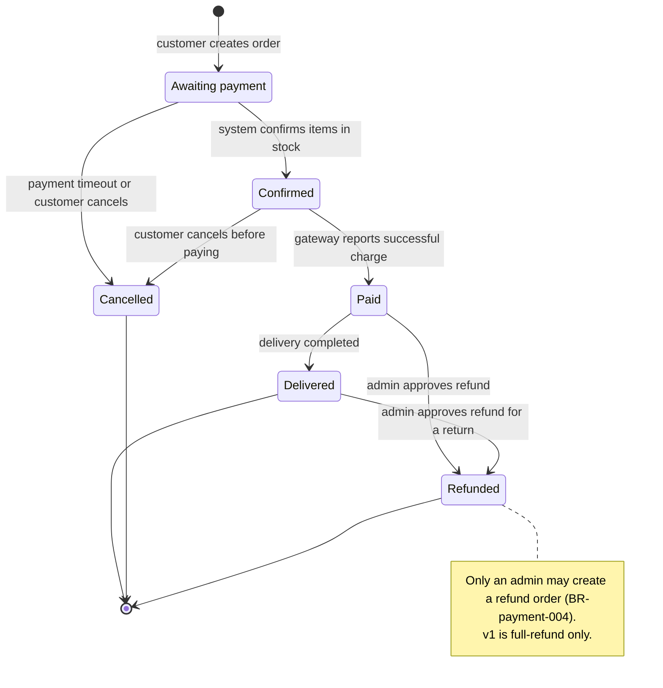

<!--
REFERENCE for /state (not a real doc). Points to imitate:
- Merged file: slim frontmatter (type: srs-states) + a bare heading "# {Feature} — States", each entity in its own "## State: {Entity}" section.
- Mermaid stateDiagram-v2: [*] --> initial; state --> next : trigger; terminal --> [*].
- Trigger placed AFTER the ":" (lenient parser) — do not use "..." around state names, use an alias when the name has spaces/diacritics.
- The "Invalid transitions" table lists FORBIDDEN transitions (NOT drawn in the diagram).
- States + order match ORDER.status in srs example-erd.md (pending → confirmed → paid → fulfilled / cancelled / refunded).
-->

# Payment — States

## State: Order
**Related entity**: Order (matches the ERD `srs/payment-erd.md` — edge source state→entity)
**Related UC**: [[../usecases/uc-checkout.md]], [[../usecases/uc-refund.md]]
**Related BR**: BR-payment-002, BR-payment-004

### Invalid transitions
| From | To | Why not |
|---|---|---|
| Paid | Pending | Charged, cannot return to awaiting payment |
| Cancelled | Confirmed | A cancelled order cannot be revived; the customer must create a new order |
| Refunded | Paid | Refunded is a terminal state, cannot return to paid |
| Fulfilled | Confirmed | Once delivered, cannot revert to confirmed |
