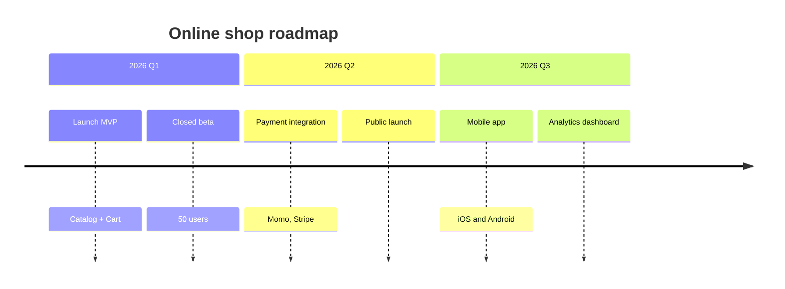

# /timeline — Roadmap / Milestone Timeline (Mermaid timeline)

## Goal

Produce a Mermaid `timeline` block — milestones grouped by period (quarter/year/phase), with a one-line note per milestone. **Single output**: append a section to `docs/{feature}/{feature}-timeline.md`, or `docs/_shared/_shared-timeline.md` for a cross-feature roadmap (`--shared`).

> PM-light by design: **no Gantt** (no task bars, no dependency arrows). If you need "task A blocks task B" planning, that is a Gantt — out of scope; this skill only shows milestones over time.

## Constraints

- **1 fixed output** — `docs/{feature}/{feature}-timeline.md` (or `--shared` → `docs/_shared/_shared-timeline.md`), append mode. One `## Timeline: {Subject}` section per timeline.
- **`--feature` optional** — auto-detect; only ask when ambiguous. **Feature does not exist + a subject → derive slug + create** (entry point, `feature-bootstrap.md` group A).
- **L1 approval** before Write — show subject + period/milestone count.
- **NO L3 iteration** — Mermaid does not render in chat; review from the file.
- **Auto-detect milestones** from `docs/{feature}/brainstorms/*.md` (roadmap section) if present; else interview: the **periods** (quarters/years/phases) in order, and **1-3 milestones** per period with a short note. No-re-ask what is known.
- **Bilingual (mirror input — @../../rules/language.md)**; `timeline`/`section`/`title` keywords stay English.
- **Idempotent** — same subject re-run → update mode (L2 diff).
- **Per `diagram-selection.md`** — timeline = milestones over time (PM-light); Gantt/dependency planning is deliberately out of scope.
- **Theme** — apply the global Mermaid init from `@../../rules/diagram-style.md` (timeline ignores `classDef`).

## Inputs

```
/timeline "<subject>" --feature <slug>      # append a section to {feature}-timeline.md
/timeline "<subject>" --shared              # cross-feature roadmap → docs/_shared/_shared-timeline.md
/timeline "<subject>"                        # feature auto-detected
/timeline "<subject of a new feature>"       # feature does not exist → derive slug + create
```

## Context (dynamic)

Today: !`date +%Y-%m-%d`
Available features: !`ls -d docs/*/ 2>/dev/null | xargs -I{} basename {} | head -20`
Features with timeline: !`for d in docs/*/*-timeline.md; do [ -f "$d" ] && echo "$d"; done | head -10`

## Approach

1. **Resolve feature + subject + target.** `--shared` → `docs/_shared/_shared-timeline.md`. Entry point if new: derive slug, confirm at L1, create `docs/{feature}/` on Write.
2. **Gather milestones.** Read brainstorm roadmap if present; else ask in one batched pass: periods (Q1/Q2… or phases) in order + 1-3 milestones per period + a short note each. Do NOT invent dates.
3. **Fact-list** — every period + milestone (the coverage checklist).
4. **Validate target** — create if missing: frontmatter (`type: timeline`, `feature` or `shared`, `updated`) + bare heading, NO meta blockquote.
5. **Generate Mermaid `timeline`** — `title`, `section <Period>`, then `Milestone : note` (colon-space separates milestone from note; `:` also lets one period have multiple milestones on separate lines).
6. **L1 plan preview** — subject + period/milestone count.
7. **Write** — append `## Timeline: {Subject}` section with the ```mermaid block.
8. **Activity log** — set `CLAUDE_SKILL_NAME=/timeline` + `CLAUDE_CHANGELOG_NOTE` before Write. Update `updated:`.
9. **Render-verify (MANDATORY)** — `bash "${CLAUDE_PLUGIN_ROOT:-.claude}/scripts/tsrun.sh" scripts/mermaid-verify.ts --file docs/{feature}/{feature}-timeline.md`. Fail → fix the section, ≤2 attempts.
10. **Output report.**

## Mermaid syntax reference (Claude composes it, do NOT hard-paste)



## L1 plan preview

> I'll append a roadmap timeline for **{subject}** to `docs/{feature}/{feature}-timeline.md`: **{N} periods**, **{M} milestones**.
> Source: {brainstorm roadmap | you provide}.
> Logged: activity log "added {subject} timeline".
> Apply? (Y / edit)

## Output report

```
✅ Timeline appended: docs/{feature}/{feature}-timeline.md → ## Timeline: {Subject}
   Periods: {N} | Milestones: {M} | Mermaid compile: OK

Open the file in IDE/Obsidian/GitHub preview to see the rendered timeline.
Need changes? /timeline "{subject}" --feature {feature} again → update mode.
```

## Gotchas

- **No classDef** — timeline ignores `classDef`; the global init (`diagram-style.md`) is the only theme lever.
- **Not a Gantt** — no task bars / dependencies / critical path. If the user asks for "Gantt" specifically, explain this skill is milestone-only (by design) and Gantt planning is out of scope.
- **Period label** — keep it short (`2026 Q1`, `Phase 1`); a long period label breaks the column layout.
- **Milestone note** — `Milestone : short note`; for a milestone with no note, just the name.
- **Update mode** — re-run the same subject → regenerate that section only.

## References

- @../../rules/ba-conventions.md
- @../../rules/approval-gate.md
- @../../rules/naming-conventions.md
- @../../rules/changelog.md
- @../../rules/diagram-selection.md
- @../../rules/feature-bootstrap.md
- @../../rules/language.md
- @../../rules/diagram-style.md
- @../../templates/diagram-timeline.md
- @./references/example-timeline.md
- @../../scripts/mermaid-verify.ts (render-verify after Write — step 9)
