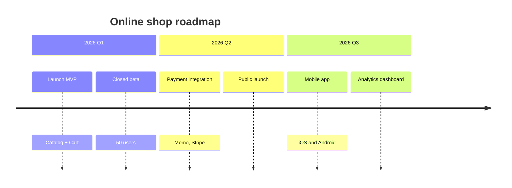

# Example timeline — "Online shop" roadmap

> A working `timeline` block as `/timeline` writes it into `{feature}-timeline.md`.
> Milestones grouped by period; NO Gantt bars/dependencies (PM-light by design).

## Timeline: Online shop roadmap

