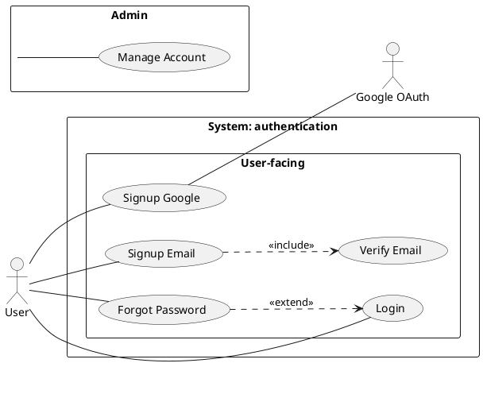

# /usecase-diagram — Use Case Diagram (PlantUML native)

## Goal

Produce a visual use case diagram for a feature: actors (outside the system) + use cases (inside the system boundary, grouped into packages when numerous) + relationships (`include`, `extend`, `generalization`). Serves stakeholder kickoff and system scope overview — NOT detailed flows (that is the `/usecase` text doc).

Output in `docs/{feature}/usecases/`:
1. `{feature}-usecase-diagram.puml` — the **source** PlantUML written by the AI (text, git-versionable). Edited when the skill is called again (auto update mode).
2. `{feature}-usecase-diagram.svg` — pre-rendered (open with browser/IDE/Obsidian).

> **No more separate `.md` wrapper file** (dropped 2026-07-13). The `.svg` image + the Actors/Use Cases/Relationships tables are embedded/written directly into **`{feature}-usecase-index.md`** (which already holds the UC metadata) — avoiding two wrapper files with duplicate data + drift. `/preview` and Obsidian read `{feature}-usecase-index.md` and see the image.

## Why PlantUML instead of a Mermaid workaround?

Mermaid **has no native use-case-diagram syntax** — the previous version faked it with `flowchart` (`([Actor])` + `(Use Case)` + subgraph), only an approximation, cannot group use cases into clear packages, cannot distinguish `include`/`extend`/`generalization` with standard notation. PlantUML has **native** `actor`/`usecase`/`package` — real UML, easily grouping use cases by sub-domain, reducing crossing lines when there are many use cases.

> **Confirmed trade-off:** there is no Java runtime on this machine to run PlantUML locally — the skill renders via the **public server `plantuml.com`** (like the bpmn-js viewer using a CDN). This means the diagram content (actor/use case names) is sent over the internet on each render. If the content is sensitive, consider installing Java + `plantuml.jar` locally instead (see Gotchas).
>
> **PlantUML also does not render natively on GitHub/Obsidian** (needs a plugin/server, like D2) — this is why the skill exports `.svg` then embeds an `` into `{feature}-usecase-index.md`, NOT embedding a `` ```plantuml `` code fence directly (which would show raw text, not render).

## Constraints

- **L1 approval** before Write — show path + actor count + use case count + package grouping (if applicable).
- **NO L3 iteration** — PlantUML does not render in chat. The user reviews from the `.svg`; to change it, call the skill again and say what needs to change.
- **`--feature` optional** — auto-detect from context/the in-progress feature; only ask via picker when ambiguous.
- **Feature does not exist OR is missing both `usecases/{feature}-usecase-index.md` and `srs/{feature}-spec.md` → REFUSE + route to `/usecase` or `/srs`** (per `feature-bootstrap.md` group B) — with no real actor/UC source, a self-invented diagram will be wrong. **Has ≥1 of the 2 sources (even if not yet approved) → proceed.**
- **Render via `render.sh`** (shared script in `${CLAUDE_PLUGIN_ROOT:-.claude}/skills/usecase-diagram/`) — do NOT call curl/encode directly in skill logic, the script handles everything.
- **Compile must PASS** (HTTP 200 + valid SVG, not an error page) before reporting done.
- **System boundary REQUIRED** — every use case sits inside one `rectangle "System: {feature}" { ... }` (or a package named after the feature); actors outside. A diagram missing the boundary = missing scope.
- **Package by REAL domain/subsystem, NOT by a count threshold** — only split into packages when there is a real sub-domain (e.g. "User-facing" / "Admin" / "Integration"). Do NOT use a mechanical ">7-8 UC" threshold (a count is not a reason to group). Few domains → a single boundary is enough.
- **Relationships must have evidence + rationale** — do NOT infer include/extend/generalization on your own. Only draw one when the UC text proves it (mandatory-shared / conditional-addition / real specialization) + a rationale can be stated. By default draw only actor `--` UC + boundary. `include` ≠ "extract a shared step to look nice"; `extend` ≠ "every error/optional branch". A wrong arrow direction is a common mistake — see the syntax reference.
- **Auto-detect** actors + use cases from:
  - `docs/{feature}/usecases/uc-*.md` — pull title + primary actor.
  - `docs/{feature}/{feature}-urd.md` Section 2 User Types.
  - `docs/{feature}/srs/{feature}-spec.md` actor mentions.
- **Bilingual (mirror input — @../../rules/language.md)** labels, auto-detected from the feature context. Want English? say "write in English". PlantUML syntax stays English.
- **Per @../../rules/diagram-selection.md** — if the feature has only 1 actor + 1 use case → warn "overkill, can skip".
- **Image + tables embedded into `{feature}-usecase-index.md`** (sections `## Diagram / Actors / Relationships`), do NOT create a separate `.md` wrapper file.

## Inputs

```
/usecase-diagram --feature <slug>    # auto-detect actors + use cases; auto update mode if diagram.puml exists
/usecase-diagram                     # feature auto-detected from context, ask only when ambiguous
```

Actor list auto-detected; the user confirms/edits in the L1 prompt rather than via a flag. Want English? say "write in English".

## Context (dynamic)

Today: !`date +%Y-%m-%d`
Available features: !`ls -d docs/*/ 2>/dev/null | xargs -I{} basename {} | head -20`

## Approach

1. **Resolve feature** — `--feature` explicit if present; else auto-detect (single in-progress) or picker. Distinguish 2 cases (per `feature-bootstrap.md` group B):
   - **Feature does NOT exist OR is missing both `usecases/{feature}-usecase-index.md` and `srs/{feature}-spec.md`** (no actor/UC source) → **REFUSE explicitly + route**: "Cannot run `/usecase-diagram` for `{feature}` yet — missing use case + source SRS (need actors + use cases to draw). Existing features: {list}. Run `/usecase {feature}` (or `/srs {feature}`) first, then come back." Do NOT create the feature yourself.
   - **Has ≥1 source** (`{feature}-usecase-index.md` or `srs/{feature}-spec.md`, even if not yet approved) → proceed.
2. **Validate existing** — `docs/{feature}/usecases/{feature}-usecase-diagram.puml` already exists → switch to update mode (L2 diff), tell the user it is updating.
3. **Auto-detect actors + use cases:**
   - Read the `docs/{feature}/usecases/{feature}-usecase-index.md` `## Use cases` table — pull slug + actor + title (UC files are zero-frontmatter, metadata lives in the index file).
   - Scan `docs/{feature}/{feature}-urd.md` Section 2 — extract user types as actors.
   - Scan `docs/{feature}/srs/{feature}-spec.md` — find actor mentions in FR/flows.
   - Dedupe + present the list for the user to confirm (Y / edit / add).
4. **Classify actors:**
   - Primary (triggers the main use case) — e.g. User, Customer.
   - Secondary (supports / receives output) — e.g. Admin, Manager.
   - System (external service) — e.g. Google OAuth, Stripe, Email Service.
5. **Identify relationships** (primary only — see Constraints):
   - `include`: use case A always calls B (e.g. "Checkout" includes "Validate Cart").
   - `extend`: use case B extends A under a specific condition (e.g. "Apply Discount" extends "Checkout").
   - `generalization`: use case A is a specific form of B (rare — only real specialization).
   - **Only infer a relationship with evidence + rationale** (per Constraints). Cannot explain it → do NOT draw it, just actor `--` UC.
6. **System boundary + package** — every UC inside one boundary named after the feature; split into packages only when there is a **real domain/subsystem** (NOT by a UC-count threshold). Present the proposed grouping for the user to confirm at L1.
7. **Write the `.puml` source** (formula below) — actor `--` UC (undirected), include base→included, extend extending→base. The AI describes the structure, PlantUML handles layout.
8. **L1 plan preview** — BA-friendly prose: "I'll draw a use case diagram for {feature} with N actors + M use cases (system boundary + {K} packages if there are domains) + J relationships with rationale. Apply? (Y / edit)".
9. **Write** `docs/{feature}/usecases/{feature}-usecase-diagram.puml` → run `render.sh` → produce `{feature}-usecase-diagram.svg`.
   - Compile fail (script exit != 0) → read the error, fix the source, re-render. At most 2 self-fix attempts before reporting to the user.
10. **Write the image + tables into `{feature}-usecase-index.md`** (do NOT create a separate `.md` wrapper file) — the `## Diagram` section embeds `` + a `## Actors` section (Actor/Type/Description/**Source**) + `## Relationships` (Type/From/To/**Rationale**). Create `{feature}-usecase-index.md` from `templates/usecase-index.md` if it does not exist. L2 diff if it does.
11. **Update mode (`.puml` already exists)** → L2 diff for the `.puml`, re-render the `.svg`, update the sections in `{feature}-usecase-index.md`. Update `updated: {date}`.
12. **Activity log** — set the env note (`{N} actors, {M} use cases, {K} packages — {note}`) before Write — the hook appends to activity.log.
13. **Output report:**
    ```
    ✅ Use case diagram written: docs/{feature}/usecases/{feature}-usecase-diagram.svg (+ .puml source)
       Actors: {N} | Use cases: {M} | Packages: {K} | Relationships: {J}
       Image + tables embedded in: usecases/{feature}-usecase-index.md (§ Diagram / Actors / Relationships)

    Open the .svg with browser/IDE/Obsidian, or view it in {feature}-usecase-index.md.
    Need changes? Call /usecase-diagram --feature {feature} again, I'll enter update mode.

    Detail per use case: run /usecase {feature} to generate text docs (fully-dressed).
    ```

## PlantUML syntax reference (native use case diagram)



> **Arrow direction (CRITICAL — often wrong):**
> - **`include`**: the arrow goes from **base → included** (`Base ..> Included : <<include>>`). Example `UC1 (Signup) ..> UC4 (Verify Email) : <<include>>` = "Signup always needs Verify". Use when the sub-behavior is **always mandatory** for the base to complete.
> - **`extend`**: the arrow goes from **extending → base** (`Extending ..> Base : <<extend>>`). Example `UC5 (Reset via Forgot) ..> UC3 (Login) : <<extend>>` is only correct IF the reset is a conditional behavior inserted into Login — usually Forgot Password is an **independent UC** started from the login screen, NOT an extend. The base must still make sense when the extension does not happen.
> - **actor↔UC association uses `--` (undirected)** — participation, NOT control flow. Avoid `-->` (suggests the actor "calls" the UC, wrong UML meaning).
> - **Do NOT infer include/extend/generalization** without evidence from the UC text. By default draw only actor `--` UC + system boundary. Only add a relationship when the UC text proves it: mandatory-shared (include) / conditional-addition at an extension point (extend) / real specialization (generalization). Cannot state a rationale → do NOT draw it.

**Conventions:**
- `left to right direction` — usually clearer for use cases (actors left, use cases center/right).
- `actor "Name with space" as Alias` — use an alias when the name has spaces/special characters.
- `usecase "Name" as UCn` — always give a short alias so relationships are easy to write.
- `rectangle "System: {feature}" { ... }` — **system boundary required**, every UC inside; actors outside.
- `package "Group name" { ... }` — group use cases by **real domain/subsystem** (NOT by a UC-count threshold). Do NOT nest packages deeply (1 package level inside the boundary is enough).
- actor↔use-case association: `Actor -- UCn` (an **undirected** line — participation, NOT `-->`).
- `include`: `Base ..> Included : <<include>>` (base → included, always-needed behavior).
- `extend`: `Extending ..> Base : <<extend>>` (extending → base, conditional behavior; the base still suffices if it does not happen).
- `generalization`: `Specific --|> General` (hollow arrow, "Specific is a specific form of General"). Rarely used — only for real specialization.
- External system actor (Google, Stripe): declare `actor "Name" as Alias`, place OUTSIDE all packages (like a user actor).

## Gotchas

- **Feature/source does not exist at all** — refuse + route to `/usecase {feature}` (or `/srs {feature}`); do NOT create the feature, do NOT invent actors/use cases. This DIFFERS from "has an index/spec but not yet approved" (that case proceeds normally).
- **Render via a public server (plantuml.com)** — the diagram content is sent over the internet on each render. Need offline / don't want to send data out → install Java (`brew install openjdk`) + download `plantuml.jar` (plantuml.com/download), then change `render.sh` to call `java -jar plantuml.jar` locally instead of HTTP. The current skill does NOT do this itself — it only flags the gotcha for the user to decide.
- **Too many use cases (>10)** still cluttered even after package grouping — consider splitting into 2 separate diagrams by major group (e.g. "User-facing" in 1 file, "Admin" in 1 file).
- **Nested packages** — PlantUML supports them but they render messily; keep a single package level.
- **External system as actor** — declare a separate actor, place it outside all packages, use an alias when the name has a space (e.g. "Google OAuth").
- **Diagram ≠ detailed flow, ≠ semantic validation.** The diagram only shows visual scope + relationships; detailed steps are in the `/usecase` text doc. A PASSing render does NOT mean it is business-correct — self-review goal level (UCs at the same level, prefer sea level), actor coverage, relationships in the right direction + with rationale, UC names matching the `{feature}-usecase-index.md` catalog.
- **Diagram is redundant when** the feature has only 1 actor + a few clear goals, or the audience needs an executable flow/AC more than a scope map → warn "can skip".
- **The real source is the `.puml`** — image + tables embedded in `{feature}-usecase-index.md`. To change content → edit the `.puml` then call the skill again (the sections in the index are regenerated). Do NOT hand-edit the `## Diagram/Actors/Relationships` sections (they get overwritten).
- **Compile fail (HTTP non-200 or SVG <200 bytes)** — `render.sh` detects it and returns a non-zero exit code. Read the specific error, fix the `.puml` (usually a missing quote/alias), re-render. At most 2 self-fix attempts before reporting to the user.
- **`/preview` reads `{feature}-usecase-index.md`** — the `## Diagram` section already embeds `` (standard HTML) so preview.html shows the image normally. No more separate `diagram.md` file.

## References

- @../../rules/ba-conventions.md
- @../../rules/approval-gate.md
- @../../rules/naming-conventions.md
- @../../rules/feature-bootstrap.md
- @../../rules/language.md
- @../../rules/changelog.md
- @../../rules/diagram-selection.md
- @../../templates/doc-usecase-index.md (image + Actors/Relationships tables embedded here, no more separate wrapper file)
- @./render.sh (compile .puml → .svg via plantuml.com)
- @./plantuml_encode.py (PlantUML text-encoding, used by render.sh)
