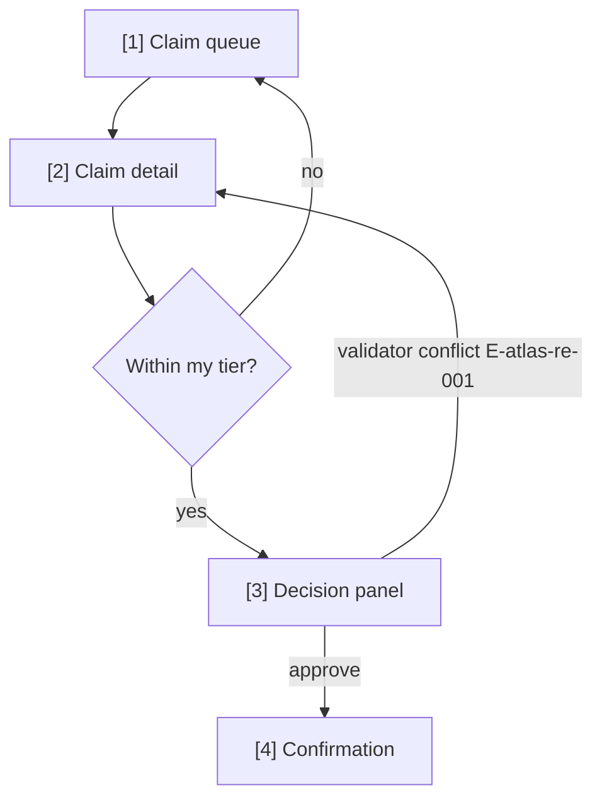

# /user-flow — Screen navigation map (the source of flow division)

## Goal

Map the feature into **flows** (flow-slug + the screens each contains) and draw the navigation per flow — Mermaid `flowchart` with screens numbered `[n]`, covering happy, error, and edge paths. **Single output**: `docs/{feature}/srs/{feature}-userflow.md` (type `srs-userflow`). `ascii-wireframe/` and `html-wireframe/` (wave 3) read THIS file to know which screens each flow contains — no other source of flow division exists.

## Constraints

- **1 fixed output** — `docs/{feature}/srs/{feature}-userflow.md`. Slim frontmatter `type`/`feature`/`updated` + state fields `stage`/`flow_approved_at`/`flow_hash`/`primary_device` (`naming-conventions.md`).
- **Group A, handles itself** (`feature-bootstrap.md`) — accepts a slug OR a free-form description; infer mode + clarify; new feature → derive slug + create.
- **Device question FIRST** (`ba-conventions.md` §7) — mobile 375 / tablet 768 / desktop 1024 decides layout thinking; recorded as `primary_device`. Ask once, never re-ask.
- **Screens are numbered `[n]` and named** — `[1] Claim queue`, `[2] Claim detail`… Numbers are stable across re-runs (new screens take the next number; removed screens retire theirs).
- **Every decision/error path lands somewhere** — an edge must end on a screen, a terminal state, or an explicit exit; dead-ends are BLOCKING per the flow's own review.
- **Flow division is deliberate** — group screens into flows by user intent (e.g. `approve-claim`, `review-history`), not by menu structure; 3-8 screens per flow; a 12-screen flow → split.
- **Sources** — UC files (MSS steps → screens), spec FRs (what surfaces must exist), URD context; else interview. No fabricated screens: every screen traces to a step/FR/answer.
- **Approval stamps state** — on user approval set `stage: approved`, `flow_approved_at: {date}`, `flow_hash` (sha of the flow list) — wireframe skills gate on these.
- **Bilingual (mirror input — @../../rules/language.md)**; mermaid keywords + screen numbers stay English.
- **Render-verify MANDATORY** — mermaid-verify after Write (step 9).
- **Validate before done** — doc-validate (step 9.5).

## Inputs

```
/user-flow <feature>                       # derive flows from UC/spec
/user-flow <feature> "<description>"       # explicit navigation description
/user-flow <new-feature> "<description>"   # group A: create feature
```

## Context (dynamic)

Today: !`date +%Y-%m-%d`
Available features: !`ls -d docs/*/ 2>/dev/null | xargs -I{} basename {} | head -20`
Existing userflows: !`ls docs/*/srs/*-userflow.md 2>/dev/null | head -10`
UC sources: !`ls docs/*/usecases/uc-*.md 2>/dev/null | head -10`

## Approach

1. **Resolve feature + read sources.** UCs (MSS steps + extensions → screen/edge candidates), spec (FRs → required surfaces, E- rows → error paths), URD (device hints).
2. **Ask the device question** (if `primary_device` not already set) + clarify gaps: entry points · what the user sees first · where each error path lands.
3. **Fact-list** — screen candidates with sources · flow grouping proposal · every decision/error edge and its destination.
4. **Draft** — frontmatter + one `## Flow: {flow-slug}` section per flow, each with its screen list (`[n] Name — one-line purpose`) and a Mermaid `flowchart TD` (screens as nodes `S1["[1] Claim queue"]`, decisions as diamonds, error paths labeled with E- codes where known).
5. **Self-check** — no dead-ends; every screen reachable from an entry; numbering has no gaps/duplicates.
6. **L1 plan preview** — flow list + screen count + device + edge coverage.
7. **Write.** **Activity log** — `CLAUDE_SKILL_NAME=/user-flow` + note + author before Write.
8. **On approval, stamp state** — `stage: approved` + `flow_approved_at` + `flow_hash`.
9. **Render-verify (MANDATORY)** — `bash "${CLAUDE_PLUGIN_ROOT:-.claude}/scripts/tsrun.sh" scripts/mermaid-verify.ts --file docs/{feature}/srs/{feature}-userflow.md`. Fail → fix, ≤2 attempts. Then doc-validate the file.
10. **Output report** — flows + screens + next (wave 3 wireframes read this file).

## Mermaid shape reference (Claude composes it, do NOT hard-paste)



## L1 plan preview

> I'll write the user flow for **{feature}** to `docs/{feature}/srs/{feature}-userflow.md`: **{F} flows** ({flow-slugs}), **{N} screens**, device **{primary_device}**.
> Error paths mapped: {E-list}. Sources: {UC/spec/interview}.
> On approval I stamp `stage: approved` (+ hash) — wireframes gate on it.
> Apply? (Y / edit)

## Output report

```
✅ User flow written: docs/{feature}/srs/{feature}-userflow.md
   Flows: {F} ({slugs}) | Screens: [1]…[{N}] | Device: {device}
   Mermaid compile: OK | doc-validate: OK | stage: approved ({date})

Wave 3 reads this file: /wireframe-ascii {feature} --flow {slug} (per flow).
Changed flows later → re-run /user-flow; the hash tells wireframes they're stale.
```

## Gotchas

- **Navigation, not process** — lanes/roles belong to `/activity-swimlane`; this diagram is what the USER sees, screen to screen.
- **Stable numbers are the contract** — wireframe files deep-link `id="s{n}"`; renumbering breaks them. Retire, don't reuse.
- **Error paths deserve screens** — "show an error" is not a destination; decide whether it's a state of the same screen or its own screen.
- **The hash is not decoration** — wave-3 skills compare `flow_hash` to detect a stale division; skipping the stamp breaks their gate.

## References

- @../../rules/ba-conventions.md
- @../../rules/approval-gate.md
- @../../rules/naming-conventions.md
- @../../rules/changelog.md
- @../../rules/doc-selection.md
- @../../rules/feature-bootstrap.md
- @../../rules/language.md
- @../../rules/diagram-style.md
- @../../templates/doc-userflow.md
- @../../scripts/mermaid-verify.ts (render-verify — step 9)
- @../../scripts/doc-validate.ts (validate after Write — step 9)
