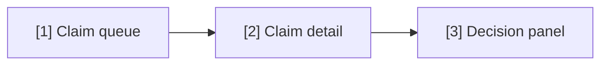

<!--
REFERENCE for /user-flow — simulated session (atlas-re).
Full artifact: example/atlas-re/srs/atlas-re-userflow.md
-->

## Command

```
/user-flow atlas-re "approve-claim and review-history flows"
```

## First question (device)

**Skill:** Primary device for these flows — mobile, tablet, or desktop?

**You:** Desktop 1024 (office web app).

## Interview

**Skill:** List screens the approver sees navigating approve-claim; where do error paths land?

**You:** [1] queue → [2] detail → [3] decision panel → [4] confirmation; errors stay on [3] with inline messages (E-001, E-004). Second flow review-history: [5] history list → [6] transition detail.

## L1 plan preview

```
[/user-flow] Will perform:
  1 | docs/atlas-re/srs/atlas-re-userflow.md | create | 2 flows, 6 screens, stage: approved after Y

Apply? (Y / edit):
```

**You:** `Y`

## Output excerpt

```yaml
---
type: userflow
feature: atlas-re
stage: approved
flow_hash: a3f91c…
primary_device: desktop 1024
---
```



## Output report

```
✅ User flow written — flows: approve-claim, review-history | screens [1]…[6]
   stage: approved + hash stamped — wireframe skills may proceed
```
